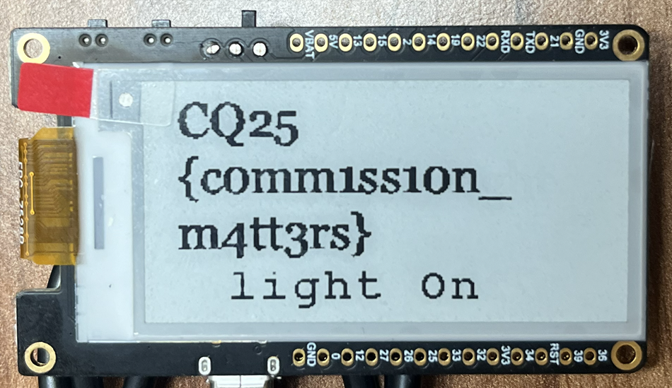

# QR code

Starting the device shows a QR code.


The QR code has a base64 value.

```bash
zbarimg 1.png
```
```
QR-Code:DBZ7G28JeHJzEA1zcg1vDgp3CApwcg==
scanned 1 barcode symbols from 1 images in 0.06 seconds
```

# XOR

The description suggest XOR decoding with 2 bytes.

```bash
echo DBZ7G28JeHJzEA1zcg1vDgp3CApwcg== | base64 -d | python xor-brute.py --length 2 --crib CQ25
```

This is not the flag appearantly. There is also a `matter` logo on it. IoT devices can use this for pairing.

<https://www.matteralpha.com/explainer/how-does-matter-qr-code-work>

```bash
echo DBZ7G28JeHJzEA1zcg1vDgp3CApwcg== | base64 -d | python xor-brute.py --length 2 --crib-start 'MT:Y'
```

```
key=0x4142: MT:Y.K902RL13O.LK5IH10
```

This has a match.

# matter

## chip-tool

The official `matter` SDK has a [CHIP tool](https://project-chip.github.io/connectedhomeip-doc/development_controllers/chip-tool/chip_tool_guide.html) that can be used for various tasks.

<details>
  <summary>Compilation</summary> 

It takes a while and it is recommended to have more than 8GB of RAM. The compilation environment is also not compatible with python 3.13 yet.
  
```bash
sudo apt-get update
sudo apt-get install git gcc g++ pkg-config cmake libssl-dev libdbus-1-dev libglib2.0-dev libavahi-client-dev ninja-build python3-venv python3-dev python3-pip unzip libgirepository1.0-dev libcairo2-dev libreadline-dev  default-jre
git clone --recurse-submodules https://github.com/project-chip/connectedhomeip.git
cd connectedhomeip
# sudo update-alternatives --config python3 # select python 3.12
source scripts/activate.sh
./scripts/examples/gn_build_example.sh examples/chip-tool out/debug
deactivate
```

</details>

## Pairing code

Using the pairing code decoded can be used as a new generated QR code for pairing.

```bash
qrencode -m 1 -s 8 -o qr_matter.png 'MT:Y.K902RL13O.LK5IH10'
```


```bash
chip-tool payload parse-setup-payload "MT:Y.K902RL13O.LK5IH10"
```

```
[1761318364.265] [30351:30351] [SPL] Parsing base38Representation: MT:Y.K902RL13O.LK5IH10
[1761318364.277] [30351:30351] [SPL] Version:             0
[1761318364.277] [30351:30351] [SPL] VendorID:            65521
[1761318364.277] [30351:30351] [SPL] ProductID:           32768
[1761318364.277] [30351:30351] [SPL] Custom flow:         0    (STANDARD)
[1761318364.277] [30351:30351] [SPL] Discovery Bitmask:   0x06 (BLE, On IP network)
[1761318364.277] [30351:30351] [SPL] Long discriminator:  467   (0x1d3)
[1761318364.277] [30351:30351] [SPL] Passcode:            69097512
```

The pairing can happen with BLE or IP network. This works after connecting to the `CyberQuest` wifi (On IP network).

## Pairing

```bash
chip-tool pairing onnetwork 1 69097512
chip-tool descriptor read parts-list 1 0
chip-tool descriptor read device-type-list 1 0,1,2
```

```
Endpoint: 2 Cluster: 0x0000_001D Attribute 0x0000_0000 DataVersion: 2868629521
  DeviceTypeList: 1 entries
    [1]: {
      DeviceType: 770 (Temperature Sensor)
      Revision: 2
     }
Endpoint: 1 Cluster: 0x0000_001D Attribute 0x0000_0000 DataVersion: 2340642525
  DeviceTypeList: 1 entries
    [1]: {
      DeviceType: 256 (On/Off Light)
      Revision: 3
     }
Endpoint: 0 Cluster: 0x0000_001D Attribute 0x0000_0000 DataVersion: 519552656
  DeviceTypeList: 1 entries
    [1]: {
      DeviceType: 22 (Root Node)
      Revision: 3
     }
```

The device has a light sensor and a temperature sensor.

After pairing the first flag is revealed on the eink display.



# Flag 1
`CQ25{c0mm1ss10n_m4tt3rs}`

# Light Switch

Switching the light back off reveals an another flag on the eink display.

```bash
chip-tool onoff on 1 1
chip-tool onoff off 1 1
```


# Flag 2
`CQ25{m4tt3r_of_l1ght_sw1tch}`

# Temperature sensor

Reading the temperature has different values each time, and it is far from the actual temperature. There is also no temperature sensor on the board.

```bash
chip-tool temperaturemeasurement read measured-value 1 2
chip-tool temperaturemeasurement read measured-value 1 2
chip-tool temperaturemeasurement read measured-value 1 2
```

```
[1761342779.053] [107777:107779] [TOO] Endpoint: 2 Cluster: 0x0000_0402 Attribute 0x0000_0000 DataVersion: 2292082662
[1761342779.053] [107777:107779] [TOO]   MeasuredValue: 11400
[1761342780.092] [107777:107779] [TOO] Endpoint: 2 Cluster: 0x0000_0402 Attribute 0x0000_0000 DataVersion: 2292082663
[1761342780.092] [107777:107779] [TOO]   MeasuredValue: 5100
[1761342781.130] [107777:107779] [TOO] Endpoint: 2 Cluster: 0x0000_0402 Attribute 0x0000_0000 DataVersion: 2292082664
[1761342781.130] [107777:107779] [TOO]   MeasuredValue: 9500
```

```bash
echo "temperaturemeasurement subscribe measured-value 0 1 1 2" | chip-tool interactive start | grep -oP '(?<=MeasuredValue: )\d+'
echo "temperaturemeasurement subscribe measured-value 0 1 1 2" | chip-tool interactive start | grep -oP '(?<=MeasuredValue: )\d+(?=\d{2})'
```

The last 2 digits are always zeroes. Converting the values to ascii numbers reveal the flag.

```bash
echo "temperaturemeasurement subscribe measured-value 0 1 1 2" | chip-tool interactive start | grep -oP '(?<=MeasuredValue: )\d+(?=\d{2})' | awk '{ printf "%c", $1 }' 
```


# Flag 3
`CQ25{t3mp3r4tur3_1s_th3_k3y}`

# Basic Information

The `basicinformation` help has the list of available attributes. One of them reveals the last flag.

```bash
(for a in $(chip-tool basicinformation read 2>&1 | grep '*' | cut -d ' ' -f 5); do chip-tool basicinformation read $a 1 0; done) | grep -A 1 'Endpoint: 0'
```


# Flag 4
`CQ25{sn_wh4ts_th3_m4tt3r}`

# Alternative solutions

## Pairing with phone

Using the XOR decoded QR code, it is possible to commission it with phone instead of the `chip-tool`. Reading the temperature sensor over matter is harder this way. On iOS, the hardware version is not visible at all.


## Programmable Button
After commissioning, pressing the Programmable Button (IO39) is also switching the light switch, revealing the other flag.

## Serial console
The serial console also has the temperature readings.

```
I (13161) app_main: Updating temperature to ASCII 'C' -> value: 6700 (67.00°C)
I (14161) app_main: Updating temperature to ASCII 'Q' -> value: 8100 (81.00°C)
I (15161) app_main: Updating temperature to ASCII '2' -> value: 5000 (50.00°C)
I (16161) app_main: Updating temperature to ASCII '5' -> value: 5300 (53.00°C)
I (17161) app_main: Updating temperature to ASCII '{' -> value: 12300 (123.00°C)
I (18161) app_main: Updating temperature to ASCII 't' -> value: 11600 (116.00°C)
I (19161) app_main: Updating temperature to ASCII '3' -> value: 5100 (51.00°C)
I (20161) app_main: Updating temperature to ASCII 'm' -> value: 10900 (109.00°C)
I (21161) app_main: Updating temperature to ASCII 'p' -> value: 11200 (112.00°C)
I (22161) app_main: Updating temperature to ASCII '3' -> value: 5100 (51.00°C)
I (23161) app_main: Updating temperature to ASCII 'r' -> value: 11400 (114.00°C)
I (24161) app_main: Updating temperature to ASCII '4' -> value: 5200 (52.00°C)
I (25161) app_main: Updating temperature to ASCII 't' -> value: 11600 (116.00°C)
I (26161) app_main: Updating temperature to ASCII 'u' -> value: 11700 (117.00°C)
I (27161) app_main: Updating temperature to ASCII 'r' -> value: 11400 (114.00°C)
I (28161) app_main: Updating temperature to ASCII '3' -> value: 5100 (51.00°C)
I (29161) app_main: Updating temperature to ASCII '_' -> value: 9500 (95.00°C)
I (30161) app_main: Updating temperature to ASCII '1' -> value: 4900 (49.00°C)
I (31161) app_main: Updating temperature to ASCII 's' -> value: 11500 (115.00°C)
I (32161) app_main: Updating temperature to ASCII '_' -> value: 9500 (95.00°C)
I (33161) app_main: Updating temperature to ASCII 't' -> value: 11600 (116.00°C)
I (34161) app_main: Updating temperature to ASCII 'h' -> value: 10400 (104.00°C)
I (35161) app_main: Updating temperature to ASCII '3' -> value: 5100 (51.00°C)
I (36161) app_main: Updating temperature to ASCII '_' -> value: 9500 (95.00°C)
I (37161) app_main: Updating temperature to ASCII 'k' -> value: 10700 (107.00°C)
I (38161) app_main: Updating temperature to ASCII '3' -> value: 5100 (51.00°C)
I (39161) app_main: Updating temperature to ASCII 'y' -> value: 12100 (121.00°C)
I (40161) app_main: Updating temperature to ASCII '}' -> value: 12500 (125.00°C)
```

## Using Dumps

Reading the flash also reveals the flags.

```bash
esptool read_flash 0 ALL dump.bin
```

Two plaintext flags can be found just by looking for the flag format.

```bash
zgrep -aEo 'CQ25{.*}' dump.zip
```

# Restore

To restore to uncomissioned state and show the QR code again, just erase the range below.

```bash
esptool erase_region 0x10000 0xC000
```