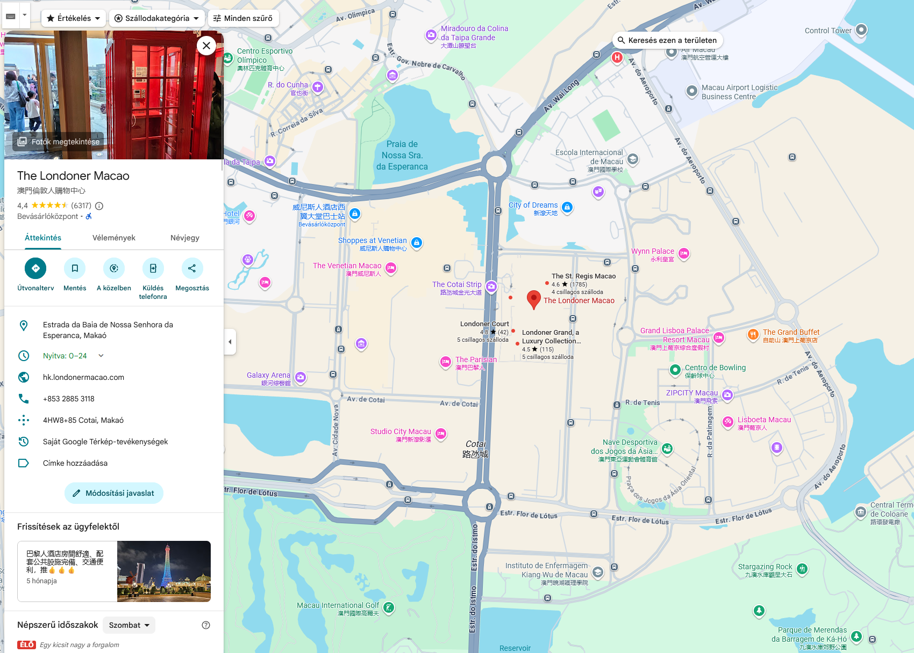

# Country

The last round ended in Thailand. Based on AI output here are the relevant countries. 

```
As a first step, get all the Asian countries with Portugese relevance. List them by relevance and recent influence.
```

There were other suggestions as well, but these made the most sense.

* [Timor-Leste / East Timor](https://en.wikipedia.org/wiki/Timor-Leste), came under Portuguese influence in the sixteenth century, remaining a Portuguese colony until 1975. Portuguese remains official language.
* [Macau / Macao](https://en.wikipedia.org/wiki/Macau), the colony remained under Portuguese rule until the 1999 handover to China. Macau is a special administrative region of China today.
* India (Goa, Daman, Diu), former [Portuguese India](https://en.wikipedia.org/wiki/Portuguese_India), was under Portuges rule as well until the last century. 
​
# Hotel

According to AI, these are the relevant hotels for the above countries.

```
Focus on East Timor, Macau and India. Any hotel with Manchester united association? Or relation to any of the famous players?
```

The mostly unfiltered answer.

* Macau
  + The Venetian Macao hosts The Manchester United Experience - a large interactive complex built in collaboration with Manchester United and Nike, including museum zones, tunnel simulators, and trophy displays.
  + The Londoner Macao mall also has a Manchester United official store, part of the team’s franchised network across Asia.
  + Additionally, the Pestana Hotel Group, co-owned by Cristiano Ronaldo, has been exploring expansion into Macau, with internal discussions about a Pestana CR7 hotel in the region.
* Goa (India)
  + Near Calangute Beach, several hotels cluster around the Cristiano Ronaldo Statue in North Goa - notably the Taj Cidade de Goa Horizon and Amoravida by 7 Apple Resorts are frequent picks among guests visiting the landmark.
* East Timor
  + No hotel or establishment shows an official Manchester United or Ronaldo association.

The `macao` and `thelondonermacao` combination worked on the flag submitter.

There is a also [Suites by David Beckham](https://www.londonermacao.com/hotels/londoner-hotel/david-beckham-suite.html) there.



# Flag
`CQ25{macao-thelondonermacao}`