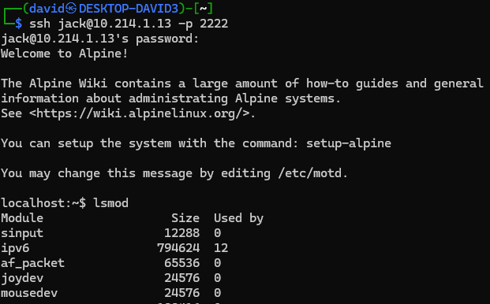
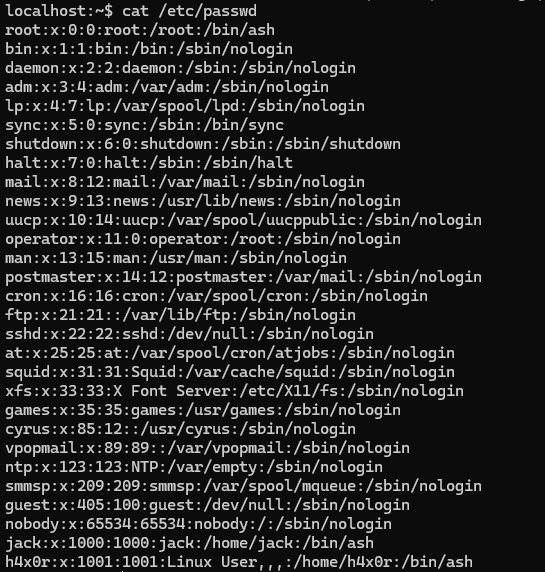
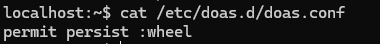
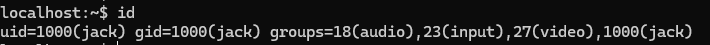
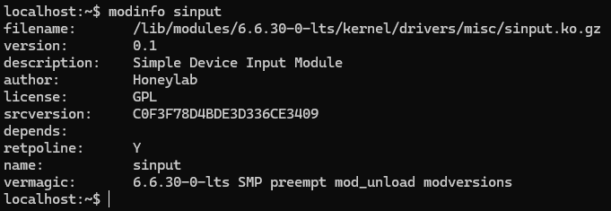
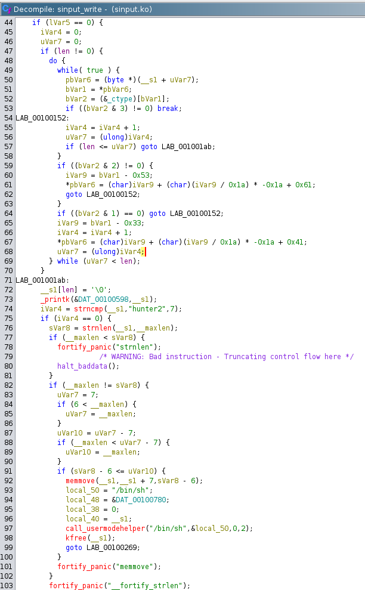
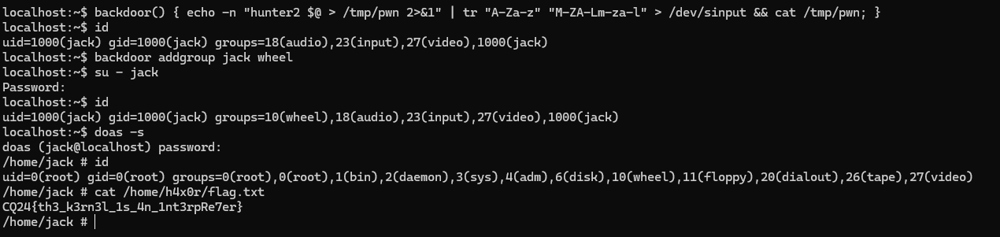

# SSH

SSH access was granted for a server.

```bash
ssh jack@10.214.1.13 -p 2222
```



Linpeas revealed nothing useful.

There is an extra `h4x0r` user.



The package `doas` was used, but we had no access for anything-



A small hint from the user groups.



# Kernel module

There was an extra kernel module loaded, `sinput`. 



# Reversing

Grabbing the [sinput.ko.gz](workdir/sinput.ko.gz) and opening in ghidra reveals the backdoor.

The driver is handling things written to the `/dev/sinput` file.



The first part is doing a caesar cipher with offset 12 on the input. The second part is checking the first part being `hunter2` and executing the rest. No output is returned.

# Backdoor

Writing a small backdoor command, using `tr` for the caesar substitution and writing/reading to a file for the output works well.

```bash
backdoor() { echo -n "hunter2 $@ > /tmp/pwn 2>&1" | tr "A-Za-z" "M-ZA-Lm-za-l" > /dev/sinput && cat /tmp/pwn; }
```

Adding jack to the `wheel` group so he can use `doas` and interact without the backdoor. The flag is located in `/home/h4x0r/flag.txt`.



# Flag
`CQ24{th3_k3rn3l_1s_4n_1nt3rpRe7er}`