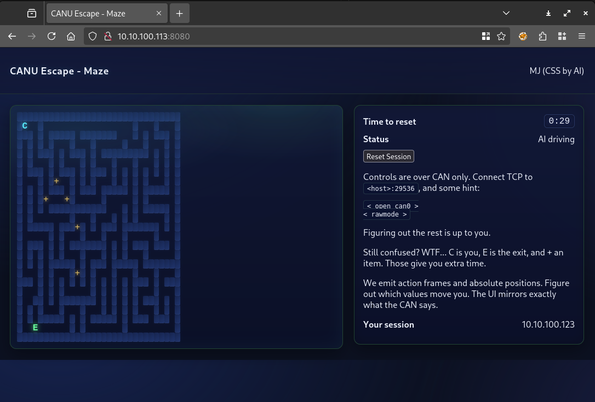
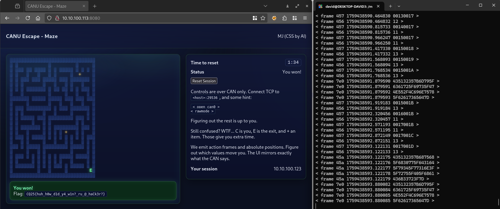
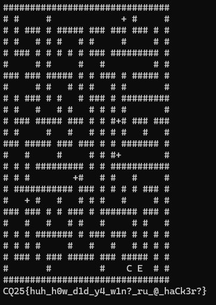

# Portscan

```bash
sudo nmap -T4 -sV -Pn -p8080,29536 10.10.100.113
```

```
Starting Nmap 7.95 ( https://nmap.org ) at 2025-10-02 11:32 CEST
Nmap scan report for 10.10.100.113
Host is up.

PORT      STATE    SERVICE    VERSION
8080/tcp  filtered http-proxy
29536/tcp filtered unknown

Service detection performed. Please report any incorrect results at https://nmap.org/submit/ .
Nmap done: 1 IP address (1 host up) scanned in 2.23 seconds
```

# Visiting the website

Visiting a site reveals a maze solving game. It has a `Car` that needs to be sent to the exit. It is AI driven normally, randomly moving in available directions. It also has info about the other port, it is some kind of CAN service.



It is sending the updates via websocket.

# CAN service

Conneting via `nc` reveals some text based protocol. The dump [dump1.txt](workdir/dump1.txt) has some CAN messages.

It opens with `< hi >` and various `< frame >`. The website also mentions `< open can 0 >` and `< ramwode >`.

## Messages

Observing the website and decoding the messages. Based on the message format, it is [socketcand](https://github.com/linux-can/socketcand/blob/6dd5d33d4645ab221e8cd265c08607366e21ddf1/doc/protocol.md).

### 456 Movement

Observing the movements they correspond like below.

```
< frame 456 1759070809.979451 10 > # up
< frame 456 1759070808.978822 11 > # down
< frame 456 1759070802.019794 12 > # left
< frame 456 1759070807.978848 13 > # right
```

### 457 Coords

Observing the messages, they correspond to the coordinates of the car. 2 bytes per axis.

```
< frame 457 1759070800.019961 00010002 >
< frame 457 1759070801.019239 00010003 >
```

### Reset 458

When doing a reset, a message like below appears.

```
< frame 458 1759070802.978342 00 >
```

### 7e0 Easy flag

There is a periodic message going on.

```
< frame 7e0 1759070799.880190 435132357B6D795F >
< frame 7e0 1759070799.880195 6361725F69735F47 >
< frame 7e0 1759070799.880196 4E552F4C696E7578 >
< frame 7e0 1759070799.880197 5F62617365647D >
```

The `4351` is `CQ`, this is a flag.

# Flag 1
`CQ25{my_car_is_GNU/Linux_based}`

# Sending frames

Reading the documentation and using the 2 commands given by the website, we can do the following.

Initialize sending.

```
< open can 0 >
< ramwode >
```

Send direction ourselves.

```
< send can_id can_dlc [data]* >
```

This works and also disables the AI movement, allowing full control.

# Interactive solver

A small terminal script [interact.py](workdir/interact.py) was created that maps `wasd` to the movements. Watching the website and using the terminal to control the car and escaping.



# Automated solver

An automated solver was also written in [solve.py](workdir/solve.py).



# Flag 2
`CQ25{huh_h0w_d1d_y4_w1n?_ru_@_haCk3r?}`