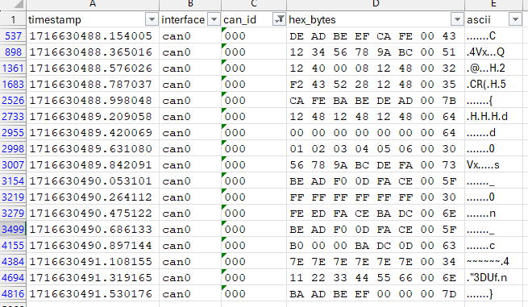

# Dump

The dump is standard text based can dump.

# Crib

Looking for the `CQ` crib results nothing this time.

```bash
cat candump.txt | cut -c 26- | grep 4351 | sort -u
```

# Filtering

Converting the dump to `tsv` and importing to excel, [candump.xlsx](workdir/candump.xlsx). This allows filtering and sorting for various things, checking the unique values, in an interactive way. The ascii representation was also used for help in 1 of the columns.

# 000

Just filtering for id 000 shows the flag, 1 letter at a time on the end of the message. Filled with random stuff like `DEADBEAFCAFE`, `CAFEBABEDEAD`, `00010203040506`, followed by a `00` and finally the important letter.



```
cat candump.txt | grep '000#' | cut -c 44- | xxd -r -p
```

```
CQ25{dd0s_0n_c4n}
```

# Flag
`CQ25{dd0s_0n_c4n}`