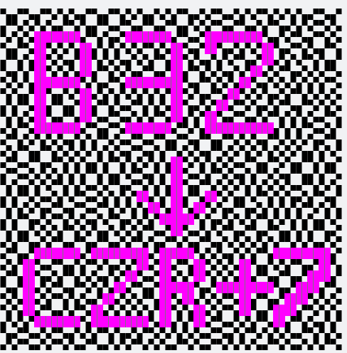
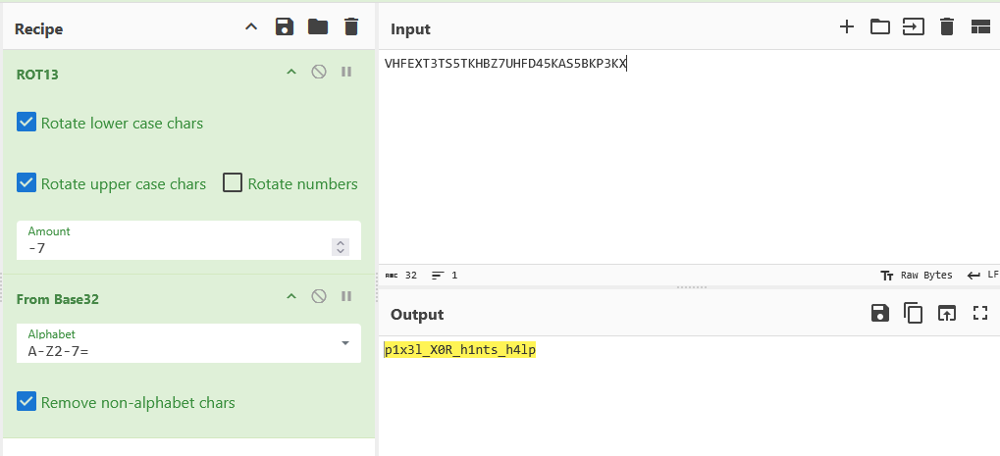

# Images

There are 2 very similar images.

# Diff

The diff has some readable letters/symbols.

`B32->CZR+7`

# Recipe

Cooking a [recipe](https://gchq.github.io/CyberChef/#recipe=ROT13(true,true,false,-7)From_Base32('A-Z2-7%3D',true)&input=VkhGRVhUM1RTNVRLSEJaN1VIRkQ0NUtBUzVCS1AzS1g&oeol=FF) for Caesar cipher (-7) and the Base32 decode solves the challenge.

# Flag
`CQ25{p1x3l_X0R_h1nts_h4lp}`