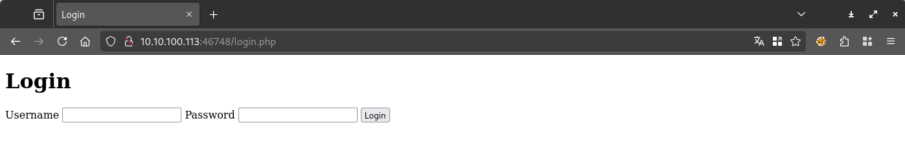
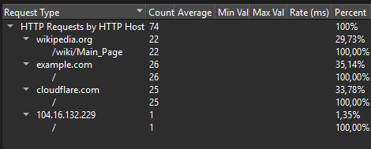
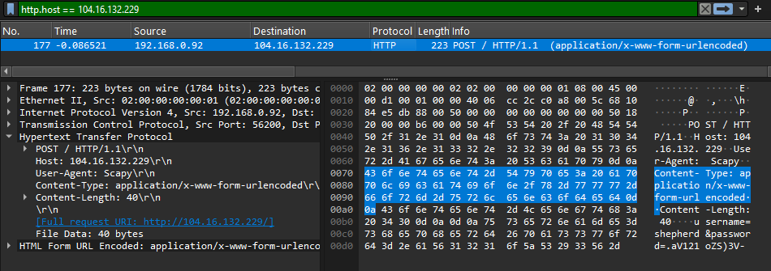
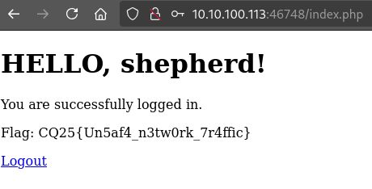

# Visiting the site

Visiting the site gives us a login form, `login.php`.



The form is sent to 

# Pcap

Opening the `pcap`, there are various HTTP traffic. 

Checking all the HTTP, or the statistics reveals an outlier.



A `POST` request with cleartext credentials. The only `POST` request in the `pcap`, and the only one with different hostname.



```
POST / HTTP/1.1
Host: 104.16.132.229
User-Agent: Scapy
Content-Type: application/x-www-form-urlencoded
Content-Length: 40

username=shepherd&password=.aV121oZS)3V-
```

# Login

Using the credentials above on the login form gives the flag.



# Flag
`CQ25{Un5af4_n3tw0rk_7r4ffic}`
