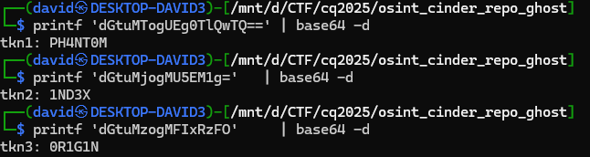

# Script
Running untrusted script on your machine is not a good idea.

Before running it in a VM, checking the script reveals too many things.

# Reverse

It is more like a very easy reversing challenge, not an OSINT at all.

Opening the file has the flags in the variables

```sh
#!/usr/bin/env bash
set -euo pipefail

NOTE=$(printf 'dGtuMTogUEg0TlQwTQ==' | base64 -d)
STASHW=$(printf 'dGtuMjogMU5EM1g='   | base64 -d)
TAGW=$(printf 'dGtuMzogMFIxRzFO'     | base64 -d)
...
```



# Flag
`CQ25{PH4NT0M_1ND3X_0R1G1N}`

# Remarks
Looks like an AI slop. Instead ziping the actual repo and hand that to players, the script has everything visible. There is a `—` long dash usually found in AI answers to suggest it was made by AI.