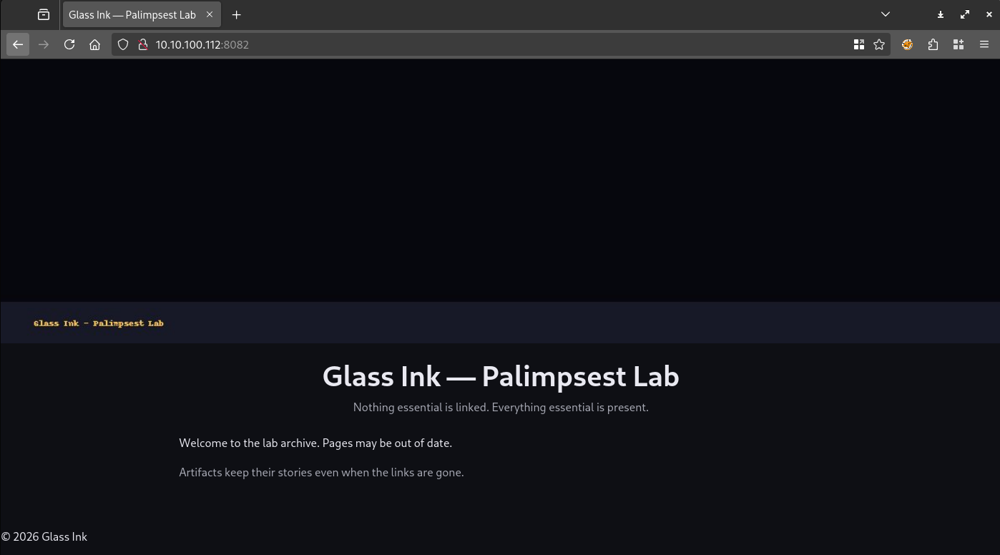
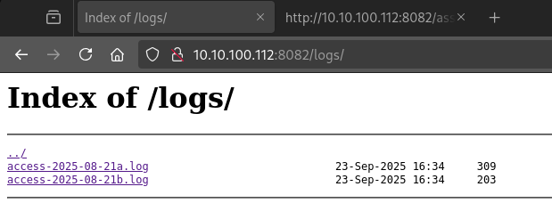
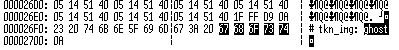

# Visiting the site

Visiting the site gives us a basic page.



# Scraping

Scraping the site and reading everything has breadcrumbs in the comments and files.

In the [/assets/css/site.css](workdir/www/assets/css/site.css), it has a comment for [/.well-known/security.txt](workdir/www/.well-known/security.txt)

```css
/* Ops: review /.well-known/security.txt */
```

```
Contact: mailto:ops@glassink.example
Acknowledgments: /logs/
Policy: /policy.html
Preferred-Languages: en
```

# Logs

The logs folder has directory listing.



The [log](workdir/www/logs/) files are quite small and have some new paths available.

```
203.0.113.10 - - [21/Aug/2025:08:11:14 +0000] "GET / HTTP/1.1" 200 640 "-" "curl/8.1"
203.0.113.10 - - [21/Aug/2025:08:11:16 +0000] "GET /.well-known/security.txt HTTP/1.1" 200 210 "-" "curl/8.1"
203.0.113.10 - - [21/Aug/2025:08:11:17 +0000] "GET /backup/palimpsest-aug.tgz HTTP/1.1" 200 16384 "-" "curl/8.1"
```

There is a backup folder wit [/backup/palimpsest-aug.tgz](workdir/www/backup/palimpsest-aug.tgz)

```
198.51.100.5 - - [21/Aug/2025:08:15:02 +0000] "GET /scripts/lab.min.js HTTP/1.1" 200 800 "-" "Mozilla/5.0"
198.51.100.5 - - [21/Aug/2025:08:15:07 +0000] "GET /L3DG3R/ HTTP/1.1" 404 120 "-" "Mozilla/5.0"
```

The `L3DG3R` looks like a flag part, it is not available, 404.

# Backup

Following the [backup](workdir/lab/), it has an [image](workdir/lab/plate.jpg) file. There are some extra text at the end of the file: `ghost`.



And an another breadcrumb in the [readme](workdir/lab/README.txt).

```
Palimpsest Lab - backup (Aug)
- plate archived
- DNS notes under /dns/
```

# DNS

This is just another directory where listing is enabled with 1 file: [/dns/zone.txt](workdir/www/dns/zone.txt).

```
;; zone fragment
palimpsest.example.  3600 IN TXT "seg=SU5fVEhF"
palimpsest.example.  3600 IN TXT "note=join TXT segs if more than one"
```

The base64 in the first entry is base64 decoded to `IN_THE`.

# Flag
`CQ25{GHOST_IN_THE_L3DG3R}`


# Remarks
There is a `—` long dash usually found in AI answers to suggest it was made by AI.