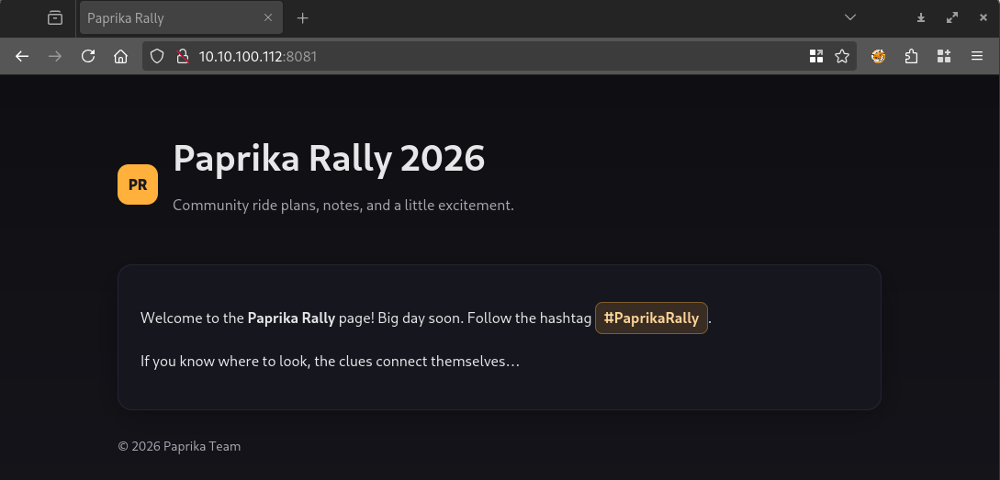
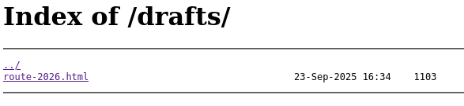
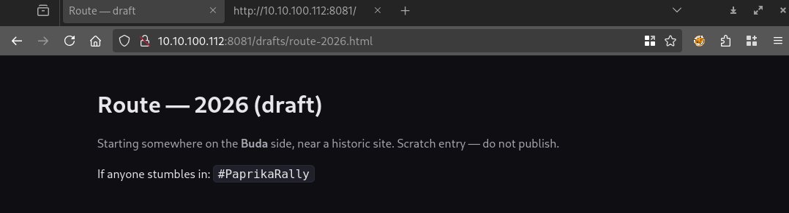

# Visiting the site

Visiting the site gives us a basic page.



# Social media

There are a bunch of tags and users found in the src, but they looks like rabbit holes. Like `goulashguru`, `PaprikaRally`, `twitter: @paprikarally`.

# Comments

There is a comment on the site.

```html
<!-- TODO: clean the drafts folder before going live -->
```

# Directory listing

The drafts folder mentioned has directory listing with an another html.



# Second page



The html has a hidden link.

```html
<a href="/lostandfound/secret" hidden aria-hidden="true">lost</a>
```

# Secret

It is broken, but the folder has another dir listing, with the file with a `txt` extension instead.

```
3VuLYSLxpRzgP3YrA9tUDG3asKWip6CWCe2UDp7td4AVK6cTwHGwB9WNHgtEn53mc5x1jvyLAbr6ALFtnSg3XWBDX8aQ
```

Base58 decoding it has the full flag.

```
TIME_LOCAL:2025-09-14 13:13
FLAG:CQ25{GUL_BABA_2026-02-28_13:13_PM}
```
# Flag
`{GUL_BABA_2026-02-28_13:13_PM}`

# Remarks
There is a `—` long dash usually found in AI answers to suggest it was made by AI.