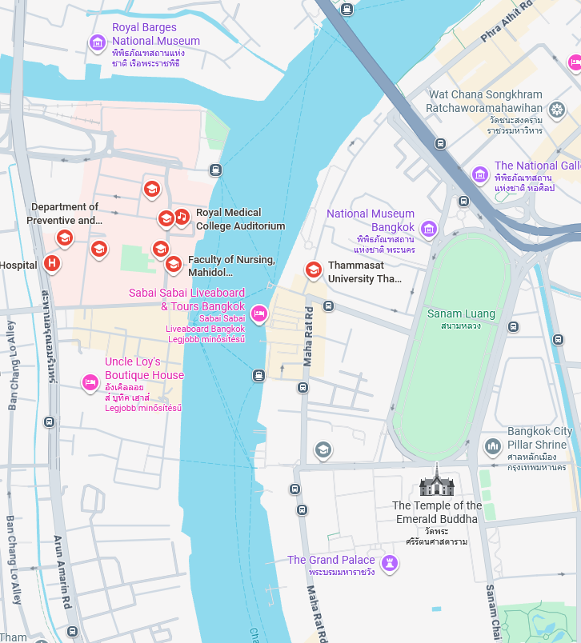
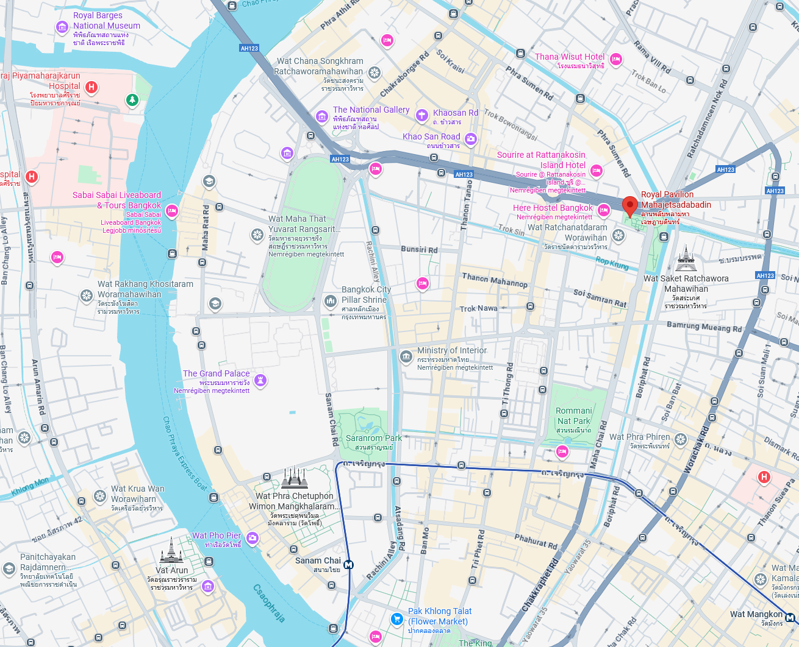
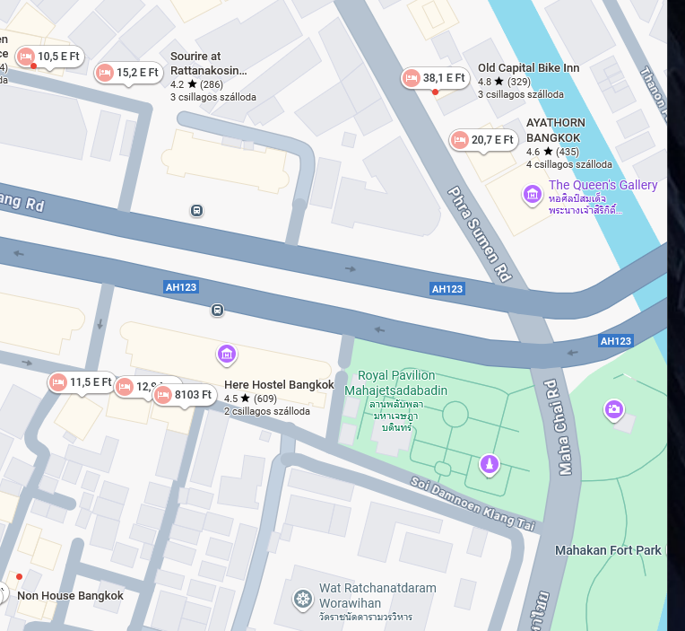

# Conversation

The [conversation.txt](files/conversation.txt) mentiones a few keys which can be used to set some constraints.

# Country

A country approximately 15 hours travel from Germany, outside of Europe. Probably flight time therefore somewhere in east Asia. They are not speaking mandarin, and using weird symbols.

This is leaving a few candidates only: Japan, Korea, Thailand, etc.

The soup is good/cheap. Some of the girls seems like having a male-ish face.

After this, Thailand is the main candidate.

# City

Based on the nearby palace and museums, some of the bigger cities. Most probably the capital.

There is a river, palace, medical school and a museum near each other and it is walking distance from the hotel. The city should also have a metro system.

The capital, Bangkok is the main candidate.




While they do not enclose a place, they are much more closer than the other options, like Tokyo or Seoul, where the river is not even nearby.

# Hotel

The hotel should be near the royal `royal pavillon`. The Royal Pavilion Mahajetsadabadin is near walking distance and the metro is also near. This fits the conversation well.



There are many hotels nearby. Unfortunately none of them worked.



```
CQ25{thailand-bangkok-ratchadamnoenresidence}
CQ25{thailand-bangkok-ayathornbangkok}
CQ25{thailand-bangkok-siamchampselyseesiuniquehotel}
CQ25{thailand-bangkok-baandinso}
CQ25{thailand-bangkok-royalrattanakosinhotel}
CQ25{thailand-bangkok-oldcapitalbikeinn}
CQ25{thailand-bangkok-nappinesshotel}
CQ25{thailand-bangkok-sourireatrattanakosinislandhotel}
CQ25{thailand-bangkok-dinsomonhotel}
CQ25{thailand-bangkok-methavalairesidencehotelbangkok}
```

# Hostel

After trying many hotels, I tried the nearest accommodation as well. It was not a hotel but a hostel, [Here Hostel Bangkok](https://maps.app.goo.gl/6hqnT6bcYNWyNnHt5)


# Flag
`CQ25{thailand-bangkok-herehostelbangkok}`