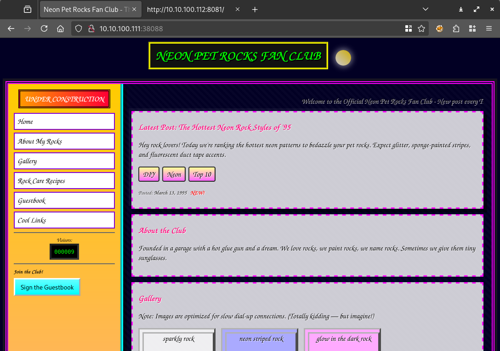
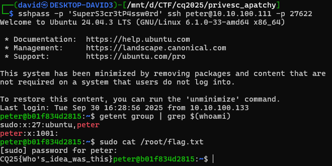
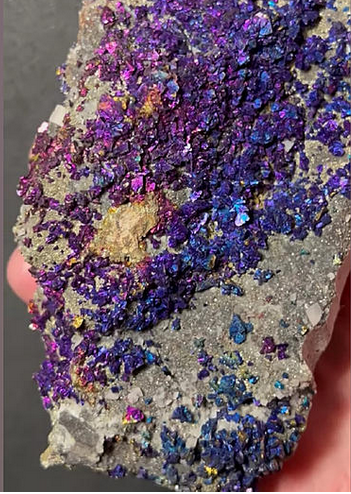
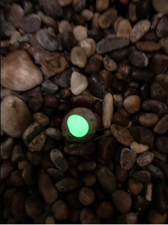

# Port scan

There are 2 ports. Scanning them reveals an SSH and HTTP server.

```bash
nmap -T4 -Pn -sV 10.10.100.111 -p27622,38088
```

```
Starting Nmap 7.95 ( https://nmap.org ) at 2025-10-01 17:36 CEST
Nmap scan report for 10.10.100.111
Host is up (0.0066s latency).

PORT      STATE SERVICE VERSION
27622/tcp open  ssh     OpenSSH 9.6p1 Ubuntu 3ubuntu13.14 (Ubuntu Linux; protocol 2.0)
38088/tcp open  http    Apache httpd 2.4.58 ((Ubuntu))
Service Info: OS: Linux; CPE: cpe:/o:linux:linux_kernel

Service detection performed. Please report any incorrect results at https://nmap.org/submit/ .
Nmap done: 1 IP address (1 host up) scanned in 11.29 seconds
```

# Visiting the site

Visiting the site reveals some rock fan club. Not the music.



The images are broken. While the links are pointing to `/var/www/images/*.png`, there is no path traversal or similar.

# Password

Checking the source, there is a hidden message.

```html
<p hidden>Peter you big dumb idiot if you forget your password again I'll kick your ass - peter:SuperS3cr3tP4ssw0rd</p>
```

# SSH

The credentials found work on the SSH server.

```bash
sshpass -p 'SuperS3cr3tP4ssw0rd' ssh peter@10.10.100.111 -p 27622
```

And peter has sudo rights. Revealing the flag.




# Flag
`CQ25{Who's_idea_was_this}`

# Images
While the image sources are broken, the images are still there.




