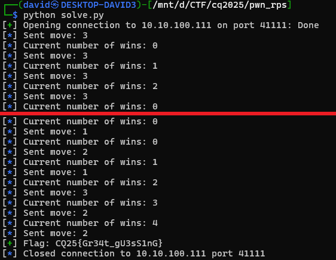

# Source code

Checking the source code reveals a few things.

There is a server listening for new connection. It is a simple Rock Paper Scissor game. Winning 5 times in a row (no tie or lose) prints the flag.

# Random

While the title suggests that prediction can be made, as multiple games are played in the same executable and there is no seed, the random number is not really predictable.

Leaking the result of random function is impossible, only the result of `rand() % 3` is known, which is not nearly enough to recover the internal state of the random generator, even with many attempts.

# Brute force

While the challenge is against this, this seems the only feasible way. Just play until we have 5 wins. This should not be too many games though, it is in the range of hundreds of games.

Implementing a solver that just plays until flag is found in [solve.py](workdir/solve.py).

# Flag
`CQ25{Gr34t_gU3sS1nG}`