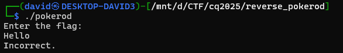
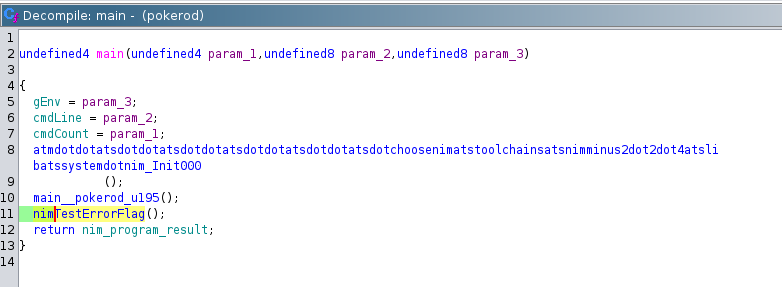
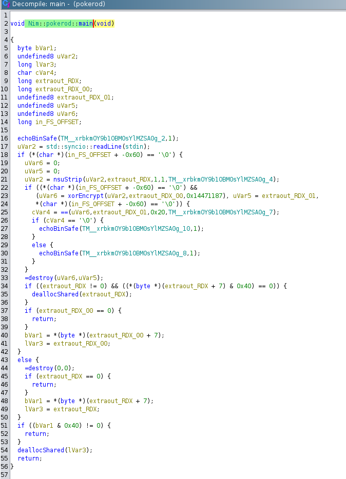
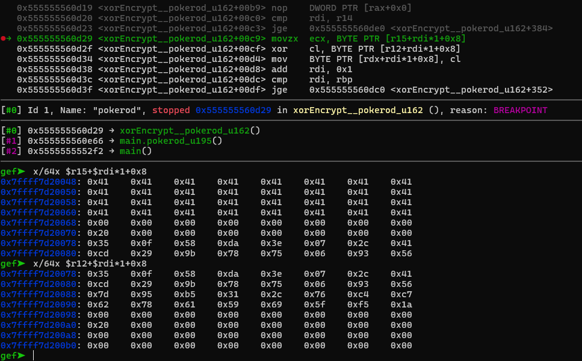
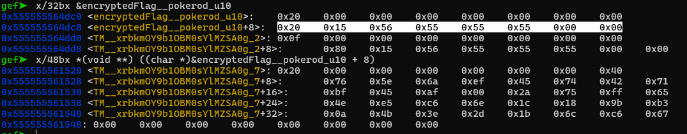
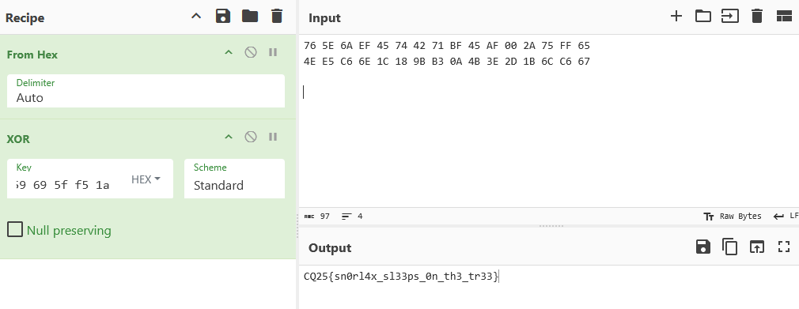

# Running the program

Running the program. It is asking for a flag and validating it.




# Nim

The binary is not striped/obfuscated. Opening the code in ghidra or gdb, the name mangling reveals that it is using [Nim](https://github.com/nim-lang/Nim/).



The tool [Nimfilt](https://github.com/eset/nimfilt) can be used to make the strings more pretty, but it not that big of a help.

Ghidra decompiled c codes are saved.

[pokerod_ghidra.c](workdir/pokerod_ghidra.c)
[pokerod_ghidra_nim.c](workdir/pokerod_ghidra_nim.c)

# Main

Checking `Nim::pokerod::main` (`main__pokerod_u195`) reveals the actual program.



It has some string obfuscation/encryption. The `echoBinSafe` is printing something.

It is printing, doing a readline, the doing a strip, xor and a comparison. Then based on the results, it is printing one of the 2 things.

This correlates with the observed run of the program.

# Debugger

Doing dynamic analysis and checking values, jumping around has more feedback.

After stopping here and there, the observations above can be verified during runtime.

```
br *main__pokerod_u195     # main
br *main__pokerod_u195+32  # readline -> 0x5555555666b0
br *main__pokerod_u195+37  # after readline
br *main__pokerod_u195+163 # if check for correct
br *main__pokerod_u195+172 # print incorrect
br *main__pokerod_u195+231 # print correct
```

Just jumping to the correct print does not do anything special, it is just printing `Correct!` 

# XOR

Stopping right before doing the actual `xor` instruction reveals the key and the input.

```
br *main__pokerod_u195+113 # xor encrypt
br *xorEncrypt__pokerod_u162+201 # inside xor encrypt
br *main__pokerod_u195+118 # after xor encrypt
```

The only trick here is that big enough initial input is required, as only that many character is used for the key as well.



One of them is our input and the other is the key.

```
35 0f 58 da 3e 07 2c 41 cd 29 9b 78 75 06 93 56 7d 95 b5 31 2c 76 c4 c7 62 78 61 59 69 5f f5 1a
```

# Check

Stopping somewhere near the check, the debug symbols help a lot: `encryptedFlag__pokerod_u10` is highlighted.

```
br *main__pokerod_u195+151
```

Checking the structs, Nim strings behave a little differently from c.

```
x/32bx &encryptedFlag__pokerod_u10
x/48bx *(void **) ((char *)&encryptedFlag__pokerod_u10 + 8)
```



```
76 5E 6A EF 45 74 42 71 BF 45 AF 00 2A 75 FF 65 4E E5 C6 6E 1C 18 9B B3 0A 4B 3E 2D 1B 6C C6 67
```

The flag is just xoring the encrypted flag and the previous key. 



# Flag
`CQ25{sn0rl4x_sl33ps_0n_th3_tr33}`