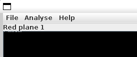
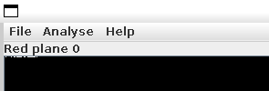
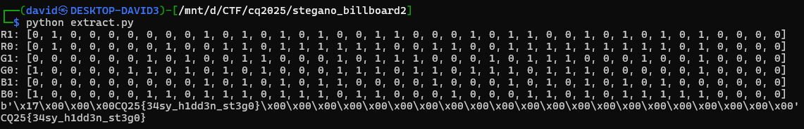
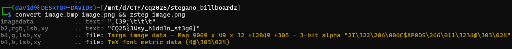

# LSB

Opening the file with [Stegsolve](http://www.caesum.com/handbook/stego.htm) reveals some data in the 2 least significant bits.

The normally black parts have some mild changes at the very beginning.





# Pattern

A small lsb extractor was written and used to view the bits and reconstruct them.

At first only the bits were printed in the channels, using the `extract_lsb_bits` from the final extractor, and manually shuffling the rows/bits.

```
R1: [0, 1, 0, 0, 0, 0, 0, 0, 0, 1, 0, 1, 0, 1, 0, 1, 0, 0, 1, 1, 0, 0, 0, 1, 0, 1, 1, 0, 0, 1, 0, 1, 0, 1, 0, 1, 0, 0, 0, 0]
R0: [0, 1, 0, 0, 0, 0, 0, 1, 0, 0, 1, 1, 0, 1, 1, 1, 1, 1, 1, 0, 0, 1, 1, 0, 0, 1, 1, 1, 1, 1, 1, 1, 1, 1, 0, 1, 0, 0, 0, 0]
G1: [0, 0, 0, 0, 0, 0, 1, 0, 1, 0, 0, 1, 1, 0, 0, 0, 1, 0, 1, 1, 1, 0, 0, 0, 1, 0, 1, 1, 1, 0, 0, 0, 1, 0, 0, 1, 0, 0, 0, 0]
G0: [1, 0, 0, 0, 0, 1, 1, 0, 1, 0, 1, 0, 1, 0, 0, 0, 1, 1, 1, 0, 1, 1, 0, 1, 1, 1, 0, 1, 1, 1, 0, 0, 0, 0, 0, 1, 0, 0, 0, 0]
B1: [0, 0, 0, 0, 0, 0, 0, 0, 0, 1, 0, 1, 0, 1, 0, 1, 1, 0, 0, 0, 0, 1, 0, 0, 0, 1, 0, 1, 0, 1, 0, 1, 0, 1, 0, 0, 0, 0, 0, 0]
B0: [1, 0, 0, 0, 0, 0, 1, 1, 0, 1, 1, 1, 0, 1, 1, 1, 0, 1, 1, 0, 0, 0, 1, 0, 0, 0, 1, 1, 0, 1, 0, 1, 1, 1, 1, 1, 0, 0, 0, 0]
```

```
C: 01000011
Q: 01010001
c: 01100011
q: 01110001
```

Looking for the above patterns for ascii chars, it was apparent that the order is r1, r0, g1, g0, b1, b0. It starts after a few bits. There are some zeros then it starts with the flag prefix.

# Extractor

The [extrac.py](workdir/extract.py) does the reconstruction.



The first 4 bytes look like the length, and there is the flag afterwards, followed by zeros.

# Flag
`CQ25{34sy_h1dd3n_st3g0}`


# Easier solution

Zsteg couldn't find the bits in the bmp, but it works with png. PNG is lossless, therefore it keeps the LSB.

```bash
convert image.bmp image.png && zsteg image.png
```



