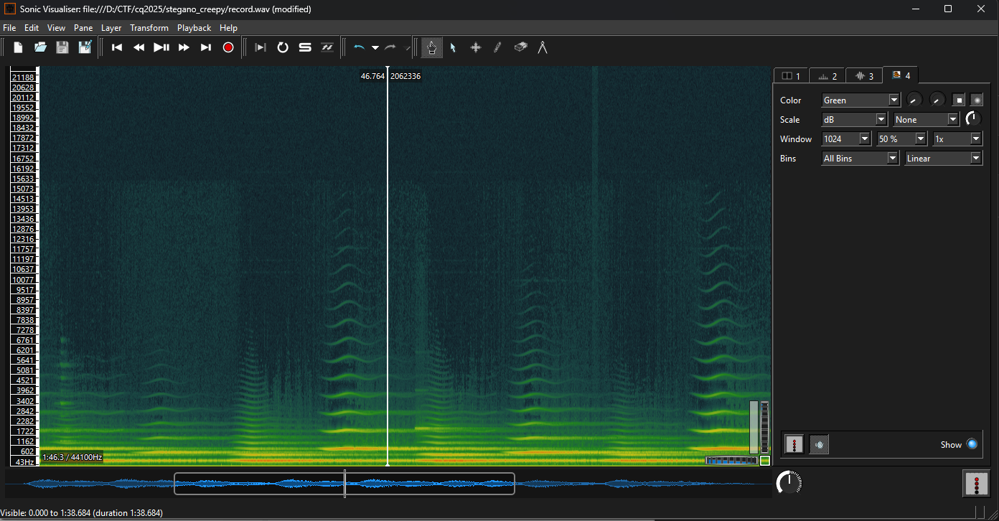
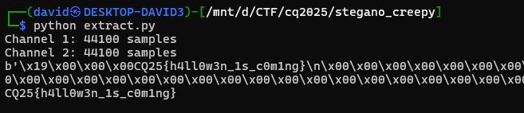

# Tools

Checking with many stego tools for wav files lead to nothing.

# Spectogram

Checking the spectogram reveals no hidden message there.



It shows some artifact at exactly 1 minute.

# Pattern

A small lsb extractor was written and used to view the bits and reconstruct them at 1 minute.

```
C0 [0, 0, 1, 0, 0, 0, 0, 0, 0, 0, 0, 0, 0, 0, 0, 0, 0, 0, 0, 1, 0, 0, 0, 0, 0, 1, 0, 1, 0, 1, 0, 0, 0, 1, 1, 1, 0, 1, 1, 0]
C1 [0, 1, 0, 1, 0, 0, 0, 0, 0, 0, 0, 0, 0, 0, 0, 0, 1, 0, 0, 1, 1, 1, 0, 1, 0, 1, 0, 0, 0, 1, 1, 1, 1, 1, 0, 1, 1, 0, 0, 0]
```

```
C: 01000011
Q: 01010001
c: 01100011
q: 01110001
```

Looking for the above patterns for ascii chars, it was apparent that the order is c0, c1. It starts after a few bits. There are some zeros then it starts with the flag prefix.

# Extractor

The [extrac.py](workdir/extract.py) does the reconstruction.



The first 4 bytes look like the length, and there is the flag afterwards, followed by zeros.

# Flag
`CQ25{h4ll0w3n_1s_c0m1ng}`