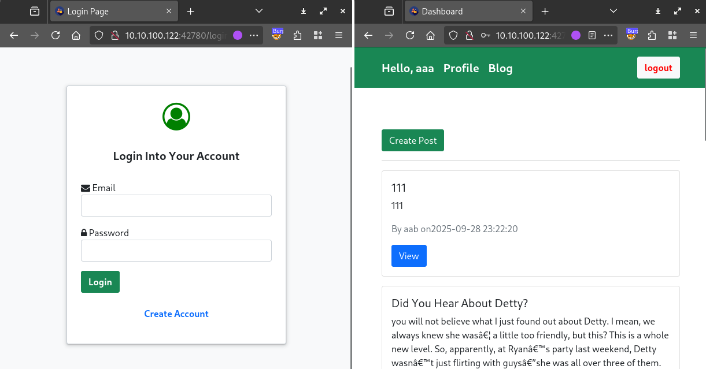
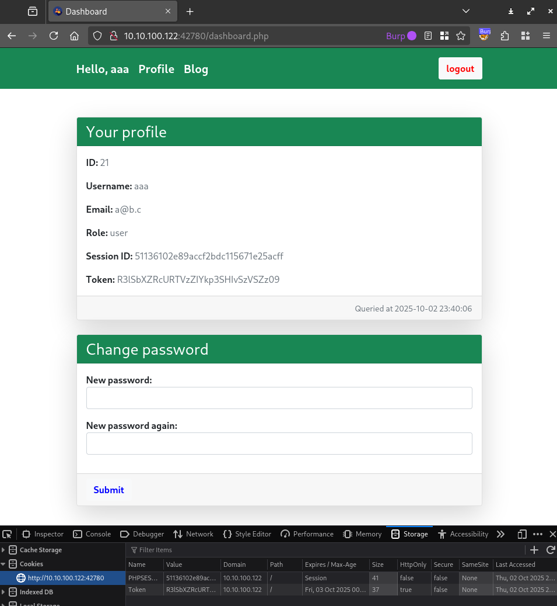
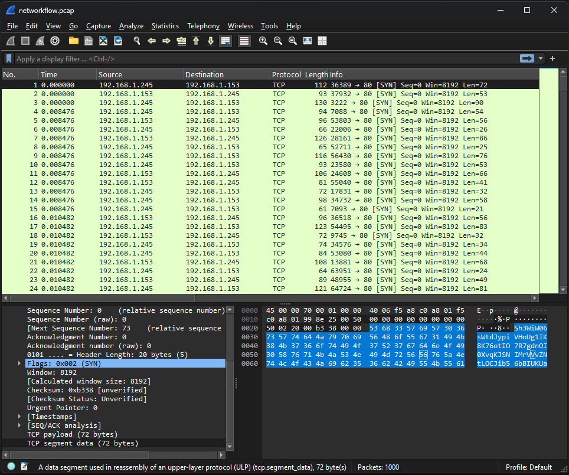
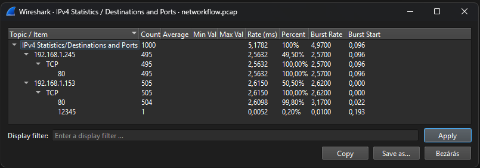
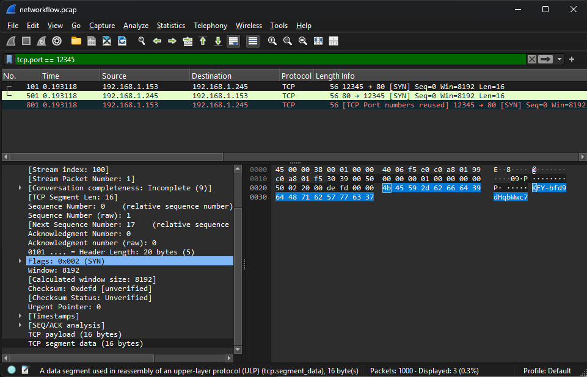
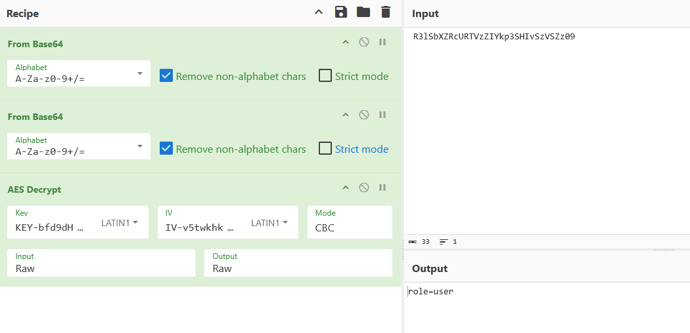
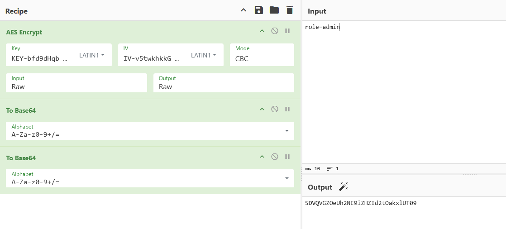
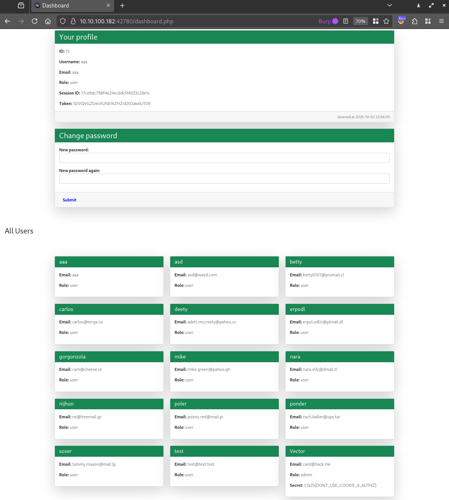

# Visiting the site

The website is a blog site with comment functionality. Everything is hidden behind authentication, but registration is open.



# Token

The profile has some user data. It also shows the session id and some unknown token. The two latter is stored in the cookies and just reflected directly.




The token looks like base64 encoded, but after that it also looks like base64 encoded again or similar, but it can not be decoded easily. Changing it does not seem to affect anything. It always has the value `R3lSbXZRcURTVzZIYkp3SHIvSzVSZz09` regardless of server or user.

# Pcap

The packet capture has no real traffic. It is just a bunch of `TCP` `SYN` packets, with some encoded data that looks base64.



There is 1 outlier, which is using port `12345`.



And it has a slightly different data inside.



```
KEY-bfd9dHqbWwc7
uPjY9CbmkE6f7pxu
IV-v5twkhkkGXZ2x
```

# AES

The key `KEY-bfd9dHqbWwc7uPjY9CbmkE6f7pxu` and iv `IV-v5twkhkkGXZ2x` from the pcap can be used to decode the token, after the 2 base64 decodes.

Cyberchef was [used](https://gchq.github.io/CyberChef/#recipe=From_Base64('A-Za-z0-9%2B/%3D',true,false)From_Base64('A-Za-z0-9%2B/%3D',true,false)AES_Decrypt(%7B'option':'Latin1','string':'KEY-bfd9dHqbWwc7uPjY9CbmkE6f7pxu'%7D,%7B'option':'Latin1','string':'IV-v5twkhkkGXZ2x'%7D,'CBC','Raw','Raw',%7B'option':'Hex','string':''%7D,%7B'option':'Hex','string':''%7D)&input=IFIzbFNiWFpSY1VSVFZ6WklZa3AzU0hJdlN6VlNaejA5).



# Admin

The token stores our role. Now that we know how it is generated, changing it to admin is possible: `SDVQVGZOeUh2NE9iZHZId2tOakxlUT09`.

Cyberchef was [used](https://gchq.github.io/CyberChef/#recipe=AES_Encrypt(%7B'option':'Latin1','string':'KEY-bfd9dHqbWwc7uPjY9CbmkE6f7pxu'%7D,%7B'option':'Latin1','string':'IV-v5twkhkkGXZ2x'%7D,'CBC','Raw','Raw',%7B'option':'Hex','string':''%7D)To_Base64('A-Za-z0-9%2B/%3D')To_Base64('A-Za-z0-9%2B/%3D')&input=cm9sZT1hZG1pbg) again.



Changing the token reveals the flag on the profile page, in the list of users. It also allows deleting stuff from the blog.



# Flag
`CQ25{DONT_USE_COOKIE_4_AUTHZ}`