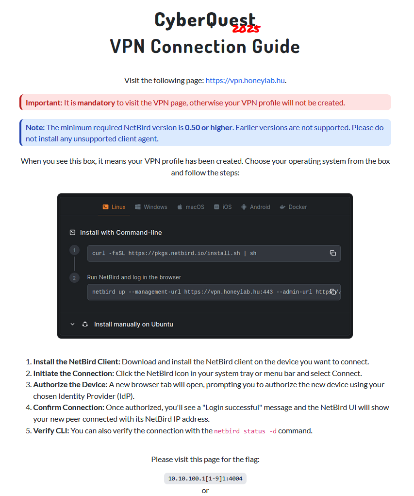
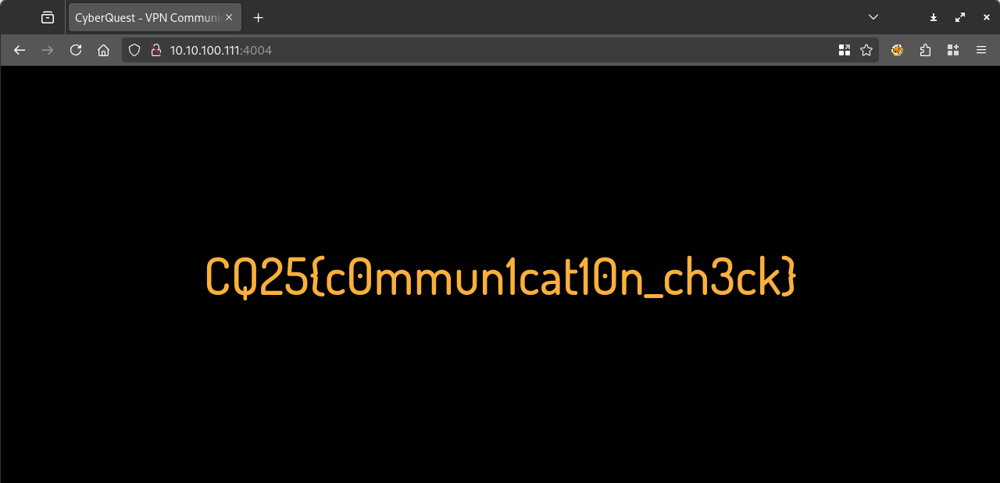

# Visiting the site

Visiting the site gives us the guide to the VPN.



# VPN

The VPN is [netbird](https://netbird.io/). Not really enterprise ready. 

Personally had issues connecting, after SSO auth, the page gave 404, not allowing to set up the interface. Support helped me solve with a generated code.

It is actively modifying your DNS resolver locally, which can lead to unexpected surprises.

Under WSL2, you have to manually start the service after start.

```bash
sudo nohup netbird service run > /dev/null 2>&1 &
```

# Sanity check



# Flag
`CQ25{c0mmun1cat10n_ch3ck}`