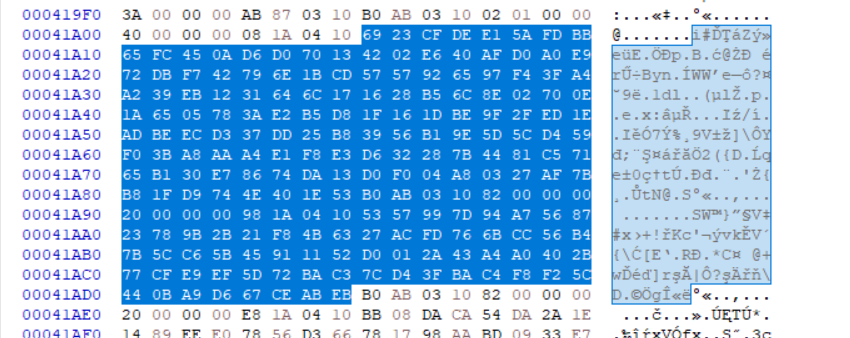
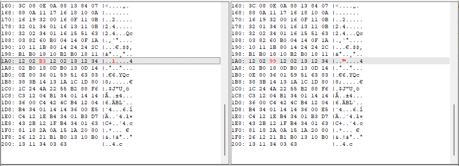

# Bonus

These are some of the things I've done after the challenge. Most of these were forbidden because of the focus of the challenge was elsewhere. 

# Secrets

The secrets can be found in plaintext form inside the firmware. Could have been used after partially recovering the key, and looking for that substring, but it was outside of the scope.



# Binary patching

The original firmware is in [fw.bin](bonus/fw.bin) for reference.

The Micropthon firmware had the modules as frozen modules to prevent easy extraction from the internal `littleFS` filesystem. See `picotool info` [info_all.txt](bonus/info_all.txt).

These are compiled to [mpy files](https://docs.micropython.org/en/latest/reference/mpyfiles.html) and integrated into the firmware. Similarly an mpy file can be installed to the internal storage as obfuscation without freezing the module, but that would enable modifying some other functionality.

As the source code is available, compiling the py files to mpy can be done with [mpy-cross](https://github.com/micropython/micropython/blob/master/mpy-cross/).

```bash
python -m mpy_cross -march=armv6m file.py -o file.mpy
```

Very small modification result in almost exactly the same binary. Such modification are modifying strings or using different (already used) variables in functions.

Running `mpy_cross` on the slightly modified python results in very similar code. The difference can be checked easily. The frozen modul in the firmware can be found easily as well with a few bytes long nearby pattern as well. This makes easily patching this 1 byte different things.

## Board swap
I wanted to further tinker with the challenge at home with the devices I have, but I had different RP2040 based device, YD-RP2040, a cheap chinase Pico variant with LED which could be utilized as the TPM LED. 


It was faster to do this than installing a new Micropython with the sources.

Switching `Pin(active_pin, Pin.OUT)` in [tpm.py](bonus/tpm.py) to `Pin(25, Pin.OUT)` results in very small change in the mpy file.



The [fw_mod_yd2040.bin](bonus/fw_mod_yd2040.bin) is this modified firmware.

The [fw_mod_gpio15.bin](bonus/fw_mod_gpio15.bin) is another one for GPIO PIN 15 instead for easier probing.

## Printing secrets
Why stop there if I can actually print out the secrets now?

Swapping `write_line(repr(e))` in [main.py](bonus/main.py) in the exception handling to `write_line(repr(d))` results another single byte change :). Forcing an exception after can be done by sending some invalid input (eg odd length data), printing out the secret key instead of the exception text.

The [fw_mod_d.bin](bonus/fw_mod_d.bin) is printing `d` on exception.

The [fw_mod_n.bin](bonus/fw_mod_n.bin) is printing `n` on exception.


## String swaps
It was not attempted, but patching the blacklisted message to something else would also allow signing the required message, resulting in a bypass without even some mpy compilation. This does not recover the key though.

# Regulator design
As a tip from the creators, you'll need custom regulator design to run the challenge at home, because without it you cannot have larger resistors than a few ohms without the chip brownouting and then you cant measure anything.


The red board we received had this schematics (does not show that R21 should not be populated, otherwise the power sensing will not work): 


TODO: Add actual PDF as it is redacted for the request of creators until finalized

[MISSING 900-007-B_PowerAnalysis_RP2040_DUT_Schematics.PDF](bonus/900-007-B_PowerAnalysis_RP2040_DUT_Schematics.PDF)
