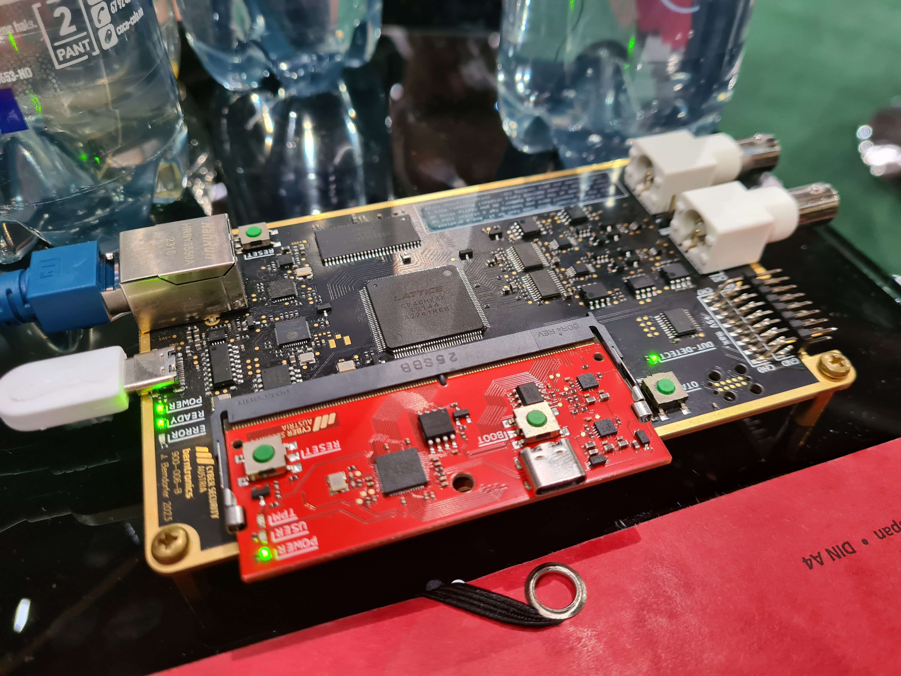

# ECSC23 Coach HW challenge

Team Austria offered a hw challenge for coaches.

> 
>
> @coaches: If anyone likes to take a break from memeing around and is interested, drop by for a **power-analysis hardware coach-challenge**!
> We're in the coach zone near the corner where team czechia is at.
>
> 

We received the `BitBuster` FPGA based oscilloscope (black), the RP2040 based TPM-like target (red) that went into a DDR4 slot. Also the basic software for the oscilloscope and help setting up the basic environment.

Reverse engineering and/or FW modifications were not an option to make the challenge fun. To ease things, the entire source code was handed over except the secrets required for the signature.

The goal was to sign a certain message that the TPM was refusing to sign and send it to a flag server.

The source code and the [BitBuster Simple GUI](https://bitbuster.eu/simple-gui/) (software for the oscilloscope) can be found in [deployment_cc2.zip](files/deployment_cc2.zip) and [simple-gui.zip](files/simple-gui.zip).

As a bonus, some FW hacking can be found in the bonus section, after the challenge was solved.

The original FW can be found in [fw.uf2](files/fw.uf2).

# Writeup

[Writeup](WRITEUP.md)

# Bonus

[Bonus](BONUS.md)
