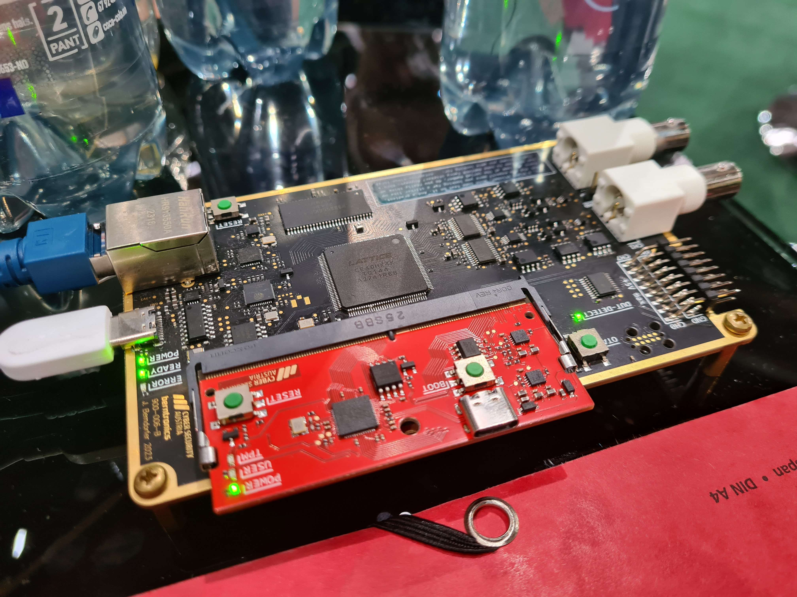
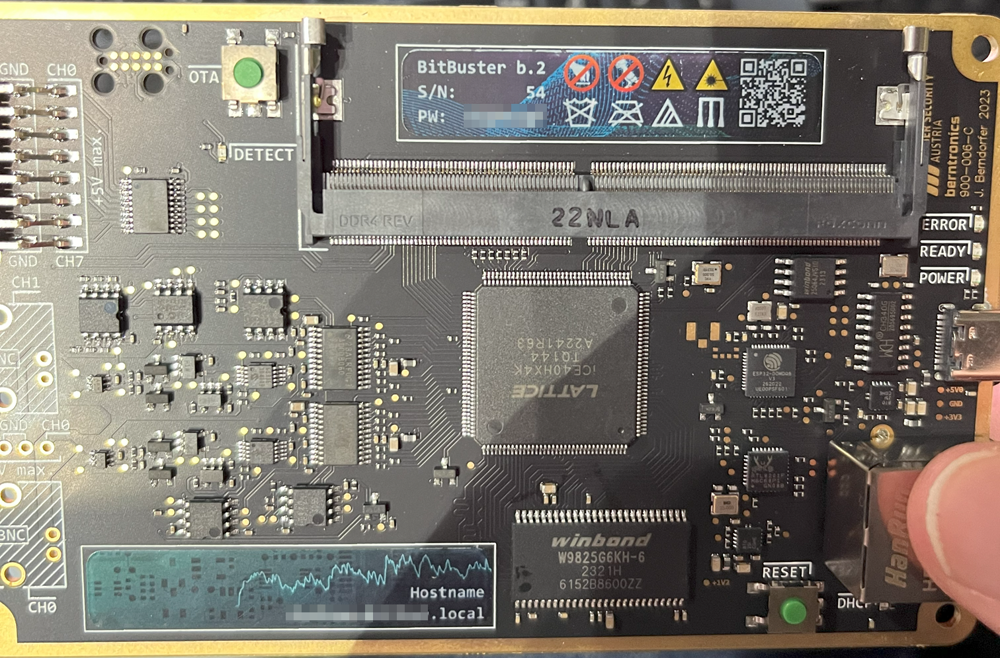
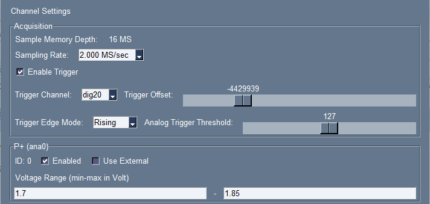
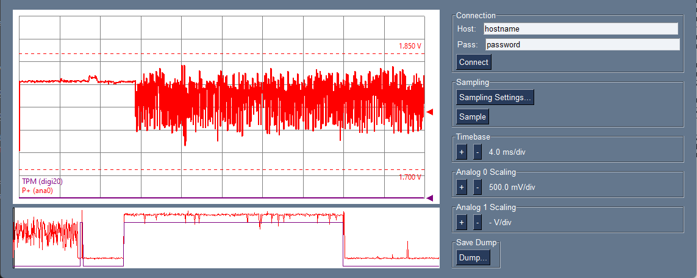
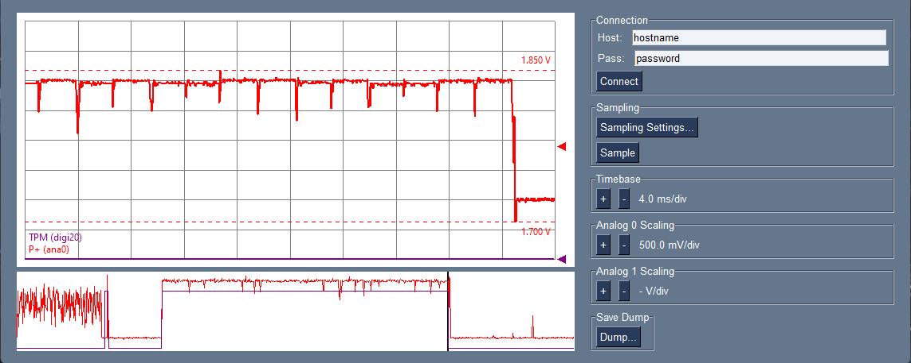
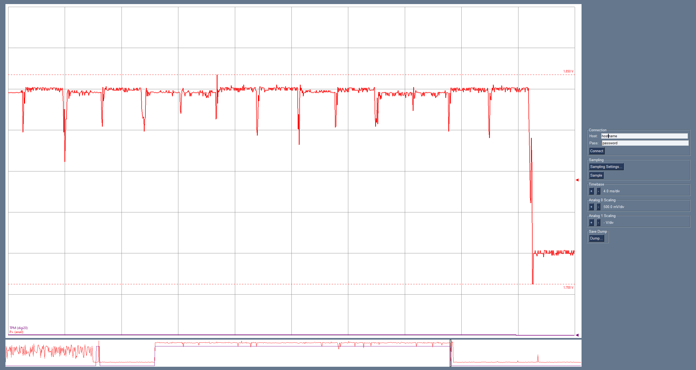
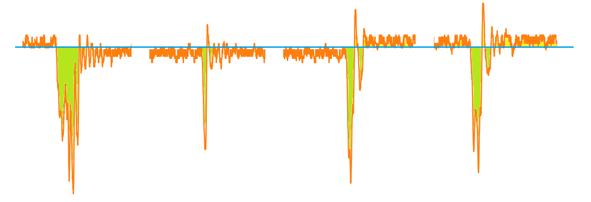
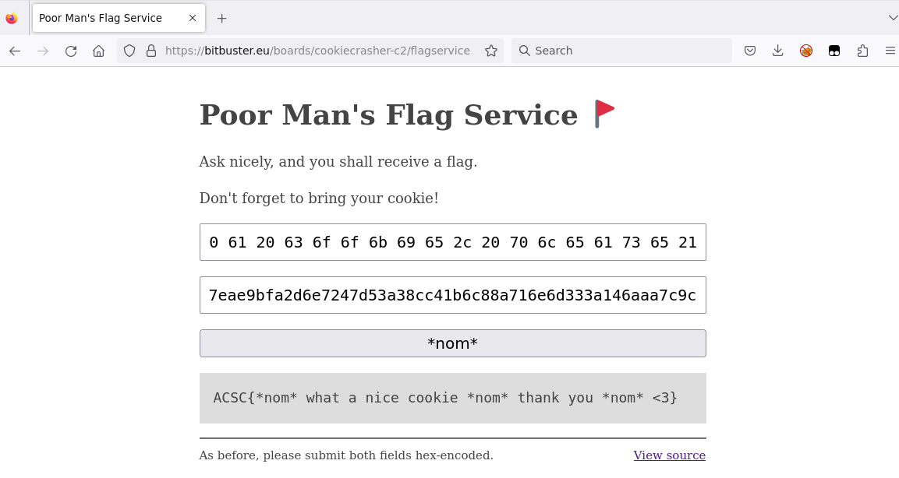

# Power curves

## Setup

The `BitBuster` communicates with the `Simple GUI` software over network via ethernet cable as a regular DHCP client. It also required power via USB type C.

The UART is forwarded from the target over the network as well.





A small travel router was used to connect the PC and the oscilloscope to a network.

Some tips were given out regarding the voltage range and trigger settings.
 - TPM led on digi20 can be used as trigger
 - Approximate sampling rate and trigger offset
 - The core voltage is around 1.8V

## Setting the parameters

After booting up, the TPM module was waiting for user input (hexadecimal) and signed the output. Lighting the TPM LED during the signature setup and process.

```
> 41
41
Processing... this may take a while
Here you go:
8b8bbb407cb47e3092796b83ebf5e122ba583c6a8853b0621628bfbf95e7aae1
75a4e523cb35f3a0c391c4cd389c1fb4b2ff71d8e90b49090364d6719e35e835
730f925b3e761024e4f1a8595f9651c91f1013e2ae4ba2b8e1262848ba4381fa
5dca63f0fc056508098e6db468f7750a67b8369ad8af3d5583f90f76386251da
```

After some experimentation similar to the following settings were used.
 - The recommended TPM LED `digi20` enabled and used as trigger.
 - The recommended trigger offset.
 - Analogue `ana0` enabled, voltage range 1.7V - 1.85V.
 - Sampling rate 2MS/s.




The scope had fixed 16MiB storage for the data. These settings captured the full process and had data before and after. The analogue resolution is 256, so the voltage range had to be set to a narrow enough. but not too narrow range.

## Simple GUI

The `Simple GUI` offered basic functionality for setting the parameters, doing the capture and dumping the data. It could be also used to check the shape of the captured data option for basic look around.

Very beginning of the capture.



At the end of the TPM operation.



Resizing the window for better visualization.



## Dumps

The settings above looked good enough, but the tool reached it's limitations. The data was extracted and a dump was created from the analogue channel. Further analysis revealed that the dump has missing information and noisy here and there, therefore more dumps were created later with similar settings. 

The dumps be found in [dumps.zip](workdir/dumps.zip).

Some communication for signing messages can be found in [comm.txt](workdir/comm.txt).

# Source code

The [deployment_cc2.zip](files/deployment_cc2.zip) has the source files for most things.

The `cookie-crasher` is running on the TPM via Micropython. It is hashing the message and doing a simple RSA with modular pow on the hash. Turning on the LED at that 2 functions. This is why there are 2 parts where `digi20` is high in our runs, the hashing part is the shorter, the encryption is the longer.

```python
def tpm(func):
    def wrapper(self, *args, **kwargs):
        # Ensure TPM led is active during security operations
        self.tpm_active.value(1)
        # allow LED to settle
        sleep_ms(10)
        x = func(self, *args, **kwargs)
        self.tpm_active.value(0)
        sleep_ms(10)
        return x
    return wrapper

class TPM:
    def __init__(self, d, n, active_pin):
        self.d = d
        self.n = n
        # self.tpm_active.value = Pin(active_pin, Pin.OUT)
        self.tpm_active = lambda: None
        self.tpm_active.value = lambda x: None # print(f"LED: {x}")
        self.tpm_active.value(0)

    # construct a full domain hash
    @tpm
    def fdh(self, message, bitsize):
        bytesize = (bitsize // 8)
        output = sha256(message).digest()

        while len(output) < bytesize:
            output += sha256(output).digest()

        return to_int(output)

    @tpm
    def sign(self, x):
        return modular_pow(x, self.d, self.n)
```

A modified version of the `cookie-crasher` can be found in [cookie-crasher_desktop](workdir/cookie-crasher_desktop/) that runs under regular (desktop) python. This was used to test the recovered secret later and to sign the blacklisted message.

The `flagserver` source has the `n` part, so only `d` is unknown. The goal is to find this.

# Patterns

As indicated, the `Simple GUI` reached it's limits for checking and processing the data. More robust approach was required.

MS Excel is quite flexible and visual. Easy to experiment with moderately sized data. In the first iteration, it was used to look into the data and look for patterns. To fit into the row limits, only every 10th data point was used.

The start of the process is really noisy, therefore the end was looked upon first. 

This revealed some interesting structures. There are mainly 4 different waves, and their order follow 2 different patterns.


These numbers are used later for referencing the shapes.

# Simple Power Analysis

The modular pow has the following source code in the target device. 

```python
def modular_pow(base, exponent, modulus):
    if modulus == 1:
        return 0
    result = 1
    base = base % modulus
    while exponent > 0:
        if int(exponent) % 2 == 1:
            result = result * base
        base = (base*base) % modulus
        result %= modulus
        exponent = exponent >> 1

    return result
```

The variable we look, `d` is passed as the exponent, `n` is passed as the modulus as usual. 

Based on the comment, it is an implementation of [right-to-left binary method](https://en.wikipedia.org/wiki/Modular_exponentiation#Right-to-left_binary_method). It has an optimization checking the exponent at the given binary digit and doing the multiplication part only if it makes sense.

This is exactly what can be seen in the patterns. There are a bigger `V` shaped wave followed by 1 or 3 other type of waves, depending whether there was multiplication inside the branch or not.

More information about this method in the following papers.

<https://www.jstage.jst.go.jp/article/elex/14/2/14_14.20162004/_article> # 2 Side channel attacks

<https://www.mdpi.com/2410-387X/4/2/15> # 3.1.1. Classic RSA Attack

After spotting the patterns, here are some of those with manual classification. [Manually classified patterns](screenshots/11.png): 

Looks like that pattern indeed repeats in the whole dump. There are a few noisier parts, this is why more dumps were created at this point.

# Classification

Given the waveform, we need to classify the different waves. Excel also reached it's limits, it is not flexible enough to actually process and classify the data. Python with `numpy` and `scipy` was used from now on.

The most important is somehow distinguish the loop starts and mark every operation. The `V` shaped slightly bigger wave, marked `4` earlier is a good candidate for loop marker.

The [plot.py](workdir/plot.py) was used to visualize the data or parts of it. Plotting an interactive graph. Looking for specific indices of interests, like beginning and end.


Beginning of the modpow operation.


End of the modpow operation.


The different dumps have really similar waveforms, sometimes shifted slightly.


## Manually one by one

There are thousands of waves, classifying them manually would be tedious and error prone task.

## Machine learning

It is quite distinguishable by a human to spot the patterns by eyeballing it, therefore a ML could do similarly. Unfortunately the sample size is not that big, and it would require labeling the data extensively, to the point where doing everything manually would be probably a better alternative. 

## Distance based

Matching the waves to a selected wave (or averages of waves) and using pointwise Euclidean distance to recognize the distance from the pattern works well for selecting neighboring patterns (even in smaller sets like last couple of waves). `Stumpy` was used for this task.


Unfortunately, the waves are quite close distance wise, so using the distance profile for classification was not that helpful.


## Manual algorithms

### Operations

Marking the operations is not that hard. There is always a big deviation from the (local) mean, while on normal cases there is not. Standard deviation amplifies this well in a given sliding window. Window size of 150 was used.

```python
window = 150
operation = np.std(np.lib.stride_tricks.sliding_window_view(data, window),1)
```


### Loops

After ~~some~~a lot of unsuccessful attempts, the following idea worked.

Note that wave `4` is mostly `V` shaped, going downwards. It also has bigger width compared to other waves (around 400 samples). This means that the "area" it has (negative values added negatively), especially if shifted to the global mean is significantly bigger than the other waves. (green negative, yellow positive)



```python
window = 400
loop = np.lib.stride_tricks.sliding_window_view((data-mean), window).sum(1)
```


### Peaks

Choosing the threshold and finding a single peak in a window (400) can mark each operation and loop. This can be found in [classify.py](workdir/classify.py).

```python
threshold = 5.3
window = 150
operation = (np.std(np.lib.stride_tricks.sliding_window_view(data, window),1) > threshold)
operation_peaks, _ = scipy.signal.find_peaks(operation, distance=400)
```

```python
threshold = -12.5
window = 400
loop = (np.lib.stride_tricks.sliding_window_view((data-mean), window).sum(1) < threshold*window)
loop_peaks, _ = scipy.signal.find_peaks(loop, distance=400)
```


This works most of the time, but there are some errors. For example the first here is not an error, as the peak is limited to 400 distance, the other 2 are actual problems. The second is a small noise/difference, resulting extra operation, the third has some noise/missing information (unclear if it was a measurement error or the target is doing some other task like garbage collection, but it is not important).


Most of these errors can be easily detected and fixed with the multiple dumps.

# Patterns

Now that we have a single peak only for each operation and loop, we can just go through them and generate a pattern. 
 - `L` will mark a loop, where there is a peak for both loop and operation nearby.
 - `o` will mark an operation alone, where there is no loop nearby.
 - Nearby is within 400 samples.

As the start was quite noisy and the more significant bits are at the end, the pattern was reversed before printing. See [pattern.py](workdir/pattern.py).

```python
pattern = []
index_loop_peak = 0
for index_opearation_peak in range(len(operation_peaks)):
    index_operation = operation_peaks[index_opearation_peak]
    while index_operation < loop_peaks_ext[index_loop_peak] or loop_peaks_ext[index_loop_peak+1] < index_operation:
        index_loop_peak += 1
    if (index_operation - loop_peaks_ext[index_loop_peak] < 400) or (loop_peaks_ext[index_loop_peak+1] - index_operation < 400):
        pattern.append("L")
    else:
        pattern.append("o")
pattern.reverse()
print(''.join(pattern))
```

Pattern `oooL` will correspond to `1` and `oL` to `0`.

# Error correction

The errors can be usually detected by simply spotting invalid patterns, like `ooL` or `LL`. Other method is checking multiple samples and if they differ, some must have errors.


Fixing is usually switching a letter or deleting some letters. It can be easily done with hand and a simple text editor. Each dump in it's own line. The differences can be seen, and resyncing the patterns can also be done visually.

Sometimes the fix is not that obvious from 4 dumps (e.g. no majority vote), but in that case, the index is easy to obtain for that pattern and can be done visually on an interactive graph. Like when there are `oooL` and `oLoL` in the picture above at the same index, there are 2 votes for each letter.


It can be clearly seen that this is not the start of the loop, so it should be `o` in this case (going from left to right on the image).

Repeating the process works well up until the very end with only a few visual lookup.


This is the really noisy part at the start. This is the least significant bit, as there are no place for more operation. Assuming the number is odd is a fair assumption. It would be even if one of the factors are even, but 2 is the only even prime. A single bit can be easily "bruteforced" as well.

```
oooLoLoooLoLoLoooLoooLoLoLoLoooLoooLoooLoooLoLoLoooLoLoLoLoLoLoLoLoooLoLoLoooLoooLoooLoLoLoooLoooLoooLoLoooLoLoLoooLooo
LoLoooLoooLoLoLoooLoLoLoLoooLoooLoooLoooLoooLoooLoLoooLoooLoooLoLoLoLoLoooLoooLoooLoooLoLoooLoooLoooLoLoooLoLoooLoooLoo
oLoooLoLoLoooLoLoLoooLoooLoooLoLoLoLoLoLoLoooLoooLoooLoLoooLoLoooLoLoLoLoLoLoLoLoLoooLoLoLoooLoooLoooLoooLoLoLoLoLoooLo
ooLoLoooLoLoLoLoLoLoLoLoooLoLoLoooLoooLoooLoooLoLoooLoooLoLoooLoLoLoooLoooLoooLoLoooLoLoLoooLoLoLoLoLoooLoooLoLoooLoooL
oooLoLoLoooLoooLoooLoLoLoooLoooLoLoLoLoLoooLoLoooLoooLoLoLoLoooLoLoooLoooLoLoLoooLoLoooLoLoooLoooLoooLoLoLoLoooLoooLooo
LoLoLoLoooLoLoooLoooLoLoLoLoLoLoLoooLoLoooLoLoLoLoooLoLoLoLoooLoooLoooLoooLoLoooLoooLoLoLoooLoLoooLoLoLoLoLoLoooLoooLoL
oLoooLoLoooLoooLoLoooLoLoooLoooLoLoooLoooLoooLoLoLoLoooLoooLoooLoooLoooLoooLoooLoLoLoLoooLoooLoooLoLoLoLoLoooLoooLoLooo
LoLoLoooLoLoLoooLoLoooLoLoooLoLoooLoLoooLoLoooLoLoooLoLoLoLoLoLoooLoooLoooLoLoooLoooLoooLoooLoooLoooLoLoLoLoLoLoooLoLoo
oLoooLoLoLoooLoooLoooLoLoooLoLoooLoLoLoLoooLoLoooLoooLoooLoLoLoLoooLoLoooLoooLoooLoLoooLoooLoLoLoooLoooLoooLoooLoLoooLo
LoooLoooLoLoLoLoooLoLoooLoLoooLoLoooLoooLoLoLoLoooLoooLoooLoLoLoooLoooLoLoooLoooLoooLoLoLoLoLoLoooLoLoLoooLoLoooLoooLoo
oLoLoooLoooLoooLoLoooLoLoLoooLoooLoLoooLoooLoooLoooLoooLoLoooLoLoLoooLoooLoooLoooLoooLoLoooLoooLoLoLoooLoLoooLoooLoooLo
ooLoooLoLoooLoLoooLoLoooLoooLoLoooLoLoLoLoooLoooLoooLoooLoLoooLoooLoooLoLoooLoooLoLoooLoLoLoooLoLoooLoooLoooLoooLoooLoL
oLoooLoooLoooLoooLoooLoooLoLoooLoooLoooLoooLoooLoLoLoLoLoooLoooLoooLoLoooLoLoLoLoooLoLoooLoooLoLoLoLoLoooLoooLoooLoooLo
ooLoooLoooLoLoooLoooLoLoLoLoooLoLoooLoooLoLoooLoLoooLoooLoooLoooLoLoLoLoooLoLoLoLoooLoooLoooLoLoooLoLoLoooLoooLoooLoooL
oLoLoLoLoLoLoLoLoooLoLoooLoLoooLoooLoLoLoooLoLoooLoLoLoLoooLoooLoLoooLoLoLoLoLoLoooLoooLoooLoLoLoooLoooLoooLoLoLoLoLoLo
LoLoLoLoLoooLoLoooLoLoLoLoooLoooLoooLoLoLoooLoooLoLoooLoooLoLoLoooLoLoooLoooLoLoooLoLoooLoLoLoooLoLoooLoLoLoLoLoLoLoooL
oLoooLoooLoLoLoLoLoooLoLoooLoooLoooLoLoooLoooLoLoooLoooLoLoLoLoooLoooLoLoLoooLoLoLoLoLoooLoooLoLoLoLoooLoLoLoLoooLoLoLo
ooLoLoooLoooLoooLoLoooLoLoooLoooLoLoLoooLoooLoooLoLoLoooLoooLoLoooLoLoLoLoooLoLoooLoLoooLoLoLoooLoLoLoLoLoooLoooLoooLoo
oLoooLoooLoooLoooLoooLoooLoLoooLoLoLoooLoLoLoooLoLoooLoooLoooLoLoooLoooLoLoLoooLoLoooLoooLoLoLoooLoLoLoooLoLoLoooLoLooo
LoLoooLoooLoooLoLoooLoLoooLoLoooLoooLoooLoooLoooLoLoLoooLoooLoLoooLoLoLoLoooLoooLoLoooLoooLoLoooLoooLoLoooLoooLoooLoLoL
oooLoooLoooLoooLoLoLoooLoLoooLoLoLoLoLoooLoLoooLoooLoooLoooLoLoooLoooLoooLoooLoooLoLoooLoooLoLoooLoooLoLoooLoooLoooLoLo
LoooLoLoooLoooLoooLoLoooLoLoLoooLoooLoLoooLoLoLoLoLoLoooLoooLoLoooLoLoLoLoLoooLoLoooLoLoooLoooLoooLoooLoLoooLoLoLoLoLoL
oLoooLoooLoooLoLoLoooLoooLoLoLoLoLoLoLoLoooLoLoLoooLoLoLoLoLoooLoLoLoLoLoooLoLoLoooLoooLoLoooLoooLoooLoLoLoLoLoooLoooLo
LoooLoLoLoLoLoooLoooLoLoooLoLoooLoooLoLoLoLoLoLoooLoLoooLoLoLoooLoLoLoLoooLoLoooLoooLoooLoooLoooLoooLoooLoLoLoLoooLoooL
oLoLoooLoLoooLoooLoLoooLoooLoooLoLoooLoooLoooLoooLoooLoooLoooLoooLoLoooLoLoooLoLoooLoooLoLoooLoLoooLoooLoooLoLoLoLoLooo
LoooLoooLoLoooLoooLoooLoooLoLoooLoooLoLoLoooLoooLoooLoooLoLoLoooLoLoLoLoooLoooLoLoooLoooLoLoooLoLoL????
```

Substituting `oooL` and then `oL` with the binary gives the recovered `d`.

```
10100110001111001000000010011100111010011011001000111111011100001111011101011110010011100000011101010000000010011110000
11010000000100111101101001110100100001101110011100110000101100010110010101110001110001011000000101000100011110110010100
00011001011010110111000111111100011100001101001001010101010101000001110111111000001011001110101000101110001011101100111
10101100010101011000111001101110000010010111011101001101111101001111101100101111101010110100011110111011010010111110011
11110111110000111010001011000011111110110001011010111100010001110100111100000000101011001010001101000001110011100000000
00101000111001101100101101010010100000010110000101110110110001100100001100010001001011101011001110011010001010100100001
11111111101001001011101100101100100100101011101010111110011010001101101101110011110010100001011110111110110110111001011
10100110100000110100001010111101000000111001100000001001000010000100110111000011010000110101100000101001000101111111000
1100101101110111111110101011010111000011101111011001111001000110110100?1
```

Alternative option (was not investigated) might be to use certainty when matching the waves and use brute force or lattice to decode the low certainty ones.

# Checking the result 
Inserting the number in the [secrets.py](workdir/cookie-crasher_desktop/secrets.py) file. 

```python
d = 0b101001100011110010000000100111001110100110110010001111110111000011110111010111100100111000000111010100000000100111100001101000000010011110110100111010010000110111001110011000010110001011001010111000111000101100000010100010001111011001010000011001011010110111000111111100011100001101001001010101010101000001110111111000001011001110101000101110001011101100111101011000101010110001110011011100000100101110111010011011111010011111011001011111010101101000111101110110100101111100111111011111000011101000101100001111111011000101101011110001000111010011110000000010101100101000110100000111001110000000000101000111001101100101101010010100000010110000101110110110001100100001100010001001011101011001110011010001010100100001111111111010010010111011001011001001001010111010101111100110100011011011011100111100101000010111101111101101101110010111010011010000011010000101011110100000011100110000000100100001000010011011100001101000011010110000010100100010111111100011001011011101111111101010110101110000111011110110011110010001101101001
d = 0x531e404e74d91fb87baf2703a804f0d013da7486e730b16571c581447b2832d6e3f8e1a4aaa83bf059d45c5d9eb15639b825dd37d3ecbead1eed2f9fbe1d161fd8b5e23a7805651a0e70028e6cb52816176c643112eb39a2a43ff49765925757cd1b6e7942f7db72e9a0d0af40e602421370d0d60a45fc65bbfd5ae1decf2369
d = 58367563017262022546877556742864536466019528888679929667973706854448492376164222234898085155053739004762307188970245660435125763213702209316324380573044161147784052335202030523344516330317367118977670724191569314940546297076822216137545109732692512584224755806690778843504547349499004534648168384973650207593
n = 117822798541930055185569963538998125003804653014766726749522356499722504923817982893134842814228943915330109229456754446126311745941489610422101611828238646577409180140644475514614937439655168904090026100858070707594140709111789427208493270936967230684017674204918428672286629795527710332575312166357025120673
```

Running now on the PC gives the same result as the device based one. This means the exponent was successfully retrieved.

```
> 41
41
Processing... this may take a while
Here you go:
8b8bbb407cb47e3092796b83ebf5e122ba583c6a8853b0621628bfbf95e7aae1
75a4e523cb35f3a0c391c4cd389c1fb4b2ff71d8e90b49090364d6719e35e835
730f925b3e761024e4f1a8595f9651c91f1013e2ae4ba2b8e1262848ba4381fa
5dca63f0fc056508098e6db468f7750a67b8369ad8af3d5583f90f76386251da
```

Signing the forbidden message is easy now.

```
I'd like a cookie, please!
49 27 64 20 6c 69 6b 65 20 61 20 63 6f 6f 6b 69 65 2c 20 70 6c 65 61 73 65 21
```

```
Processing... this may take a while
Here you go:
7eae9bfa2d6e7247d53a38cc41b6c88a716e6d333a146aaa7c9cc36d94a632c1
fa293ead9cd05e1dbf084a74f71fa910487630662fc21591fa98389e8a8d09e3
336c664e8a7f8ff9180b0c4906cd542daeeb84c72e5f15ef898078e89c0fd77d
8c662e9ef224c13b2d16a36b5f1d07ef98ee2d5882bbbe9a46a7585364c04900
```

Submitting on <https://bitbuster.eu/boards/cookiecrasher-c2/flagservice> gives us the flag.



# Flag 
`ACSC{*nom* what a nice cookie *nom* thank you *nom* <3}`