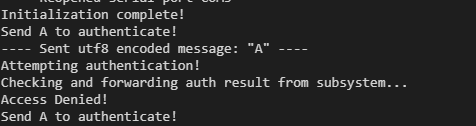
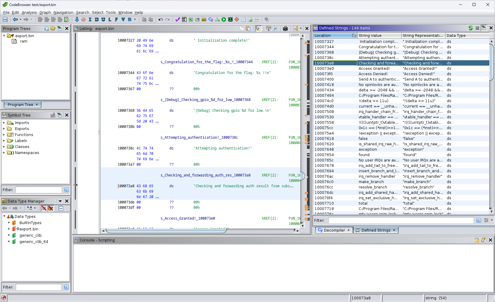
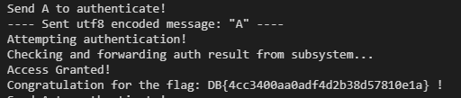

# Running it

Sending `A` on serial connection, it is attempting to authenticate.

# Import binary

To import binary from pico to Ghidra, these steps can be followed.

Put board into BOOT mode. (Press and hold BOOT while resetting, release after connected as mass storage)

Use `picotools save export.bin` to export it as bin file. Alternatively, the `uf2` can be converted as well, for example with [uf2conv ](https://github.com/microsoft/uf2/blob/master/utils/uf2conv.md).

Import file in Ghidra.

Select appropriate language: RP2040 is ARM Cortex M0+ (Armv6-M) Little Endian (LE). Base Address is 0x10000000. (See datasheet)

# Reversing

Under strings, you can find the `Checking and forwarding auth result ...` string. 

Only referenced in `FUN_100003cc`. It has 2 function calls to `FUN_10000394` and comparisons. Any of the calls returning true can satisfy the check. Parameters are `0x18` (24), `0xe` (14).

Based on the debug string, it is checking for GPIO low state.

On successful auth, the `FUN_1000035c` is called with parameter `0x101FF000`. 

Which in turn is decrypting the flag from the parameter given, with some sliding XOR.

`0x10000000` – `0x102000000` is the built-in flash (4MB for regular pico, see datasheet).

# Solution 1

Checking the pinout.

We have to short `GP24` or `GP14` to ground (low state). `USRKEY` button does that exactly.
Sending `A` while shorting any of these passing the authentication. 

# Solution 2

We can patch the check in the binary (e.g. removing the jump via hexedit) and reupload it to pass the auth.

# Solution 3

Read the encrypted data and do the decryption.

Implement our own fw to read the address above, and run the decryption.
Alternatively export that part with picotool (or manually from uf2) and manually reverse the encryption.

# Flag
`DB{4cc3400aa0adf4d2b38d57810e1a}`

# Fuzzing
The challenge was a little bit too simple. There were solutions just pressing the button while sending `A`.