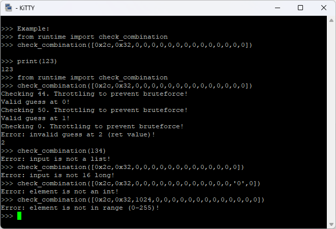
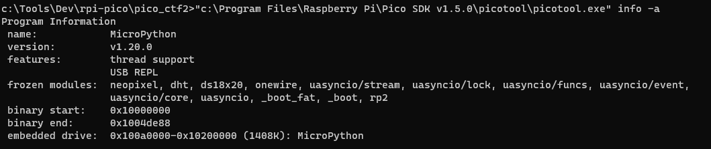
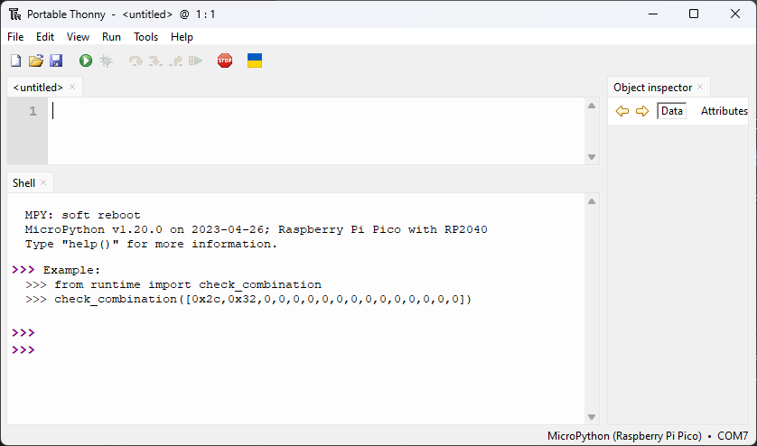
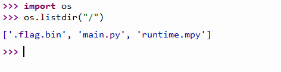
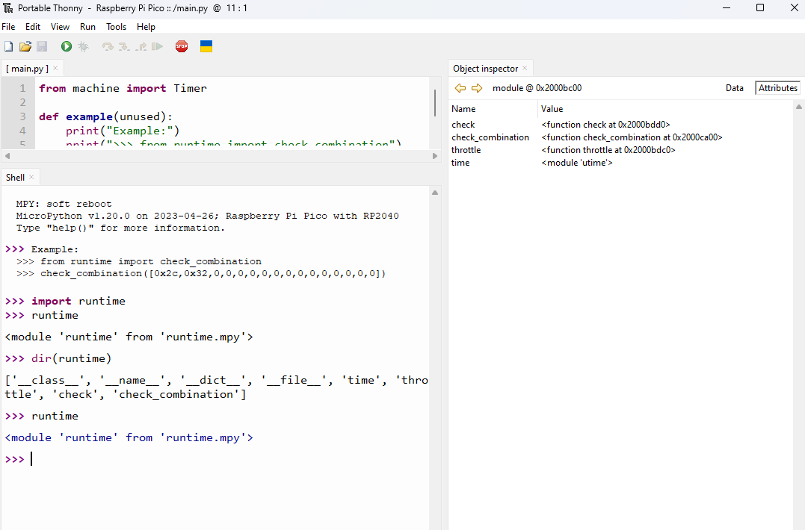
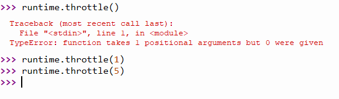
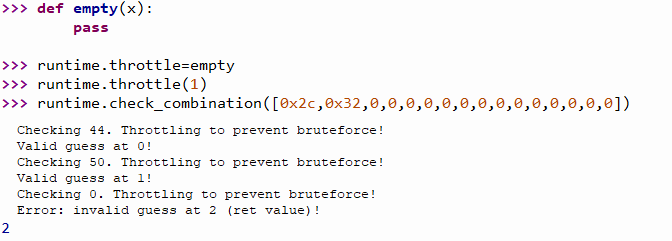
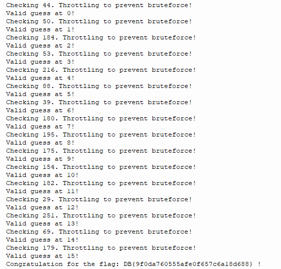

# Python

Opening a serial connection reveals a python interpreter with an example.

You have to guess the correct combination, 16 bytes long list, elements between 0-255. It also returns the position of the first incorrect number in the combination (starting at pos 2). Brute force is prevented by waiting some time for checks.

Picotool also reveals it is running MicroPython.

# IDE

[Thonny](https://thonny.org/) can be used to run code and look around in MicroPython.

Although it is not strictly necessery to use the IDE, as the interpreter is exposed on the COM interface.

# Looking around

Opening files reveal some of the files:

Other way is to use `os.listdir`. It also reveals some hidden file. It can be also toggled on the open dialog to show this.

We can actually edit the main as well and run our code, or use the interpreter.

The flag.bin is also not revealing anything.

The runtime.mpy is converted to code, so it is not readable, but can be imported like a regular python file. The Object inspector or the `dir` command reveals some internals.

Playing with the functions, looks like `throttle()` is delaying the execution with the parameter as seconds.

# Exploit

Monkey patching the throttle function to an empty one skipping all the wait time.

Bruteforcing after this is possible. Implementation is in [solution.py](workdir/solution.py). It should be still possible within a few hours with the throttle, but it was outside of the scope for this practice.

The flag is decrypted at the end.

# Flag
DB{9f0da760555afe0f657c6a18d688}