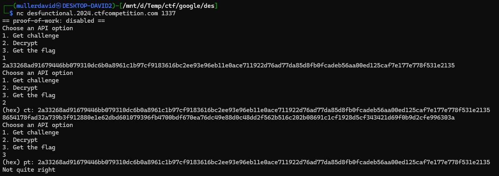

# Service

It is some encryption service, but something is strange.



# Source

Checking the [chall.py](workdir/chall.py) source, it is a DES encryption service.

We have 3 options.
1. Get challenge
    - sending an encrypted challenge string
1. Decrypt
    - we have 128 attempts to decrypt something
    - there is a catch, the key is corrupted before decryption, some bits are flipped, see [Flips](#flips).
1. Get the flag
    - sending the deencrypted challenge can be exchanged for the flag

The `key` and `iv` are random.

The [chall_mod.py](workdir/chall_mod.py) is just a modified version to print a lot of extra info.

# Flips


1. Each bit can only flip once
1. At start, every 8th bit is flipped
1. If everything is flipped and there is nothing more to flip, it starts from every 8th again
1. Before every decrypt, random number of them (at least 1) from the remaining unflipped bits are flipped

There are 192 bits to flip, so unless we are really unlucky, we can restart the flips.

The flips are not deterministic, the only constant is the first and restarted rounds, where every 8th bit is flipped.

As the key has never has zero bits flipped anymore, spamming the encrypted challenge to decrypt is not helpful.

# Exploit

The DES encrypt/decrypt and it's operations is not affected if every bit is flipped in the `key`/`iv`/`message`.

```
encrypt(key, iv, pt) == encrypt(flip(key), flip(iv), flip(pt)) == ct
decrypt(key, iv, ct) == decrypt(flip(key), flip(iv), flip(ct)) == pt
```

We can flip bits ourselfves on known values without anything else.

We can ask the server for the encrypted challenge, the `ct`.

We can enforce (and detect) the server to `decrypt` with the `flip(key)` key. Repeating the `decrypt` and when we have the first value again, that is when the flip reset happened and the previous round was a key where every bit was flipped.

We have everything from `decrypt(flip(key), flip(iv), flip(ct))` but the `flip(iv)`. With a round of decrypts, it can be also calculated. We can send an all 1 bit ciphertext (flipped all 0), and when it is decrypted with the `flip(key)` as before, we can just xor the iv and the first block to calculate `flip(iv)`.

This way we have all the gadgets to decrypt `ct` and get `pt`.

Not to exhaust the 128 credit, both flip detects were ran 48 times.

Implemented in [](workdir/exploit.py)


# Flag
`CTF{y0u_m4y_NOT_g3t_th3_k3y_but_y0u_m4y_NOT_g3t_th3_c1ph3rt3xt_as_w3ll}`