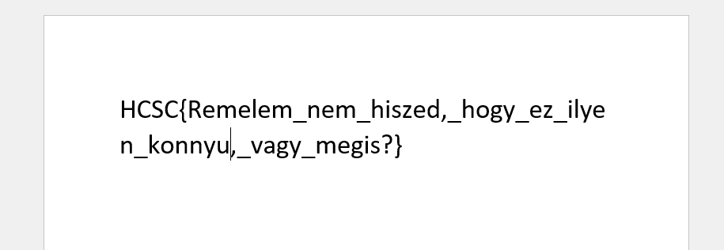
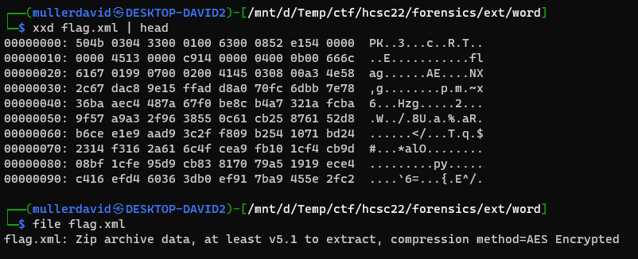
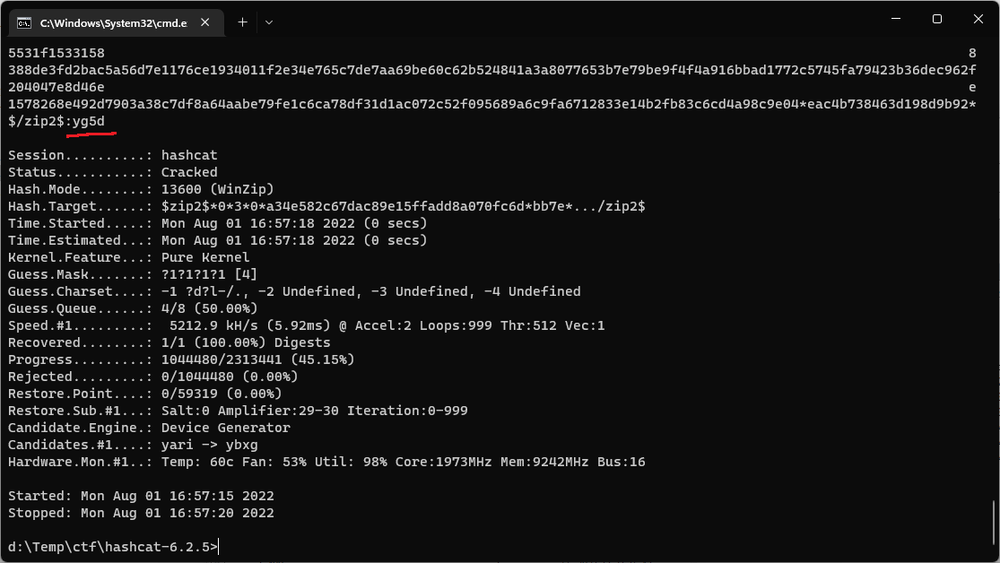
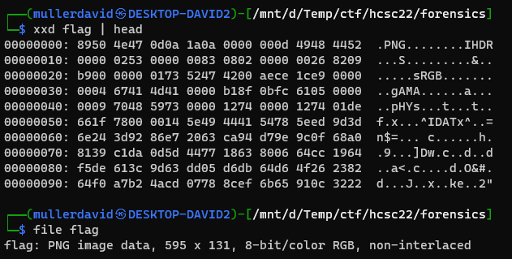

# Opening the file

Opening the file has a decoy flag.



Every Office OpenXML (docx, xlsx, etc) file is a zip file that has the office specific files, but it is in a zip container. 

There is a [HCSC.docx](workdir/HCSC.zip)`\word\`[flag.xml](workdir/flag.xml) file that is normally not there.

# Zip

The `flag.xml` is not actually an xml. It is an another zip file, which is visible from the magic bytes `PK`. The [file](https://linux.die.net/man/1/file) command also shows this, with the info that it is encrypted.



Cracking with a wordlist has no luck.

```bash
zip2john flag.zip > zip.hashes
john --wordlist=./rockyou.txt zip.hashes
```

Using a good mask based attack with [hashcat](https://hashcat.net/hashcat/) reveals the password in seconds with GPU acceleration.

```bash
cat zip.hashes | cut -d ':' -f 2 > zip_cat.hashes
hashcat.exe -m 13600 -a 3 --increment -1 ?d?l-/. ..\hcsc22\forensics\zip_cat.hashes ?1?1?1?1?1?1?1?1 
```



With the recovered `yg5d` password, the zip can extract the flag in png format.




# Flag
`HCSC{hgd4fju39974vbd}`
