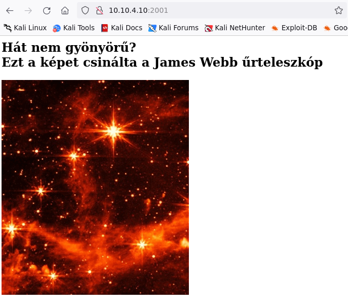
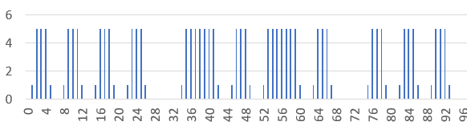
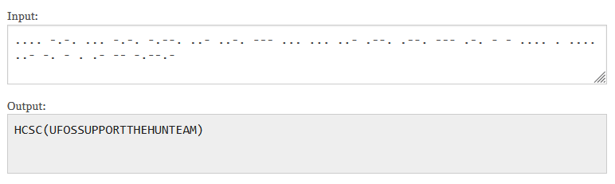

# Checking the site.

Opening the site reveals the pulsating [photo2.gif](workdir/photo2.gif).



# Gif


Bright / dim.


# Morse

The pulses are morse code. The brightness can be manually or automatically extracted.

The [run.py](workdir/run.py) script extracts the message.



```python
#!/usr/bin/env python3
from PIL import Image
img = Image.open('photo2.gif')
counter = 0
out = ""
while True:
    frame = img.tell()
    rgb_img = img.convert('RGB')
    r,g,b = rgb_img.getpixel((195, 95))
    #red has 179 min value, 184 max
    #print(frame, r-179) 
    if r == 184:
        out = out + 'h'
    elif r == 179:
        out = out + 'l'
    try:
        img.seek(frame+1)
    except:
        break
out = ' '.join(out.split())
#short beep has high val, long has 7
out = out.replace("hhhhhhh", "-")
out = out.replace("hhh", ".")
#spacer has 7 low values
out = out.replace("lllllll", " ")
out = out.replace("l", "")
print(out)
```

```
.... -.-. ... -.-. -.--. ..- ..-. --- ... ... ..- .--. .--. --- .-. - - .... . .... ..- -. - . .- -- -.--.- 
```

Online translator can be used for example. <https://morsecode.world/international/translator.html>



# Flag
HCSC(UFOSSUPPORTTHEHUNTEAM)