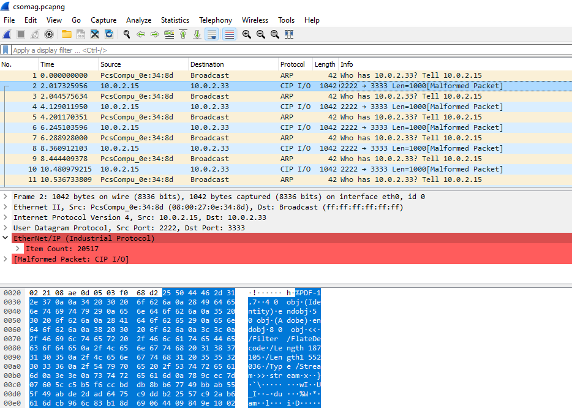
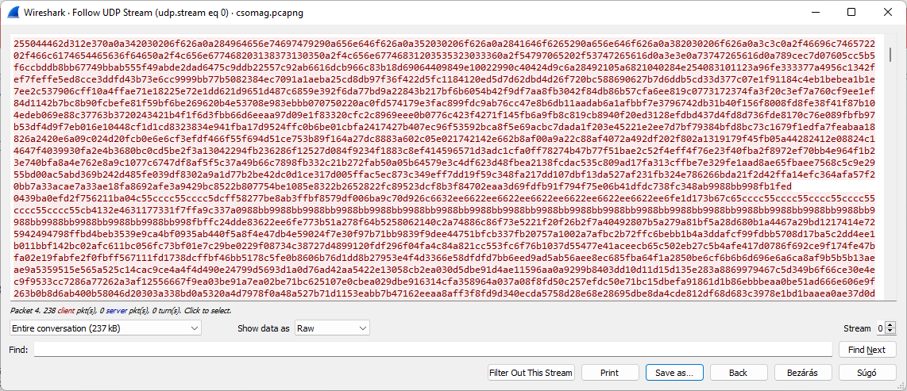
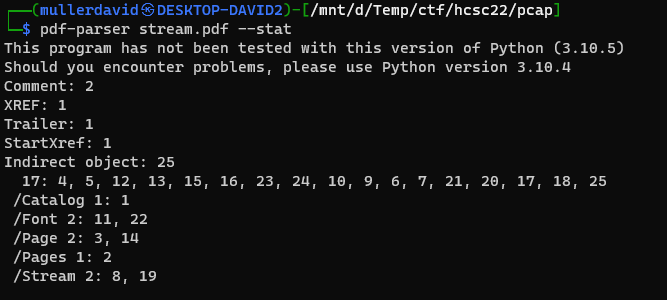
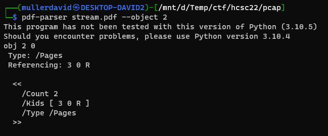
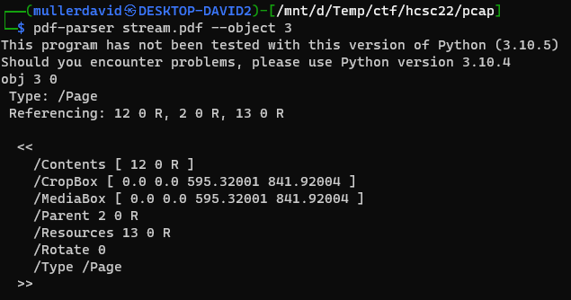
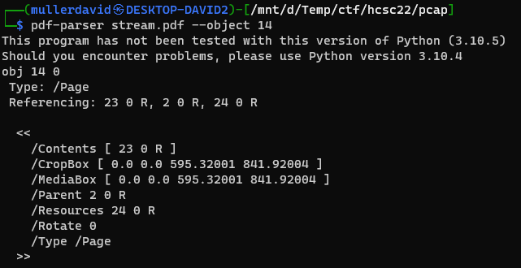
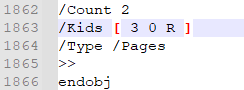
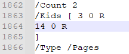
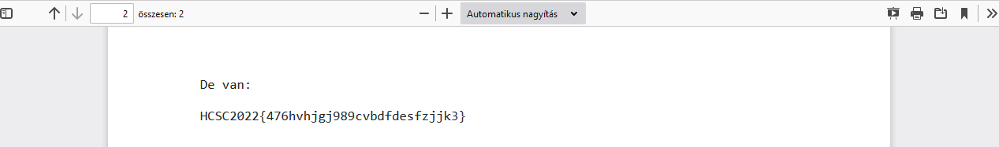

# Pcap

Opening the pcap with wireshark, there is only one udp stream and arp packets inside.



Right click on the packet, Follow, UDP Stream. Saving the file in Raw format (otherwise it will corrupt it) reveals a pdf file.



# PDF

Opening the file, there is a message about non-existing second page in hungarian. The page was hidden.


With [pdf-parser](https://www.kali.org/tools/pdf-parser/) the information can be extracted from the document step by step.

```bash
pdf-parser stream.pdf --stat
```



object 2 has the pages.

```bash
pdf-parser stream.pdf --object 2
```



Object 3 is the first page. This can be seen under `Kids` in previous step.



The only other object with `/Type /Page` is Object 14.



The pdf format is text based mostly, which means it can be restored with a simple text editor as well. Only the missing page object should be added to the pages under `Kids`.




Opening the pdf afterwards has the second page.



# Flag
HCSC2022{476hvhjgj989cvbdfdesfzjjk3}
 
