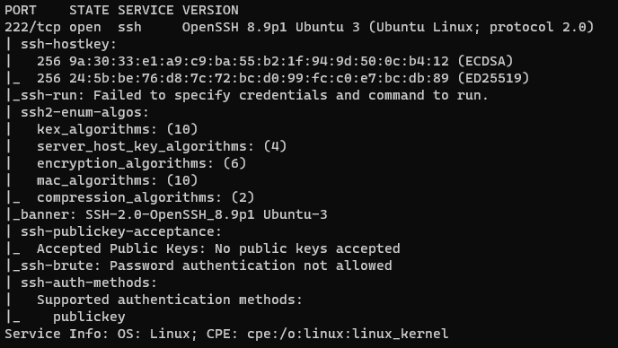
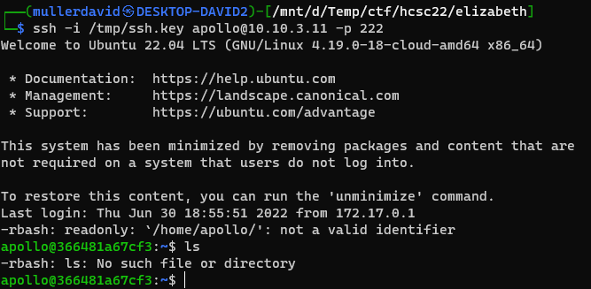
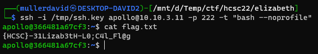
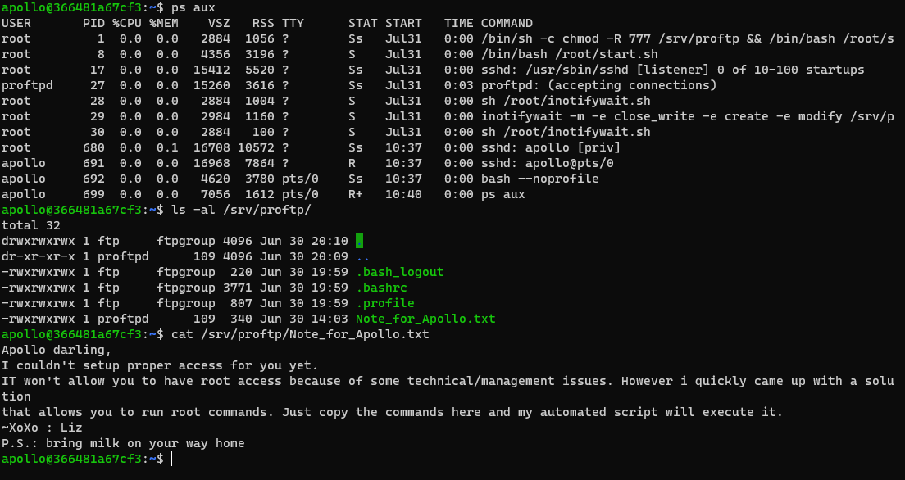
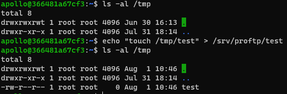
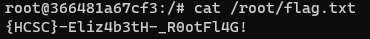

# Nmap

After a quick nmap scan, there is an SSH server running.



Only publickey auth is allowed.

# Apollo

There was an SSH keypair found earlier. See [Apollo challenge (SPOILER)](../Pentest_Apollo/WRITEUP.md#spoiler) for details.

This works, but only for a limited [rbash](https://www.gnu.org/software/bash/manual/html_node/The-Restricted-Shell.html) shell.



# Bash

The `rbash` can be bypassed with `bash –noprofile` during the ssh connection.

```bash
ssh -i /tmp/ssh.key apollo@10.10.3.11 -p 222 -t "bash --noprofile" 
```



The flag is in `flag.txt`.

# Flag local
`{HCSC}-31Lizab3tH-L0;C4l_Fl@g`

# Privesc service

Checking the running processes, there is an unknown service running as root.

```
/bin/sh -c chmod -R 777 /srv/proftp && /bin/bash /root/start.sh 
```

The script can not be viewed as regular user. There is a [Note_for_Apollo.txt](workdir/Note_for_Apollo.txt) in `/srv/proftp/`.



Based on the text, if we drop a file in the folder, it will be executed. There was also an [inotifywait](https://linux.die.net/man/1/inotifywait) running, so this is probable.

```bash
echo "touch /tmp/test" > /srv/proftp/test
```

The file appeared, so this works.



Our favorite reverse shell can be used similarly. Otherwise a setuid binary can be created as well.



# Flag root
`{HCSC}-Eliz4b3tH-_R0otFl4G!`