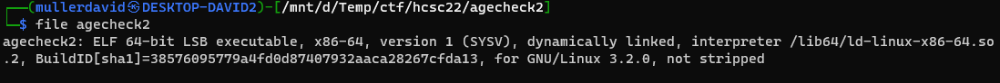
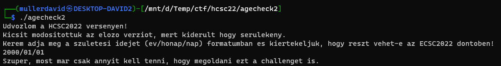
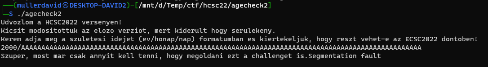

# Binary

The binary is much smaller now, dynamically linked, 64-bit. The remotely running libc binary was also provided.



Running it is expecting the birthday in a YYYY/MM/DD format as input. Similar to `Agecheck`.



# Logic

Decompiling it with Ghidra is still good enough, no need to work in assembly. The program is reading 0x140 bytes into a buffer sized 0x40. Same as the previous version. [agecheck2.c](workdir/agecheck2.c)

```c
void processInput(char *param_1)
{
  undefined2 local_16;
  int local_14;
  char *local_10;
  
  local_16 = 0x2f;
  local_10 = strtok(param_1,(char *)&local_16);
  local_14 = atoi(local_10);
  if (local_14 < 0x7cd) {
    puts("Sajnalom, de On tul van a korhataron :(");
    fflush(stdout);
                    // WARNING: Subroutine does not return
    exit(1);
  }
  if (0x7d6 < local_14) {
    puts("Sajnalom, de On a korhatar alatt van :(");
    fflush(stdout);
                    // WARNING: Subroutine does not return
    exit(1);
  }
  printf("Szuper, most mar csak annyit kell tenni, hogy megoldani ezt a challenget is.");
  fflush(stdout);
  return;
}

void main(void)
{
  char local_48 [64];
  
  puts("Udvozlom a HCSC2022 versenyen!");
  puts("Kicsit modositottuk az elozo verziot, mert kiderult hogy serulekeny.");
  puts(
      "Kerem adja meg a szuletesi idejet (ev/honap/nap) formatumban es kiertekeljuk, hogy reszt vehet-e az ECSC2022 dontoben!"
      );
  fflush(stdout);
  fgets(local_48,0x140,stdin);
  processInput(local_48);
  return;
}

```
# Offset

The program behaves the same as the previous version. Segfault on longer input.



Buffer size is same, the rip offset should be the same as well.

# ROP chain

The `test` backdoor function was removed. The binary is dynamically linked, with the address of libc dynamically changing (ASLR). Leaking an address is necessary.

Ropper can find all the rop gadgets to use them as building blocks. [rop.zip](workdir/rop.zip)

```bash
ropper --file ./agecheck2 --nocolor > rop.txt
ropper --file ./libc.so.6 --nocolor > rop-libc.txt
```

Based on the gadgets and requirements, 2 ROP chains were creaed. It is calling libc [system](https://cplusplus.com/reference/cstdlib/system/) at the end. 

In the first iteration it is leaking a libc address. Based on this the address of `system` can be calculated, and can be executed at the second step. Fun fact, there is a `/bin/bash` string in libc already, so no issue generating it. The following gadgets were used.

Leak:
 - rdi <-- puts got
 - puts() (rdi is the first parameter, which should be the executable)
 - main()
 
Exploit:
 - rdi <-- address of /bin/sh
 - system()

The completed script is in [exploit.py](workdir/exploit.py).
