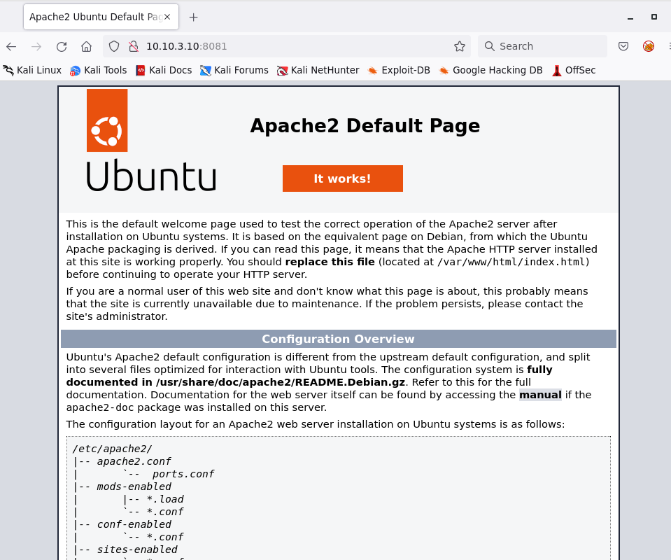
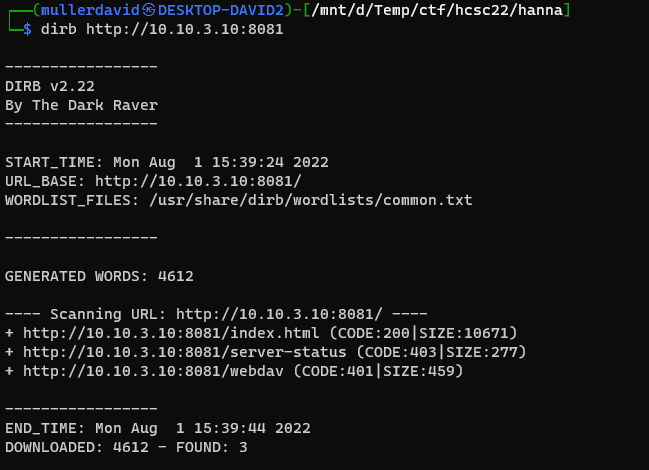
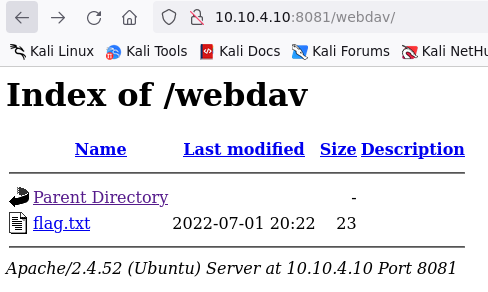
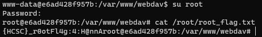

# Checking the site

Visiting the site has the default Ubuntu Apache site.



# Webdav

Dirb or any similar enumeration software can be used to find the `webdav` directory.

```bash
dirb http://10.10.3.10:8081
```



Unfortunately, it is asking for credentials. Our favorite mythical creatures can not help here with the usual wordlists. Apollo on the other hand can log in with his credentials: `admin:apollo13`. See [Apollo challenge (SPOILER)](../Pentest_Apollo/WRITEUP.md#spoiler) for details.

The directory listing is turned on, and the flag is here.



# Flag local
`{HCSC}!hanN@:l0CAL-FlaG`

# Upload

As the `webdav` name suggests, it is a [WebDAV](https://en.wikipedia.org/wiki/WebDAV) endpoint. The uploaded `php` files can be executed as well.

Our favorite reverse shell can be dropped, and deleted later.

```bash
curl -v --digest -u apollo:apollo13 -T ../webshell.php http://10.10.3.10:8081/webdav/
#curl -v --digest -u apollo:apollo13 -X DELETE http://10.10.3.10:8081/webdav/webshell.php
```

# Privesc

Of course, the `root` user has the same `apollo13` password, so it is reused everywhere.




# Flag root
`{HCSC}_r0otFl4g:4:H@nnA`