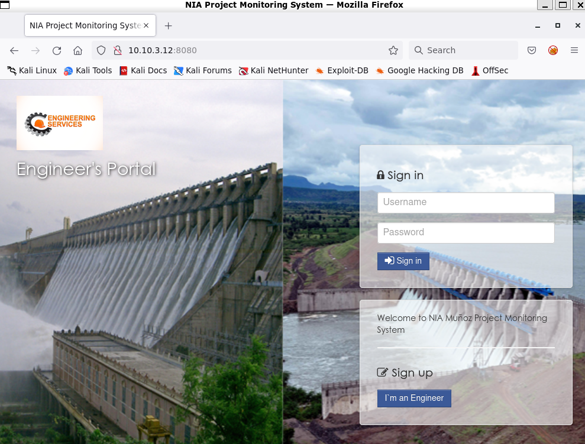
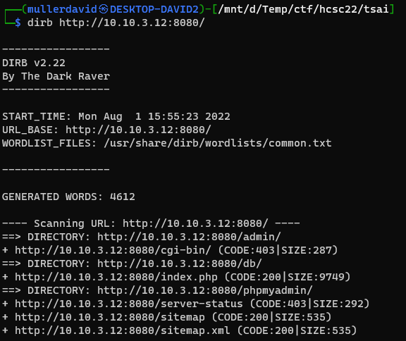
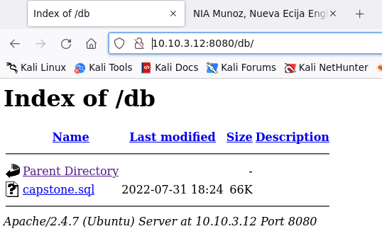
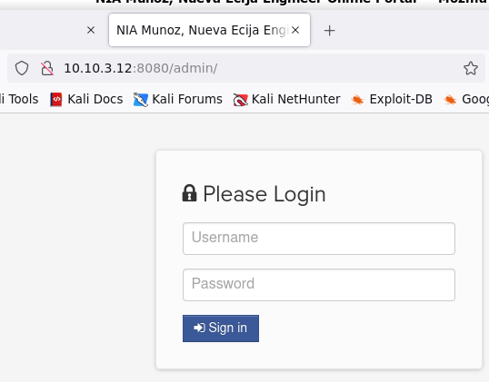
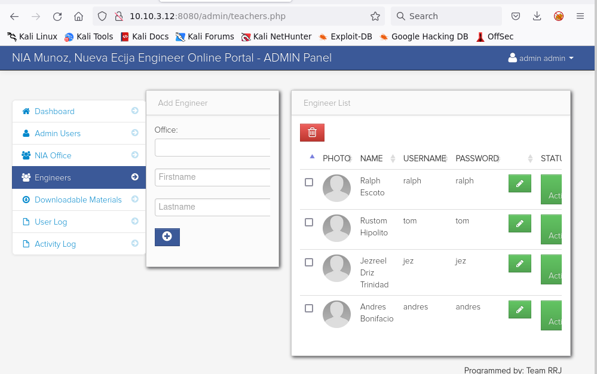
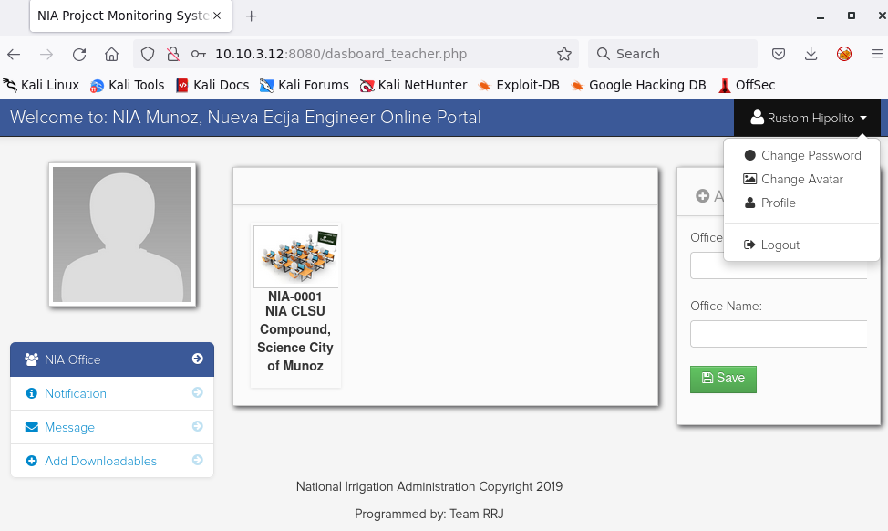
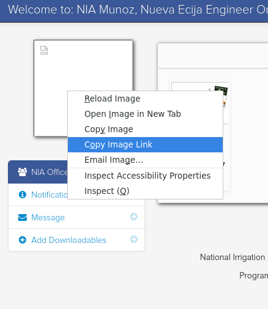
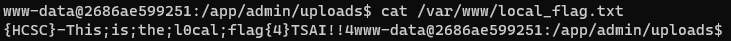
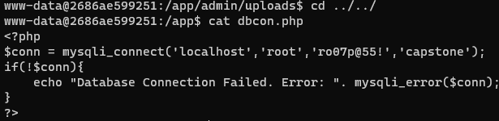
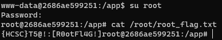

# Checking the site

Visiting the site has a website with a login form.



# Interesting places

Dirb or any similar enumeration software can be used to find interesting directories.



The `http://10.10.3.12:8080/db/` has directory listing enabled with `capstone.sql` database backup.



The `http://10.10.3.12:8080/admin/` has an admin interface.



# Database

The database backup has credentials.

```sql
--
-- Table structure for table `users`
--
 
CREATE TABLE `users` (
  `user_id` int(11) NOT NULL,
  `username` varchar(100) NOT NULL,
  `password` varchar(100) NOT NULL,
  `firstname` varchar(100) NOT NULL,
  `lastname` varchar(100) NOT NULL
) ENGINE=InnoDB DEFAULT CHARSET=latin1;
 
--
-- Dumping data for table `users`
--
 
INSERT INTO `users` (`user_id`, `username`, `password`, `firstname`, `lastname`) VALUES
(15, 'admin', 'admin', 'admin', 'admin');
```

# Admin

Using the credentials `admin:admin` can log in to the admin panel. All the other users with their credentials can be found here.



# User

Logging in as the user there is a `Change Avatar` functionality.



There is no file restriction on the uploaded file. The image "disappears" when anything but images is uploaded and checking it it points to the newly uploaded file inside `http://10.10.3.12:8080/admin/uploads/`.



Even php files can be uploaded as well, there is no restriction. Our favourite web/reverse shell can be uploaded. The flag is in `/var/www`.



# Flag local
{HCSC}-This;is;the;l0cal;flag{4}TSAI!!4

# Root

Amongst the portal files, there is one responsible for database connections. Also has credentials inside.



```php
$conn = mysqli_connect('localhost','root','ro07p@55!','capstone'); 
```

Reusing this for the `root` user, the privileges can be escalated.



# Flag root
{HCSC}T5@!:[R0otFl4G!]