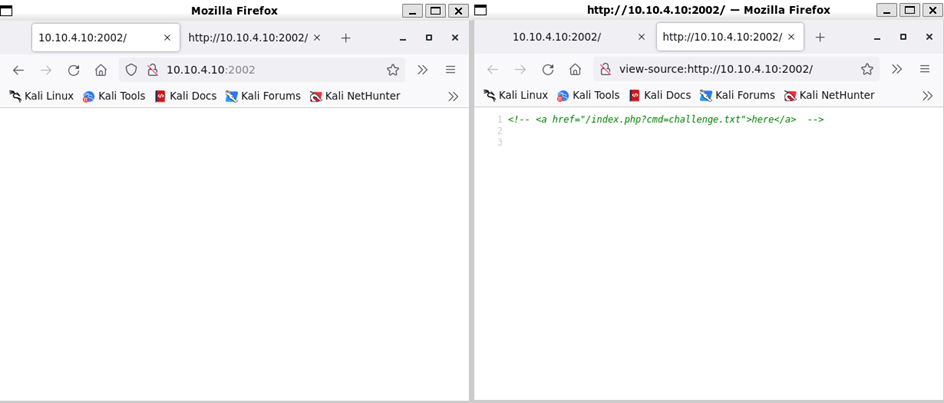
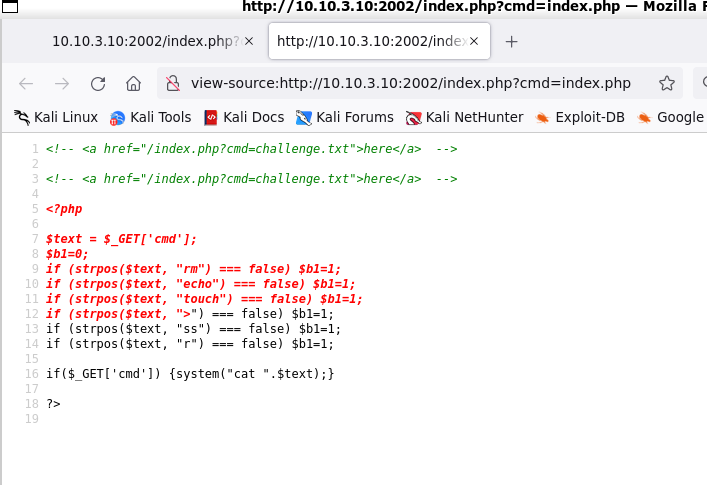
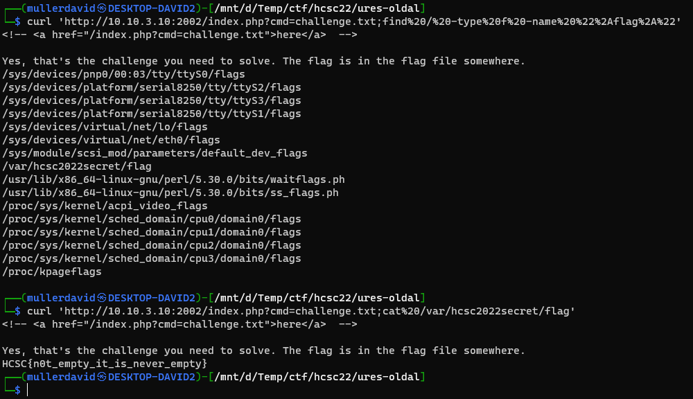

# Checking the site

Visiting the site is empty, but it has a comment viewing the source.



# Source

The cmd parameter is printing a file. Can be used to check the source of the page itself.

```
http://10.10.3.10:2002/index.php?cmd=index.php
```



It is using `cat` internally, directly concatenating the input and running it with system. There are a few checks for blakclist, but they are not actually used. Using `;` any command can be used to run after cat.

Looking around the flag is in `/var/hcsc2022secret/flag`.



# Flag
HCSC{n0t_empty_it_is_never_empty}
