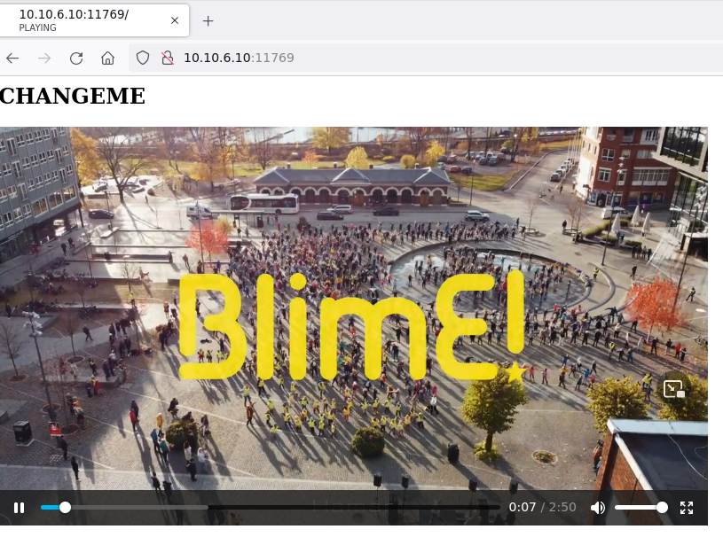
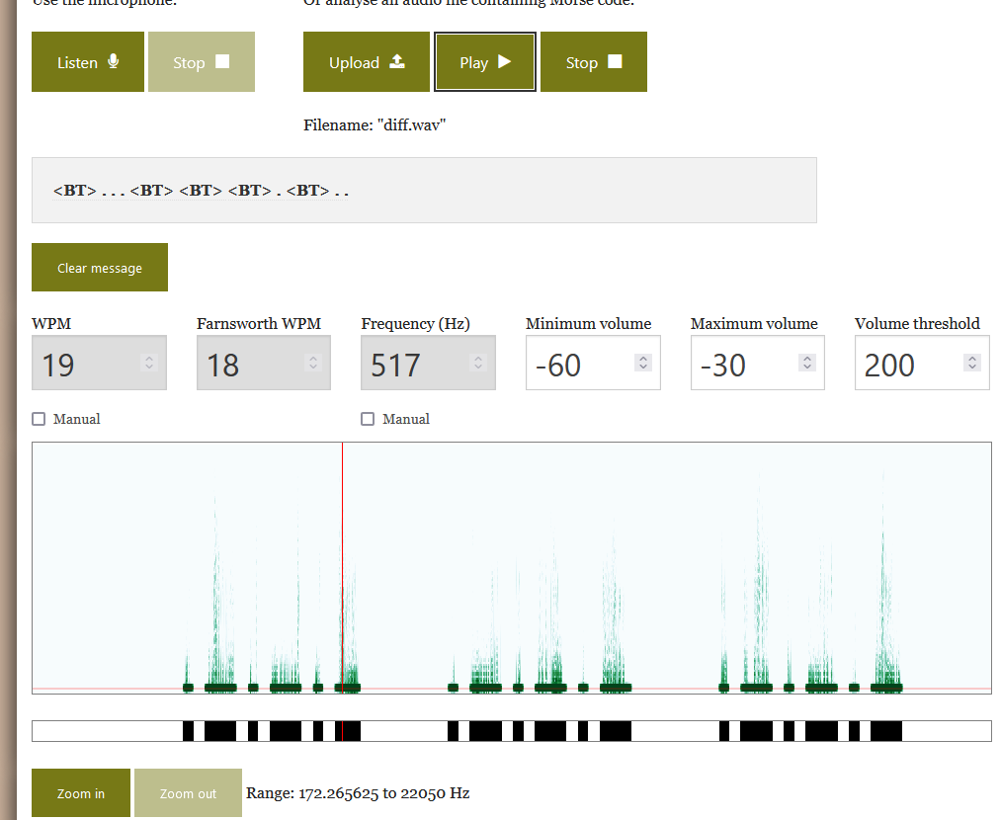
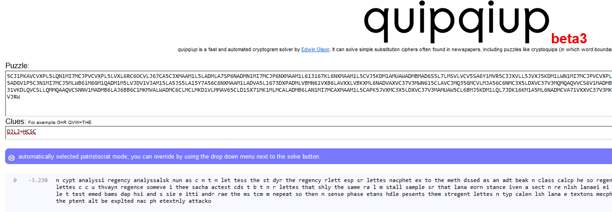
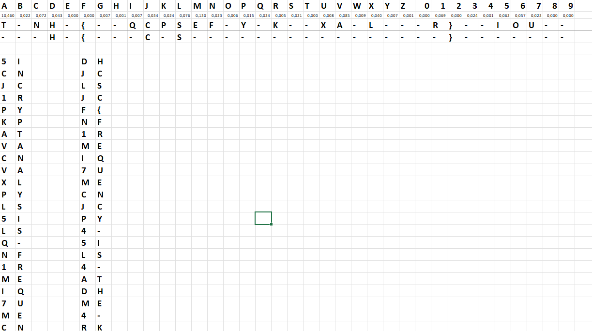

# Checking the site

Visiting the site from browser reveals a video, [BlimE_2021_Hamar_kommune_2021.mp4](workdir/BlimE_2021_Hamar_kommune_2021.mp4)



# Morse

There is a morse code on the right channel. We either decode it by sound or visually. As 

As it is only on one of the channels, and the 2 channels are similar, the other sounds can be mostly negated by subtracting the left channel from right for better results.

```bash
ffmpeg -i BlimE_2021_Hamar_kommune_2021.mp4 -af "pan=mono|FC=FL" left.wav -af "pan=mono|FC=FR" right.wav
sox -m -v 1 left.wav -v -1 right.wav diff.wav
```

The file can be decoded easier. The tool at <https://morsecode.world/international/decoder/audio-decoder-adaptive.html> was used.



The `dah-di-di-di-dah` should be the `=` not `<BT>`. Based on this, we get the following text.
```
=.. .=== .=.. .=== ..=. =. .==== == .. ==... == =.=. .=== .==. ....= ..... .=.. ....= .= =.. == ....= .=. == .==. ..===
```

This is an another morse code. Decoding results in `DJLJFN1MI7MCJP45L4ADM4RMP2`.

The sample given is also a morse code in text. Decoding into [sample-decoded.txt](workdir/sample-decoded.txt).


# Cipher

Based on the site, it is sized as a flag and the `DJLJ` is similar to `HCSC` pattern. 3 different letters followed by the second again. Probably ROT or substitution cipher. ROT is not giving the solution here.

Based on the sample, the substitutions can be figured out. Frequency analysis helps pairing the letters together.

The automated solvers I know do not handle numbers, but they gave a good approximation as starter based on the `DJLJ=HCSC`. <https://quipqiup.com/ >



After this, using excel and [solver.xlsx](workdir/solver.xlsx) was utilized.



The `-` was found only at the end of the sample: `INACIPHERTEXT-ONLYATTACK`.

The `{ }` symbols can not be found in the sample, they were guessed based on the flag format.

The uppercase version was not good. The morse code is not differentiating upper and lower case, therefore it was attempted with the lowercase version, which worked.

# Flag
`hcsc{frequency-is-the-key}`
