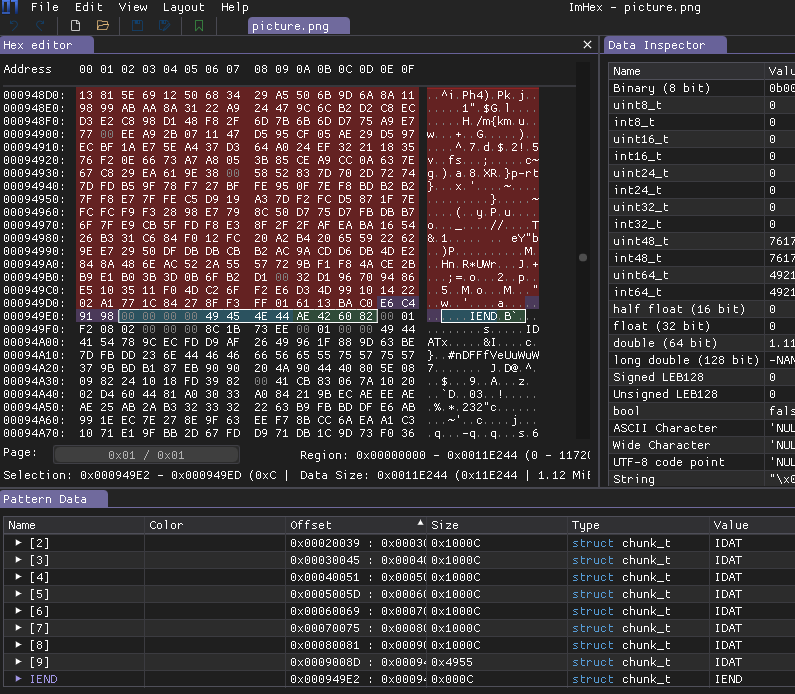
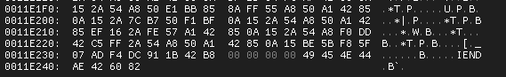
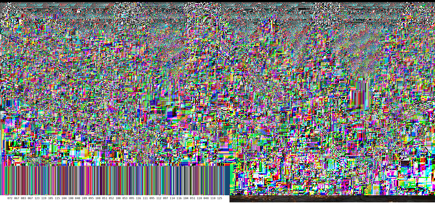
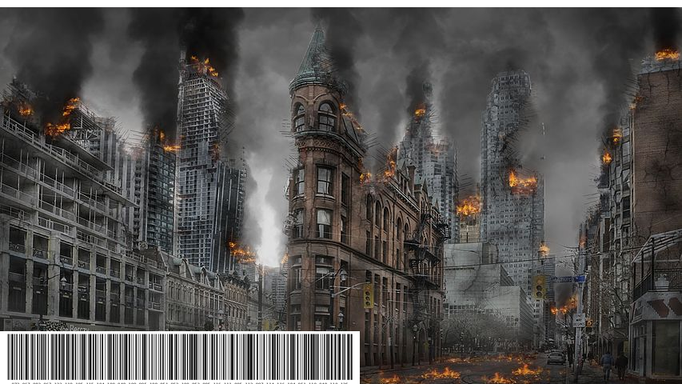

# Viewing the image

The image is 853x480 pixels.


# Checking the image

Opening the [](workdir/picture.png) with hexeditor, it can be seen that the png is ending earlier than the actual file. There are 2 IEND chunks inside. More info: <https://www.da.vidbuchanan.co.uk/blog/hello-png.html>.



Later the second IEND, which is not part of the png.



There was a recent `CVE 2023-21036` (aCropalypse), that is exploiting such files. Based on EOFWorld challenge name, it is highly probable.

In a nutshell, when the png is resized, the png itself is resized, but the file is not truncated if it was larger. The leftover data is from the original png. 

Knowing the original image  size before cropping is necessery, but can be guessed based on the current image. Same width, just bigger height. There is no issue if the height is not exactly the same, bigger is fine.

Although the online <https://acropalypse.app/> can be used for this challenge, it is not recovering the file properly.



There is a better variant, with an in depth explanation of the problem. 

<https://www.da.vidbuchanan.co.uk/blog/exploiting-acropalypse.html>

<https://gist.github.com/DavidBuchanan314/93de9d07f7fab494bcdf17c2bd6cef02>

Using this, the result is quite good. At 853x498 resolution there is no extra magenta bar at the top.



There is a "barcode" at the bottom. The numbers under it are barely readable, but they give out the flag.


```
72 67 83 67 123 119 105 115 104 100 48 109 95 108 51 52 100 53 95 116 111 095 112 097 114 116 104 51 110 048 110 125
```

# Flag
HCSC{wishd0m_l34d5_to_parth3n0n}

