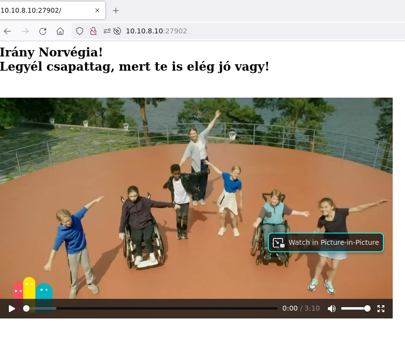
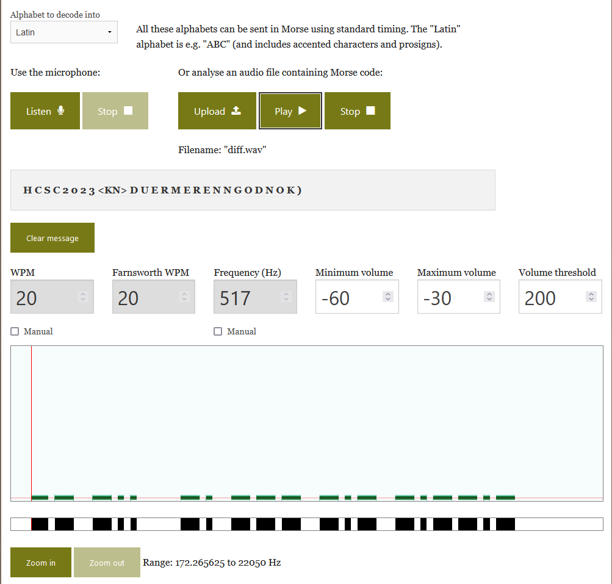

# Visiting the website

Visiting the address in a browser shows a video, `Norwegian-army-dancing-to-More-t.mp4`.



# Morse

There are some morse code beeps on the right channel. Can be decoded based on sound, visually or with tools.

As it is only on one of the channels, and the 2 channels are similar, the other sounds can be mostly negated by subtracting the left channel from right for better results.

```bash
ffmpeg -i Norwegian-army-dancing-to-More-t.mp4 -af "pan=mono|FC=FL" left.wav -af "pan=mono|FC=FR" right.wav
sox -m -v 1 left.wav -v -1 right.wav diff.wav
```

The file can be decoded easier. The tool at <https://morsecode.world/international/decoder/audio-decoder-adaptive.html> was used.

```
.... -.-. ... -.-. ..___ _____ ..___ ...__ -.--. _.. .._ . ._. __ . ._. . _. _. __. ___ _.. _. ___ _._ _.__._
```



With a small manual fix, the flag is acquired.

# Flag
`HCSC2023(DUERMERENNGODNOK)`
